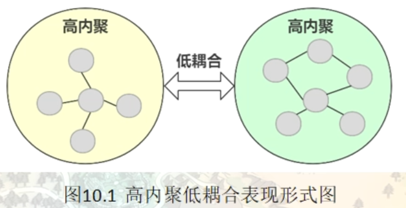

# 迭代器模式（Iterator）

在现实生活以及程序设计中，经常要访问一个聚合对象中的各个元素，如“数据结构 ”中的链表遍历，通常的做法是将链表的创建和遍历都放在同一个类中，但这种方式不利于程序的扩展，如果要更换遍历方法就必须修改程序源代码，这违背了 “开闭原则”。

既然将遍历方法封装在聚合类中不可取，那么聚合类中不提供遍历方法，将遍历方法由用户自己实现是否可行呢？答案是同样不可取，因为这种方式会存在两个缺点：

1. 暴露了聚合类的内部表示，使其数据不安全；
2. 增加了客户的负担。


“迭代器模式”能较好地克服以上缺点，它在客户访问类与聚合类之间插入一个迭代器，这分离了聚合对象与其遍历行为，对客户也隐藏了其内部细节，且满足“单一职责原则”和“开闭原则”，如 Java 中的 Collection、List、Set、Map 等都包含了迭代器。

迭代器模式在生活中应用的比较广泛，比如：物流系统中的传送带，不管传送的是什么物品，都会被打包成一个个箱子，并且有一个统一的二维码。这样我们不需要关心箱子里是什么，在分发时只需要一个个检查发送的目的地即可。再比如，我们平时乘坐交通工具，都是统一刷卡或者刷脸进站，而不需要关心是男性还是女性、是残疾人还是正常人等信息。

## 模式的定义与特点

迭代器（Iterator）模式的定义：提供一个对象来顺序访问聚合对象中的一系列数据，而不暴露聚合对象的内部表示。迭代器模式是一种对象行为型模式，其主要优点如下。

1. 访问一个聚合对象的内容而无须暴露它的内部表示。
2. 遍历任务交由迭代器完成，这简化了聚合类。
3. 它支持以不同方式遍历一个聚合，甚至可以自定义迭代器的子类以支持新的遍历。
4. 增加新的聚合类和迭代器类都很方便，无须修改原有代码。
5. 封装性良好，为遍历不同的聚合结构提供一个统一的接口。


其主要缺点是：增加了类的个数，这在一定程度上增加了系统的复杂性。

在日常开发中，我们几乎不会自己写迭代器。除非需要定制一个自己实现的数据结构对应的迭代器，否则，开源框架提供的 API 完全够用。

## 模式的结构与实现

迭代器模式是通过将聚合对象的遍历行为分离出来，抽象成迭代器类来实现的，其目的是在不暴露聚合对象的内部结构的情况下，让外部代码透明地访问聚合的内部数据。现在我们来分析其基本结构与实现方法。

#### 1. 模式的结构

迭代器模式主要包含以下角色。

1. 抽象聚合（Aggregate）角色：定义存储、添加、删除聚合对象以及创建迭代器对象的接口。
2. 具体聚合（ConcreteAggregate）角色：实现抽象聚合类，返回一个具体迭代器的实例。
3. 抽象迭代器（Iterator）角色：定义访问和遍历聚合元素的接口，通常包含 hasNext()、first()、next() 等方法。
4. 具体迭代器（Concretelterator）角色：实现抽象迭代器接口中所定义的方法，完成对聚合对象的遍历，记录遍历的当前位置。

## 容器和迭代器的简单范例

```c++
namespace _nmsp1
{
    void func()
    {
        std::vector<int> msgVector;
        msgVector.push_back(1);
        msgVector.push_back(2);
        msgVector.push_back(3);
        msgVector.push_back(4);
        msgVector.push_back(5);
        
        for (std::vector<int>::iterator pos = msgVector.begin(); pos != msgVector.end(); ++pos)
        {
            std::cout << *pos << std::endl;
        }
        
        std::cout << "--------------------------------------------------" << std::endl;
        
        std::list<int> msglist;
        msglist.push_back(1);
        msglist.push_front(2);
        msglist.push_back(3);
        msglist.push_front(4);
        
        for (std::list<int>::iterator pos = msglist.begin(); pos != msglist.end(); ++pos)
        {
            std::cout << *pos << std::endl;
        }
    }
}
```

在迭代器早期的实现中，是把迭代器和容器全都是现在一个类模板中。随着语言发展，才将迭代器拆分出来。

## 单一职责原则

### 单一职责原则的定义

单一职责原则（Single Responsibility Principle，SRP）又称单一功能原则，由罗伯特·C.马丁（Robert C. Martin）于《敏捷软件开发：原则、模式和实践》一书中提出的。这里的职责是指类变化的原因，单一职责原则规定一个类应该有且仅有一个引起它变化的原因，否则类应该被拆分（There should never be more than one reason for a class to change）。

该原则提出对象不应该承担太多职责，如果一个对象承担了太多的职责，至少存在以下两个缺点：

1. 一个职责的变化可能会削弱或者抑制这个类实现其他职责的能力；
2. 当客户端需要该对象的某一个职责时，不得不将其他不需要的职责全都包含进来，从而造成冗余代码或代码的浪费。

### 单一职责原则的优点

单一职责原则的核心就是控制类的粒度大小、将对象解耦、提高其内聚性。如果遵循单一职责原则将有以下优点。

- 降低类的复杂度。一个类只负责一项职责，其逻辑肯定要比负责多项职责简单得多。
- 提高类的可读性。复杂性降低，自然其可读性会提高。
- 提高系统的可维护性。可读性提高，那自然更容易维护了。
- 变更引起的风险降低。变更是必然的，如果单一职责原则遵守得好，当修改一个功能时，可以显著降低对其他功能的影响。

### 单一职责原则的实现方法

单一职责原则是最简单但又最难运用的原则，需要设计人员发现类的不同职责并将其分离，再封装到不同的类或模块中。而发现类的多重职责需要设计人员具有较强的分析设计能力和相关重构经验。

### 内聚和耦合

内聚性是衡量一个模块（类）紧密的达到单一目的特性。指的是从功能角度来度量模块内的联系。当一个模块被设计成只支持一组功能的时候，他就被称为高内聚，反之如果支持一组不相关的功能就被称为低内聚

耦合性是模块间相互关联的程度，取决于两者之间的接口的复杂性，相互之间的调用方式以及调用时哪些信息需要交互。

耦合性的几种类型（耦合性由高到低）

- 内容耦合：耦合性高，应该避免使用
- 公共耦合
- 外部耦合
- 控制耦合
- 标记耦合
- 数据耦合：耦合长度最低

耦合性的高低决定了程序代码的编写质量，如果程序代码中不可避免的要出现耦合，应该尽量使用数据耦合，少用控制耦合，控制公共耦合的范围，避免使用内容耦合。程序设计的原则就是 高内聚，低耦合。

要达到地耦合的目的，也要尽量遵循依赖倒置原则（也就是高层组件和底层组件都依赖于 抽象层 ），或者说，尽量使用抽象耦合来代替类耦合




## 迭代器模式的范例及现代C++中的迭代器

### 迭代器模式范例

### 现代c++中的迭代器