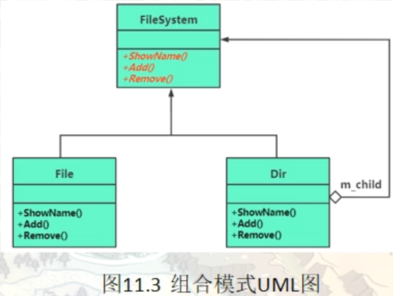

# 组合模式（Composite）

在现实生活中，存在很多“部分-整体”的关系，例如，大学中的部门与学院、总公司中的部门与分公司、学习用品中的书与书包、生活用品中的衣服与衣柜、以及厨房中的锅碗瓢盆等。在软件开发中也是这样，例如，文件系统中的文件与文件夹、窗体程序中的简单控件与容器控件等。对这些简单对象与复合对象的处理，如果用组合模式来实现会很方便。

组合（Composite Pattern）模式的定义：有时又叫作整体-部分（Part-Whole）模式，它是一种将对象组合成树状的层次结构的模式，用来表示“整体-部分”的关系，使用户对单个对象和组合对象具有一致的访问性，属于 **结构型设计模式** 。

组合模式发挥作用的前提是，具体数据必须能以树形结构的方式表示，树中包含了单个和组合对象。该模式专注于对树形结构中单个对象和组合对象的递归遍历。并且能够把相同的操作应用在单个以及组合对象上，并且可以忽略单个对象和组合对象之间的差别

组合模式一般用来描述整体与部分的关系，它将对象组织到树形结构中，顶层的节点被称为根节点，根节点下面可以包含树枝节点和叶子节点，树枝节点下面又可以包含树枝节点和叶子节点，树形结构图如下。


由上图可以看出，其实根节点和树枝节点本质上属于同一种数据类型，可以作为容器使用；而叶子节点与树枝节点在语义上不属于用一种类型。但是在组合模式中，会把树枝节点和叶子节点看作属于同一种数据类型（用统一接口定义），让它们具备一致行为。

这样，在组合模式中，整个树形结构中的对象都属于同一种类型，带来的好处就是用户不需要辨别是树枝节点还是叶子节点，可以直接进行操作，给用户的使用带来极大的便利。

组合模式的主要优点有：

1. 组合模式使得客户端代码可以一致地处理单个对象和组合对象，无须关心自己处理的是单个对象，还是组合对象，这简化了客户端代码；简化了代码书写。
2. 更容易在组合体内加入新的对象，客户端不会因为加入了新的对象而更改源代码，满足“开闭原则”；
3. 组合模式为树形结构的面向对象实现方式提供了一种灵活的解决方案，通过对单个对象以及组合对象的递归遍历，可以处理复杂的数据结构


其主要缺点是：

1. 设计较复杂，客户端需要花更多时间理清类之间的层次关系；
2. 不容易限制容器中的构件；
3. 不容易用继承的方法来增加构件的新功能；

## 一个基本的目录内容遍历范例

```c++
namespace _nmsp1
{
    // 文件相关的类
    class File
    {
    public:
        // 构造函数
        File(string name):m_sname(name)
        {}
        
        // 显示文件名
        void showName(string lvlstr)    // lvlstr 用来显示层次关系的缩进字符串内容
        {
            std::cout << lvlstr << "[-]" << m_sname << std::endl;
            // '-' 代表是一个文件，属于末端节点（与之对应的 + 代表一个目录）
        }
        
    private:
        string m_sname;     // 文件名
    };
    
    // 目录相关的类
    class Dir
    {
    public:
        Dir(string name) : m_sname(name)
        {}
        
    public:
        // 往目录中增加文件
        void addFile(File* tmpv)
        {
            m_childFile.push_back(tmpv);
        }
        
        // 往目录中增加目录
        void addDir(Dir* tmpv)
        {
            m_childDir.push_back(tmpv);
        }
        
        // 显示目录名(同时也要负责旗下的目录和文件名显示)
        void showName(string lvlstr)
        {
            // 输出本目录名（+代表一个目录）
            std::cout << lvlstr << "[+]" << m_sname << std::endl;
            
            // 输出所包含的文件名
            lvlstr += "────";
            // 本目录中的文件和目录的显示，要缩进一些来显示
            for(auto iter = m_childDir.begin(); iter != m_childDir.end(); ++iter)
            {
                (*iter)->showName(lvlstr);
            }
            
            // 输出所包含的文件名
            for(auto iter = m_childFile.begin(); iter != m_childFile.end(); ++iter)
            {
                (*iter)->showName(lvlstr);
            }
            
        }
        
    private:
        string m_sname; // 目录名
        list<File*> m_childFile;    // 目录中包含的文件列表
        list<Dir*> m_childDir;      // 目录中包含的子目录列表
    };
}
```

main中调用进行测试

```c++
int main()
{
    // 创建一个目录树结构
    _nmsp1::Dir* pdir1 = new _nmsp1::Dir("root");
    _nmsp1::Dir* pdir2 = new _nmsp1::Dir("src");
    _nmsp1::Dir* pdir3 = new _nmsp1::Dir("lib");
    _nmsp1::Dir* pdir4 = new _nmsp1::Dir("net");
    _nmsp1::Dir* pdir5 = new _nmsp1::Dir("commpoment");
    
    _nmsp1::File* file1 = new _nmsp1::File("vue.config.js");
    _nmsp1::File* file2 = new _nmsp1::File("main.ts");
    _nmsp1::File* file3 = new _nmsp1::File("shims-vue.d.ts");
    _nmsp1::File* file4 = new _nmsp1::File("README.md");
    
    _nmsp1::File* file5 = new _nmsp1::File("hello.vue");
    _nmsp1::File* file6 = new _nmsp1::File("world.vue");
    _nmsp1::File* file7 = new _nmsp1::File("plugin.ts");
    _nmsp1::File* file8 = new _nmsp1::File("config.tsx");
    
    _nmsp1::File* file9 = new _nmsp1::File(".bable.rc");
    _nmsp1::File* file10 = new _nmsp1::File("socket.ts");
    _nmsp1::File* file11 = new _nmsp1::File("include.h");
    _nmsp1::File* file12 = new _nmsp1::File("error.ts");
    
    _nmsp1::File* file13 = new _nmsp1::File("index.vue");
    _nmsp1::File* file14 = new _nmsp1::File("big.vue");
    
    pdir5->addFile(file13);
    pdir5->addFile(file14);
    
    pdir2->addDir(pdir5);
    
    pdir4->addFile(file12);
    pdir4->addFile(file11);
    pdir4->addFile(file10);
    
    pdir3->addFile(file9);
    
    pdir2->addFile(file5);
    pdir2->addFile(file6);
    pdir2->addFile(file7);
    pdir2->addFile(file8);
    
    pdir1->addDir(pdir2);
    pdir1->addDir(pdir3);
    pdir1->addDir(pdir4);
    
    pdir1->addFile(file1);
    pdir1->addFile(file2);
    pdir1->addFile(file3);
    pdir1->addFile(file4);
    
    
    // 输出目录结构
    pdir1->showName("┼");
    // ┼[+]root
    // ┼────[+]src
    // ┼────────[+]commpoment
    // ┼────────────[-]index.vue
    // ┼────────────[-]big.vue
    // ┼────────[-]hello.vue
    // ┼────────[-]world.vue
    // ┼────────[-]plugin.ts
    // ┼────────[-]config.tsx
    // ┼────[+]lib
    // ┼────────[-].bable.rc
    // ┼────[+]net
    // ┼────────[-]error.ts
    // ┼────────[-]include.h
    // ┼────────[-]socket.ts
    // ┼────[-]vue.config.js
    // ┼────[-]main.ts
    // ┼────[-]shims-vue.d.ts
    // ┼────[-]README.md
    

    // 内存释放。。。
    return 0;
}
```

当前这个范例有什么问题？

为了输出树形结构，这里我们对目录和文件进行了区分（写了两个类，其实也就是树形结构里的树枝和树叶）,所以，这里就引入组合模式，组合模式就是为了解决在处理这些树形结构的时候，不再需要将叶子和枝干进行区分。而是引入一个新的类，比如这里可以引入一个 FileSystem 文件系统抽象类，然后在该抽象类中提供一个接口。然后让File类和Dir类分别继承自FileSystem抽象类

## 使用组合模式改造目录内容遍历范例

````c++
namespace _nmsp2
{
    // 抽象父类（文件系统）
    class FileSystem
    {
    public:
        virtual void _showName(int level) = 0;   // 显示名字，参数level表示文件层级
        virtual int _add(FileSystem* pfilesys) = 0;  // 用于向当前目录中增加文件 或者 子目录
        virtual int _remove(FileSystem* pfilesys) = 0;  // 用于从当前目录中移除文件或者子目录
        
        virtual ~FileSystem() {}
    };
    
    // 文件相关的类
    class File : public FileSystem
    {
    public:
        File(string tmpv) : m_sname(tmpv)
        {}
        
        virtual void _showName(int level)
        {
            for (int i = 0; i < level; ++i)
            {
                std::cout << "────";
            }
            
            std::cout << "[-]" << m_sname << std::endl;
        }
        
        virtual int _add(FileSystem* tmpv)
        {
            return -1;
        }
        
        virtual int _remove(FileSystem* tmpv)
        {
            return -1;
        }
        
    private:
        string m_sname;
    };
    
    // 目录相关的类
    class Dir : public FileSystem
    {
    public:
        Dir(string name):m_sname(name)
        {}
        
        virtual void _showName(int level)
        {
            for (int i = 0; i < level; ++i)
            {
                std::cout << "────";
            }
            
            std::cout << "[+]" << m_sname << std::endl;
            
            // 显示的层级向下走一级
            level++;
            // 输出所包含的子类容
            for(auto iter = m_child.begin(); iter!=m_child.end(); ++iter)
            {
                (*iter)->_showName(level);
            }
        }
        
        virtual int _add(FileSystem* tmpv)
        {
            m_child.push_back(tmpv);
            return 0;
        }
        
        virtual int _remove(FileSystem* tmpv)
        {
            m_child.remove(tmpv);
            return 0;
        }
        
    private:
        string m_sname; // 文件目录名
        list<FileSystem*> m_child;  // 目录中包含的文件或者其他目录列表
    };
    
    void func()
    {
        FileSystem* pdir1 = new Dir("root");
        FileSystem* pdir2 = new Dir("src");
        FileSystem* pdir3 = new Dir("lib");
        FileSystem* pdir4 = new Dir("net");
        FileSystem* pdir5 = new Dir("commpoment");
        
        FileSystem* file1 = new File("vue.config.js");
        FileSystem* file2 = new File("main.ts");
        FileSystem* file3 = new File("shims-vue.d.ts");
        FileSystem* file4 = new File("README.md");
        
        FileSystem* file5 = new File("hello.vue");
        FileSystem* file6 = new File("world.vue");
        FileSystem* file7 = new File("plugin.ts");
        FileSystem* file8 = new File("config.tsx");
        
        FileSystem* file9 = new File(".bable.rc");
        FileSystem* file10 = new File("socket.ts");
        FileSystem* file11 = new File("include.h");
        FileSystem* file12 = new File("error.ts");
        
        FileSystem* file13 = new File("index.vue");
        FileSystem* file14 = new File("big.vue");
        
        pdir5->_add(file13);
        pdir5->_add(file14);
        
        pdir2->_add(pdir5);
        
        pdir4->_add(file12);
        pdir4->_add(file11);
        pdir4->_add(file10);
        
        pdir3->_add(file9);
        
        pdir2->_add(file5);
        pdir2->_add(file6);
        pdir2->_add(file7);
        pdir2->_add(file8);
        
        pdir1->_add(pdir2);
        pdir1->_add(pdir3);
        pdir1->_add(pdir4);
        
        pdir1->_add(file1);
        pdir1->_add(file2);
        pdir1->_add(file3);
        pdir1->_add(file4);
        
        pdir1->_showName(0);
        // [+]root
        // ────[+]src
        // ────────[+]commpoment
        // ────────────[-]index.vue
        // ────────────[-]big.vue
        // ────────[-]hello.vue
        // ────────[-]world.vue
        // ────────[-]plugin.ts
        // ────────[-]config.tsx
        // ────[+]lib
        // ────────[-].bable.rc
        // ────[+]net
        // ────────[-]error.ts
        // ────────[-]include.h
        // ────────[-]socket.ts
        // ────[-]vue.config.js
        // ────[-]main.ts
        // ────[-]shims-vue.d.ts
        // ────[-]README.md
    }
}
````

## 引入组合模式（Composite）

组合模式的结构不是很复杂，下面对它的结构和实现进行分析。

### 模式的结构

组合模式包含以下主要角色。

1. 抽象构件（Component）角色：它的主要作用是为树叶构件和树枝构件声明公共接口，并实现它们的默认行为。在透明式的组合模式中抽象构件还声明访问和管理子类的接口；在安全式的组合模式中不声明访问和管理子类的接口，管理工作由树枝构件完成。（总的抽象类或接口，定义一些通用的方法，比如新增、删除）。对应上面范例中的FileSystem抽象类。
2. 树叶构件（Leaf）角色：是组合中的叶节点对象，它没有子节点，用于继承或实现抽象构件。对应上面范例中的File实现类。
3. 树枝构件（Composite）角色 / 中间构件：是组合中的分支节点对象，它有子节点，用于继承和实现抽象构件。它的主要作用是存储和管理子部件，通常包含 Add()、Remove()、GetChild() 等方法。对应上面范例中的Dir实现类



## 透明组合模式与安全组合模式

#### (1) 透明方式

我们这个范例里采用（或者说实现的）正是这种模式。

在该方式中，由于抽象构件声明了所有子类中的全部方法，所以客户端无须区别树叶对象和树枝对象，对客户端来说是透明的。但其缺点是：树叶构件本来没有 Add()、Remove() 及 GetChild() 方法，却要实现它们（空实现或抛异常），这样会带来一些安全性问题。

#### (2) 安全方式

在该方式中，将管理子构件的方法移到树枝构件中，抽象构件和树叶构件没有对子对象的管理方法，这样就避免了上一种方式的安全性问题，但由于叶子和分支有不同的接口，客户端在调用时要知道树叶对象和树枝对象的存在，所以失去了透明性。也就是客户端无法完全针对抽象进行编程，必须调整代码，来区别对待叶子组件和树枝组件，因为树枝和树叶他具有不同的接口

改造成安全模式（然后新增了一个统计文件数量的接口）

```c++
namespace _nmsp3
{
    class Dir;
    
    // 抽象父类（文件系统）
    class FileSystem
    {
    public:
        virtual void _showName(int level) = 0;   // 显示名字，参数level表示文件层级
        
        // 判断是不是一个组合对象（也就是判断是不是树枝（是不是目录 Dir 对象））
        virtual Dir* ifConmpositeObj()
        {
            return nullptr;
        }
        
        // 增加一个统计目录下文件数目的功能
        virtual int countNumOfFIles() = 0;
        
        virtual ~FileSystem() {}
    };
    
    // 文件相关的类
    class File : public FileSystem
    {
    public:
        File(string tmpv) : m_sname(tmpv)
        {}
        
        virtual void _showName(int level)
        {
            for (int i = 0; i < level; ++i)
            {
                std::cout << "────";
            }
            
            std::cout << "[-]" << m_sname << std::endl;
        }
        
        virtual int countNumOfFIles()
        {
            return 1;   // 文件节点，在统计文件数目时，按1处理
        }
        
    private:
        string m_sname;
    };
    
    // 目录相关的类
    class Dir : public FileSystem
    {
    public:
        Dir(string name):m_sname(name)
        {}
        
        virtual void _showName(int level)
        {
            for (int i = 0; i < level; ++i)
            {
                std::cout << "────";
            }
            
            std::cout << "[+]" << m_sname << std::endl;
            
            // 显示的层级向下走一级
            level++;
            // 输出所包含的子类容
            for(auto iter = m_child.begin(); iter!=m_child.end(); ++iter)
            {
                (*iter)->_showName(level);
            }
        }
        
        int _add(FileSystem* tmpv)
        {
            m_child.push_back(tmpv);
            return 0;
        }
        
        int _remove(FileSystem* tmpv)
        {
            m_child.remove(tmpv);
            return 0;
        }
        
        // 判断是不是一个组合对象（也就是判断是不是树枝（是不是目录 Dir 对象））
        virtual Dir* ifConmpositeObj()
        {
            return this;
        }
        
        virtual int countNumOfFIles()
        {
            int iNumOfFiles = 0;
            for(auto iter = m_child.begin(); iter != m_child.end(); ++iter)
            {
                iNumOfFiles += (*iter)->countNumOfFIles();
                // 递归调用
            }
            return iNumOfFiles;
        }
        
    private:
        string m_sname; // 文件目录名
        list<FileSystem*> m_child;  // 目录中包含的文件或者其他目录列表
    };
    
    void func()
    {
        Dir* pdir1 = new Dir("root");
        Dir* pdir2 = new Dir("src");
        Dir* pdir3 = new Dir("lib");
        Dir* pdir4 = new Dir("net");
        Dir* pdir5 = new Dir("commpoment");
        
        FileSystem* file1 = new File("vue.config.js");
        FileSystem* file2 = new File("main.ts");
        FileSystem* file3 = new File("shims-vue.d.ts");
        FileSystem* file4 = new File("README.md");
        
        FileSystem* file5 = new File("hello.vue");
        FileSystem* file6 = new File("world.vue");
        FileSystem* file7 = new File("plugin.ts");
        FileSystem* file8 = new File("config.tsx");
        
        FileSystem* file9 = new File(".bable.rc");
        FileSystem* file10 = new File("socket.ts");
        FileSystem* file11 = new File("include.h");
        FileSystem* file12 = new File("error.ts");
        
        FileSystem* file13 = new File("index.vue");
        FileSystem* file14 = new File("big.vue");
        
        // 然后我们可以在使用树枝（目录）组件的成员函数的时候，先判断一下是不是树枝（目录对象）
        if (pdir5->ifConmpositeObj() != nullptr)
        {
            // 是一个组合对象（是树枝节点对象，目录）
            // 那这个时候你再调用_add就肯定没问题
            pdir5->_add(file13);
            pdir5->_add(file14);
        }
        
        // 其他的就不判断了（懒）
        pdir2->_add(pdir5);
        
        // 当然，如果你不用这种成员函数的写法，使用强制类型转换来进行判断，也是可以的
        if(dynamic_cast<Dir*>(pdir4) != nullptr)
        {
            pdir4->_add(file12);
            pdir4->_add(file11);
            pdir4->_add(file10);
        }
        
        pdir3->_add(file9);
        
        pdir2->_add(file5);
        pdir2->_add(file6);
        pdir2->_add(file7);
        pdir2->_add(file8);
        
        pdir1->_add(pdir2);
        pdir1->_add(pdir3);
        pdir1->_add(pdir4);
        
        pdir1->_add(file1);
        pdir1->_add(file2);
        pdir1->_add(file3);
        pdir1->_add(file4);
        
        pdir1->_showName(0);
        // [+]root
        // ────[+]src
        // ────────[+]commpoment
        // ────────────[-]index.vue
        // ────────────[-]big.vue
        // ────────[-]hello.vue
        // ────────[-]world.vue
        // ────────[-]plugin.ts
        // ────────[-]config.tsx
        // ────[+]lib
        // ────────[-].bable.rc
        // ────[+]net
        // ────────[-]error.ts
        // ────────[-]include.h
        // ────────[-]socket.ts
        // ────[-]vue.config.js
        // ────[-]main.ts
        // ────[-]shims-vue.d.ts
        // ────[-]README.md
        
        std::cout << "root目录下的文件数量为：" << pdir1->countNumOfFIles() << std::endl;
        // root目录下的文件数量为：14
    }
}
```


## 其他使用组合模式的场景探讨