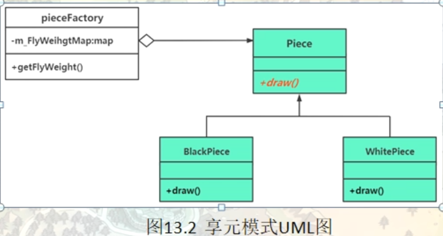

# 享元模式（Flyweight）

享元模式也被称为蝇量模式，他是一种结构型模式，解决的是面向对象的程序设计性能问题，享元：指的是被共享单元或者被共享对象。Flyweight，轻量级（让对象作用内存更少）。设计思想就是当需要某个对象时，尽量共用已经创建出的同类对象从而避免频繁创建使用new创建同类或者相似对象

在面向对象程序设计过程中，有时会面临要创建大量相同或相似对象实例的问题。创建那么多的对象将会耗费很多的系统资源，它是系统性能提高的一个瓶颈。

例如，围棋和五子棋中的黑白棋子，图像中的坐标点或颜色，局域网中的路由器、交换机和集线器，教室里的桌子和凳子等。这些对象有很多相似的地方，如果能把它们相同的部分提取出来共享，则能节省大量的系统资源，这就是享元模式的产生背景。

## 享元模式的定义与特点

享元（Flyweight）模式的定义：运用共享技术来有效地支持大量细粒度对象的复用。它通过共享已经存在的对象来大幅度减少需要创建的对象数量、避免大量相似类的开销，从而提高系统资源的利用率。

享元模式的主要优点是：相同对象只要保存一份，这降低了系统中对象的数量，从而降低了系统中细粒度对象给内存带来的压力。

其主要缺点是：

1. 为了使对象可以共享，需要将一些不能共享的状态外部化，这将增加程序的复杂性。
2. 读取享元模式的外部状态会使得运行时间稍微变长。

## 从一个典型的范例开始

#### 情景模拟：

围棋游戏棋子范例。

```c++
namespace _nmsp1
{
    enum EnumColor  // 代表棋子类型（黑棋 白棋）
    {
        Black,  // 黑棋
        Whilte // 白棋
    };
    
    struct Position // 棋子位置
    {
        int m_x;
        int m_y;
        // 构造函数
        Position(int tx, int ty) : m_x(tx), m_y(ty)
        {}
    };
    
    class Piece //  棋子类
    {
    public:
        Piece(EnumColor tc, Position ts) : m_color(tc), m_position(ts)
        {}
        
        // 绘制棋子
        void draw()
        {
            if(m_color == Black)
            {
                std::cout << "黑子落子在----[" << m_position.m_x << ", " << m_position.m_y << "]" << std::endl;
            }
            else
            {
                std::cout << "白子落子在----[" << m_position.m_x << ", " << m_position.m_y << "]" << std::endl;
            }
        }
        
    private:
        // 棋子颜色
        EnumColor m_color;
        // 棋子位置
        Position m_position;
    };
    
    
    void func()
    {
        Piece* pb1 = new Piece(Black, Position(2, 5));
        pb1->draw();
        // 黑子落子在----[2, 5]
        
        Piece* pw1 = new Piece(Whilte, Position(4, 3));
        pw1->draw();
        // 白子落子在----[4, 3]
        
        Piece* pb2 = new Piece(Black, Position(9, 4));
        pb2->draw();
        // 黑子落子在----[9, 4]
        
        Piece* pw2 = new Piece(Whilte, Position(12, 5));
        pw2->draw();
        // 白子落子在----[12, 5]
        
        
        delete pb1;
        delete pb2;
        delete pw1;
        delete pw2;
    }
}
```

试想，随着棋局的不断进行，每落下一颗子，就需要创建这么一个piece对象，程序中会创建越来越多的piece对象，而这些piece对象之间除了颜色和显示的位置不同之外，并没有什么不同。从这个角度看，就没有必要创建这么多的piece对象。如果只创建一个代表黑色棋子的piece对象和一个代表白色棋子的piece对象，那么在绘制棋子的时候，就只需要借用或者共享这两个对象，一个代表黑棋，一个代表白棋，然后在绘制的时候传递棋子位置这么一个信息。这样就可以取代上面创建越来越多的棋子对象的成本。这就是享元模式的设计思想，然后这里代表黑色棋子的piece对象和代表白色棋子的piece对象就被称为享元对象（被共享对象）

```c++
// 利用享元模式重写
namespace _nmsp2
{
    struct Position // 棋子位置
    {
        int m_x;
        int m_y;
        // 构造函数
        Position(int tx, int ty) : m_x(tx), m_y(ty)
        {}
    };
    
    // 创建棋子抽象类
    class Piece
    {
    public:
        virtual void draw(Position position) = 0;
        
        virtual ~Piece() {}
    };
    
    class BlackPiece : public Piece
    {
    public:
        virtual void draw(Position position)
        {
            std::cout << "黑子落子在----[" << position.m_x << ", " << position.m_y << "]" << std::endl;
        }
    };
    
    class WhiltePiece : public Piece
    {
    public:
        virtual void draw(Position position)
        {
            std::cout << "白子落子在----[" << position.m_x << ", " << position.m_y << "]" << std::endl;
        }
    };
    
    enum EnumColor  // 代表棋子类型（黑棋 白棋）
    {
        Black,  // 黑棋
        Whilte // 白棋
    };
    
    
    // 简单工厂类，创建棋子
    class PieceFactory
    {
    public:
        virtual ~PieceFactory()
        {
            // 释放内存
            for(auto iter = m_FlyWeightMap.begin(); iter != m_FlyWeightMap.end(); ++iter)
            {
                Piece *tmpv = iter->second;
                delete tmpv;
            }
            
            m_FlyWeightMap.clear();
        }
        
        Piece* getFlyWeight(EnumColor color)    // 获取享元对象，黑棋和白棋对象（参数告知获取什么棋子）
        {
            auto iter = m_FlyWeightMap.find(color);
            
            if (iter == m_FlyWeightMap.end())
            {
                // 第一次获取（对象还没创建出来）
                // 那这里就创建一个
                Piece* tmpv = nullptr;
                if (color == Whilte)
                {
                    tmpv = new WhiltePiece();
                }
                else if (color == Black)
                {
                    tmpv = new BlackPiece();
                }
                m_FlyWeightMap.insert({color, tmpv});
                return tmpv;
            }
            else
            {
                return iter->second;
            }
        }
        
    private:
        std::map<EnumColor, Piece*> m_FlyWeightMap; // 用map容器来保存所有的享元对象，一共就两个，黑色棋子一个，白色一个
    };
    
    
    void func()
    {
        // 先创建工厂
        PieceFactory* pieceFactory = new PieceFactory();
        
        Piece* pb1 = pieceFactory->getFlyWeight(Black);
        pb1->draw(Position(2, 12));
        // 黑子落子在----[2, 12]
        
        Piece* pw1 = pieceFactory->getFlyWeight(Whilte);
        pw1->draw(Position(9, 7));
        // 白子落子在----[9, 7]
        
        Piece* pb2 = pieceFactory->getFlyWeight(Black);
        pb2->draw(Position(6, 2));
        // 黑子落子在----[6, 2]
        
        Piece* pw2 = pieceFactory->getFlyWeight(Whilte);
        pw2->draw(Position(12, 4));
        // 白子落子在----[12, 4]
        
        // 释放资源的时候，只需要释放工厂
        delete pieceFactory;
    }
}
```


## 引入享元（Flyweight）模式

享元模式的定义提出了两个要求，细粒度和共享对象。因为要求细粒度，所以不可避免地会使对象数量多且性质相近，此时我们就将这些对象的信息分为两个部分：内部状态和外部状态。

- 内部状态指对象共享出来的信息，存储在享元信息内部，并且不回随环境的改变而改变；这种状态可以被共享
- 外部状态指对象得以依赖的一个标记，随环境的改变而改变，不可共享。比如范例中的位置属性，每个棋子的位置信息都是不一样的，这个状态信息是不可被共享的。如果我们这里把棋子颜色也作为一个外部状态来传递的话，我们甚至在范例中都不需要实现黑棋和白棋这两个对象，只需要一个piece对象


比如，连接池中的连接对象，保存在连接对象中的用户名、密码、连接URL等信息，在创建对象的时候就设置好了，不会随环境的改变而改变，这些为内部状态。而当每个连接要被回收利用时，我们需要将它标记为可用状态，这些为外部状态。

享元模式的本质是缓存共享对象，降低内存消耗。

#### 1. 模式的结构

享元模式的主要角色有如下。

1. 抽象享元角色（Flyweight）：是所有的具体享元类的基类，为具体享元规范需要实现的公共接口，非享元的外部状态以参数的形式通过方法传入。
2. 具体享元（Concrete Flyweight）角色：实现抽象享元角色中所规定的接口。
3. 非享元（Unsharable Flyweight)角色：是不可以共享的外部状态，它以参数的形式注入具体享元的相关方法中。
4. 享元工厂（Flyweight Factory）角色：负责创建和管理享元角色。当客户对象请求一个享元对象时，享元工厂检査系统中是否存在符合要求的享元对象，如果存在则提供给客户；如果不存在的话，则创建一个新的享元对象。



## 享元模式的应用场景

当系统中多处需要同一组信息时，可以把这些信息封装到一个对象中，然后对该对象进行缓存，这样，一个对象就可以提供给多出需要使用的地方，避免大量同一对象的多次创建，降低大量内存空间的消耗。

享元模式其实是 工厂方法模式 的一个改进机制，享元模式同样要求创建一个或一组对象，并且就是通过工厂方法模式生成对象的，只不过享元模式为工厂方法模式增加了缓存这一功能。

前面分析了享元模式的结构与特点，下面分析它适用的应用场景。享元模式是通过减少内存中对象的数量来节省内存空间的，所以以下几种情形适合采用享元模式。

1. 系统中存在大量相同或相似的对象，这些对象耗费大量的内存资源。
2. 大部分的对象可以按照内部状态进行分组，且可将不同部分外部化，这样每一个组只需保存一个内部状态。
3. 由于享元模式需要额外维护一个保存享元的 数据结构 ，所以应当在有足够多的享元实例时才值得使用享元模式。

不要将享元模式与 对象池，连接池，线程池混为一谈。采用池技术实现的复用主要是提高效率和节省时间。使用完的对象，放到池中，而不是通过delete来释放掉。下次需要创建新对象，新连接或者新线程的时候，就可以直接从池中取出来再次使用，而不是使用new等来重新创建对象。但是在每一时刻，池中的每个对象，连接，线程都会被每个使用者独占，额不会被多处使用。

而享元模式的复用指的是在享元对象存在期间，可以被所有使用者共享，从而达到节省内存空间的作用。