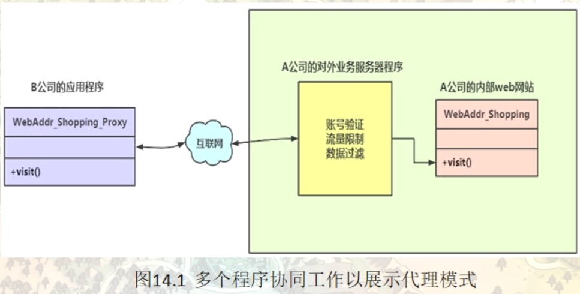
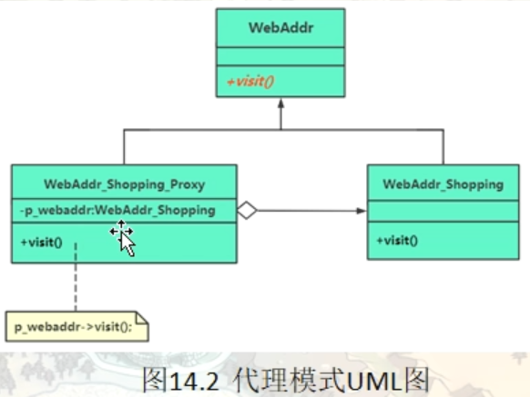

# 代理模式（Proxy）

在有些情况下，一个客户不能或者不想直接访问另一个对象，这时需要找一个中介帮忙完成某项任务，这个中介就是代理对象。例如，购买火车票不一定要去火车站买，可以通过 12306 网站或者去火车票代售点买。

在软件设计中，使用代理模式的例子也很多，例如，要访问的远程对象比较大（如视频或大图像等），其下载要花很多时间。还有因为安全原因需要屏蔽客户端直接访问真实对象，如某单位的内部数据库等。

## 代理模式的定义与特点

代理模式的定义：由于某些原因需要给某对象提供一个代理以控制对该对象的访问。这时，访问对象不适合或者不能直接引用目标对象，代理对象作为访问对象和目标对象之间的中介。

代理模式的主要优点有：

- 代理模式在客户端与目标对象之间起到一个中介作用和保护目标对象的作用；
- 代理对象可以扩展目标对象的功能；
- 代理模式能将客户端与目标对象分离，在一定程度上降低了系统的耦合度，增加了程序的可扩展性


其主要缺点是：

- 代理模式会造成系统设计中类的数量增加
- 在客户端和目标对象之间增加一个代理对象，会造成请求处理速度变慢；
- 增加了系统的复杂度；

> 那么如何解决以上提到的缺点呢？答案是可以使用动态代理方式

## 基本概念和范例

代理模式同样也是一种结构型模式，在很多不同的场合，代理模式具有很广泛的应用。引入代理模式的目的，是为客户端增加额外的功能，约束或者针对客户端的调用屏蔽一些复杂的细节问题。

通过引入一个代理类，来为原始类（被代理类）增加额外的能力，这些能力可能是新功能，新特性，新服务，也可能是一些约束或者限制

```c++
namespace _nmsp1
{
    // 创建一个基类，代表要访问的网站
    class WebAddr
    {
    public:
        virtual void visit() = 0;   // 执行访问网站的动作
        virtual ~WebAddr() {}
    };
    
    // 某个购物网站
    class WebAddr_Shopping : public WebAddr
    {
    public:
        virtual void visit()
        {
            std::cout << "访问WebAddr_Shopping购物网站" << std::endl;
        }
    };
    
    // 某个视频网站
    class WebAddr_Video : public WebAddr
    {
    public:
        virtual void visit()
        {
            std::cout << "访问WebAddr_Video视频网站" << std::endl;
        }
    };
    
    
    // 引入一个代理类，来做网站访问功能
    class WebAddrProxy : public WebAddr
    {
    public:
        // 构造函数，引入的目的是传递进来要访问的具体网站
        WebAddrProxy(WebAddr* addr):m_webaddr(addr)
        {}
        
    public:
        virtual void visit()
        {
            // 在这里进行访问的合法性检查，日志记录或者流量限制功能等代码的填充
            m_webaddr->visit();
        }
        
    private:
        WebAddr* m_webaddr; // 要访问的具体网站
    };
    
    
    // ---------------------------------------------
    // 专门针对某视频网站的代理
    class WebAddr_Video_Proxy : public WebAddr
    {
    public:
        virtual void visit()
        {
            WebAddr_Video *p_webaddr = new WebAddr_Video();
            p_webaddr->visit();
            delete p_webaddr;
        }
        
    };
    
    void func()
    {
        // 模拟浏览器访问网站
        WebAddr* addr1 = new WebAddr_Shopping();
        WebAddr* addr2 = new WebAddr_Video();
        
        addr1->visit();
        // 访问WebAddr_Shopping购物网站
        addr2->visit();
        // 访问WebAddr_Video视频网站
        
        std::cout << "---------------------------------------------" << std::endl;
        // 代理模式进行网站访问
        WebAddrProxy* proxy = new WebAddrProxy(addr1);
        
        // 通过代理进行访问
        proxy->visit();
        // 访问WebAddr_Shopping购物网站
        
        std::cout << "---------------------------------------------" << std::endl;
        WebAddr_Video_Proxy* proxyVideo = new WebAddr_Video_Proxy();
        proxyVideo->visit();
        
        // 资源回收
        delete addr2;
        delete addr1;
        delete proxy;
    }
    
}
```



## 引入代理（Proxy）模式

代理模式的结构比较简单，主要是通过定义一个继承抽象主题的代理来包含真实主题，从而实现对真实主题的访问，下面来分析其基本结构和实现方法。

#### 模式的结构

代理模式的主要角色如下。

1. 抽象主题（Subject）类：通过接口或抽象类声明真实主题和代理对象实现的业务方法。对应上面范例中的WebAddr类
2. 真实主题（Real Subject）类：实现了抽象主题中的具体业务，是代理对象所代表的真实对象，是最终要引用的对象。对应上面范例中的WebAddr_Shopping 和 WebAddr_Video类
3. 代理（Proxy）类：提供了与真实主题相同的接口，其内部含有对真实主题的引用，它可以访问、控制或扩展真实主题的功能。



## 代理模式的应用场合探究

### 代理模式常用应用场景

当无法或不想直接引用某个对象或访问某个对象存在困难时，可以通过代理对象来间接访问。使用代理模式主要有两个目的：一是保护目标对象，二是增强目标对象。

前面分析了代理模式的结构与特点，现在来分析以下的应用场景。

- 远程代理，这种方式通常是为了隐藏目标对象存在于不同地址空间的事实，方便客户端访问。例如，用户申请某些网盘空间时，会在用户的文件系统中建立一个虚拟的硬盘，用户访问虚拟硬盘时实际访问的是网盘空间。
- 虚拟代理，这种方式通常用于要创建的目标对象开销很大时。例如，下载一幅很大的图像需要很长时间，因某种计算比较复杂而短时间无法完成，这时可以先用小比例的虚拟代理替换真实的对象，消除用户对服务器慢的感觉。
- 安全代理，这种方式通常用于控制不同种类客户对真实对象的访问权限。
- 智能指引，主要用于调用目标对象时，代理附加一些额外的处理功能。例如，增加计算真实对象的引用次数的功能，这样当该对象没有被引用时，就可以自动释放它。
- 延迟加载，指为了提高系统的性能，延迟对目标的加载。例如，Hibernate 中就存在属性的延迟加载和关联表的延时加载（这个是一个java库）。
- 写时复制，string类，看成是原始字符串的代理

### 缓存/缓冲代理（Cache Proxy）一例

比如说某个文件中的内容要被多个客户端读取，代理就是通过接口将真实的文件内容读入内存，这样每个客户端再频繁的读取的时候，就不需要调用真实的接口到文件中去去，只需要通过代理接口去从缓存中取