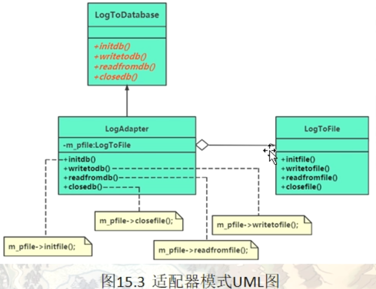
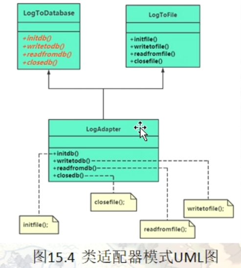

# 适配器模式（Adapter）

适配器模式属于结构型模式（别名：包装器模式）

在现实生活中，经常出现两个对象因接口不兼容而不能在一起工作的实例，这时需要第三者进行适配。例如，讲中文的人同讲英文的人对话时需要一个翻译，用直流电的笔记本电脑接交流电源时需要一个电源适配器，用计算机访问照相机的 SD 内存卡时需要一个读卡器等。

在软件设计中也可能出现：需要开发的具有某种业务功能的组件在现有的组件库中已经存在，但它们与当前系统的接口规范不兼容，如果重新开发这些组件成本又很高，这时用适配器模式能很好地解决这些问题。

## 模式的定义与特点

适配器模式（Adapter）的定义如下：将一个类的接口转换成客户希望的另外一个接口，使得原本由于接口不兼容而不能一起工作的那些类能一起工作。适配器模式分为类结构型模式和对象结构型模式两种，前者类之间的耦合度比后者高，且要求程序员了解现有组件库中的相关组件的内部结构，所以应用相对较少些。

该模式的主要优点如下。

- 客户端通过适配器可以透明地调用目标接口。
- 复用了现存的类，程序员不需要修改原有代码而重用现有的适配者类。
- 将目标类和适配者类解耦，解决了目标类和适配者类接口不一致的问题。
- 在很多业务场景中符合开闭原则。


其缺点是：

- 适配器编写过程需要结合业务场景全面考虑，可能会增加系统的复杂性。
- 增加代码阅读难度，降低代码可读性，过多使用适配器会使系统代码变得凌乱。

## 一个简单的范例

假设有如下日志类，做如下简单的日志操作

```c++
// 假设有如下日志类，做如下简单的日志操作
namespace _nmsp1
{
    // 日志文件操作相关类
    class LogFile
    {
    public:
        void inifile()
        {
            // 做日志文件初始化工作
            // 。。。
            std::cout << "做日志文件初始化工作" << std::endl;
            
        }
        
        void writeFile(const char* pcontent)
        {
            // 将日志内容写入文件
            std::cout << "将日志内容写入文件" << pcontent << std::endl;
        }
        
        void readfromfile()
        {
            // 从日志文件中读取信息
            std::cout << "从日志文件中读取信息" << std::endl;
        }
        
        void closefile()
        {
            // 关闭日志文件
            std::cout << "关闭日志文件" << std::endl;
        }
    };
    
    void func()
    {
        LogFile* _logf = new LogFile();
        _logf->inifile();
        _logf->writeFile("写日志------");
        _logf->readfromfile();
        _logf->closefile();
        
        delete _logf;
        
    }
}
```

随着项目迭代，发现这种单纯的向日志文件中记录信息可能会导致日志文件膨胀过大，所以考虑改造日志系统。将原有的把日志信息写入到文件改为将日志写入到数据库中

```c++
namespace _nmsp2
{
    // 日志文件操作相关类（数据库版本）
    class LogDatebase
    {
    public:
        void initdb()
        {
            // 数据库连接等初始化工作
            // 。。。
            
        }
        
        void writetodb(const char* pcontent)
        {
            // 将日志内容写入数据库
        }
        
        void readfromdb()
        {
            // 从日志数据库中读取信息
        }
        
        void closedb()
        {
            // 关闭数据库连接
        }
    };
    
    void func()
    {
        LogDatebase* _logd = new LogDatebase();
        _logd->initdb();
        _logd->writetodb("写日志------");
        _logd->readfromdb();
        _logd->closedb();
        
        delete _logd;
        
    }
}
```

假设某天机房断电无法从数据库中读取日志，或者要从文件中读取旧的日志信息，那么目前的这两个日志类，要么无法从数据库读，要么无法从日志文件中读。


可以考虑使用适配器模式，将LogDatabase中的接口调用适配成LogFile版本

```c++
namespace _nmsp3
{
    class LogDatebase
    {
    public:
        virtual void initdb() = 0;
        virtual void writetodb(const char* pcontent) = 0;
        virtual void readfromdb() = 0;
        virtual void closedb() = 0;
        
        virtual ~LogDatebase() {}
    };
    
    // 适配器类 （注意这里适配器类中构造函数的形参）
    class LogAdapter : public LogDatebase
    {
    public:
        // 构造函数
        LogAdapter(_nmsp1::LogFile* pfile) : m_logfile(pfile)  // 形参是老接口所属的类指针
        {}
        
        virtual void initdb()
        {
            m_logfile->inifile();
        }
        
        virtual void writetodb(const char* pcontent)
        {
            m_logfile->writeFile(pcontent);
        }
        
        virtual void readfromdb()
        {
            m_logfile->readfromfile();
        }
        
        virtual void closedb()
        {
            m_logfile->closefile();
        }
        
        
    private:
        _nmsp1::LogFile* m_logfile;
    };
    
    void func()
    {
        _nmsp1::LogFile* lof = new _nmsp1::LogFile();
        LogDatebase* _logd = new LogAdapter(lof);
        _logd->initdb();
        // 做日志文件初始化工作
        _logd->writetodb("写日志------");
        // 将日志内容写入文件写日志------
        _logd->readfromdb();
        // 从日志文件中读取信息
        _logd->closedb();
        // 关闭日志文件
        
        delete _logd;
    }
}

```


## 引入适配器（Adapter）模式

### 模式的结构与实现

类适配器模式可采用多重继承方式实现，如 C++  可定义一个适配器类来同时继承当前系统的业务接口和现有组件库中已经存在的组件接口；Java  不支持多继承，但可以定义一个适配器类来实现当前系统的业务接口，同时又继承现有组件库中已经存在的组件。

对象适配器模式可釆用将现有组件库中已经实现的组件引入适配器类中，该类同时实现当前系统的业务接口。现在来介绍它们的基本结构。

#### 模式的结构

适配器模式（Adapter）包含以下主要角色。

1. 目标（Target）接口：当前系统业务所期待的接口，它可以是抽象类或接口。这里指的就是范例中的LogDatabase类
2. 适配者（Adaptee）类：它是被访问和适配的现存组件库中的组件接口。这里对应范例中的旧日志类（LogFile)类
3. 适配器（Adapter）类：它是一个转换器，通过继承或引用适配者的对象，把适配者接口转换成目标接口，让客户按目标接口的格式访问适配者。这里对应范例中的LogAdaper类



## 类适配器

适配器依据使用方式不同，分为两种。一种类适配器，一种对象适配器，上面讲到的是对象适配器。对象适配器的实现关系是类与类之间的组合关系（一个类定义中包含着其他类类型的成员变量），这种关系实现了委托机制，成员函数把功能的实现委托给其他的类型函数。而类适配器是一种类与类之间的继承关系。

当然，从使用上来讲，不提倡使用类适配器，类适配没有对象适配器灵活。因为本身private这种继承机制，他就限制了基类的接口访问权限

````c++
// 实现类适配器
namespace _nmsp4
{
    class LogDatebase
    {
    public:
        virtual void initdb() = 0;
        virtual void writetodb(const char* pcontent) = 0;
        virtual void readfromdb() = 0;
        virtual void closedb() = 0;
        
        virtual ~LogDatebase() {}
    };
    
    // 类适配器
    // 共有继承新接口，私有继承旧接口
    // 这里公有继承时一个is a关系，也就是通过public继承的子类对象他也一定是一个父类对象
    // 私有继承他是一种组合关系，这里的private继承就是指想通过LogFile这个类来实现出LogAdapter这个类的意思
    // 某些类适配器的实现中不会用private继承（这种其实严格上来说，是不严谨的）
    class LogAdapter : public LogDatebase, private _nmsp1::LogFile
    {
    public:
        // 构造函数
        LogAdapter()  // 形参是老接口所属的类指针
        {}
        
        virtual void initdb()
        {
            inifile();
        }
        
        virtual void writetodb(const char* pcontent)
        {
            writeFile(pcontent);
        }
        
        virtual void readfromdb()
        {
            readfromfile();
        }
        
        virtual void closedb()
        {
            closefile();
        }
    };
    
    void func()
    {
        LogAdapter* _logd = new LogAdapter();
        _logd->initdb();
        // 做日志文件初始化工作
        _logd->writetodb("写日志------");
        // 将日志内容写入文件写日志------
        _logd->readfromdb();
        // 从日志文件中读取信息
        _logd->closedb();
        // 关闭日志文件
        
        delete _logd;
    }
}
````



## 适配器模式的扩展运用

适配器模式（Adapter）通常适用于以下场景。

- 以前开发的系统存在满足新系统功能需求的类，但其接口同新系统的接口不一致。
- 使用第三方提供的组件，但组件接口定义和自己要求的接口定义不同。