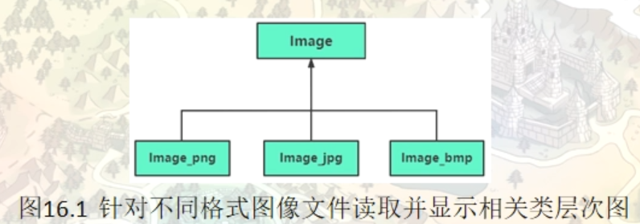
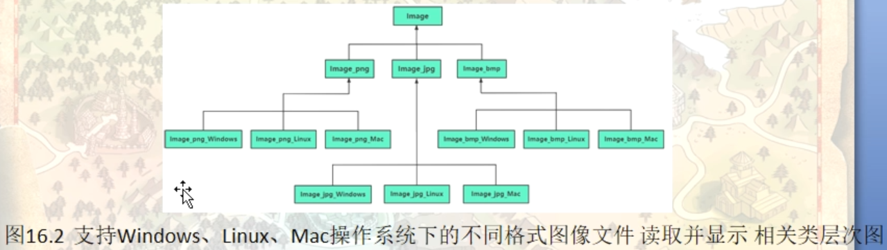
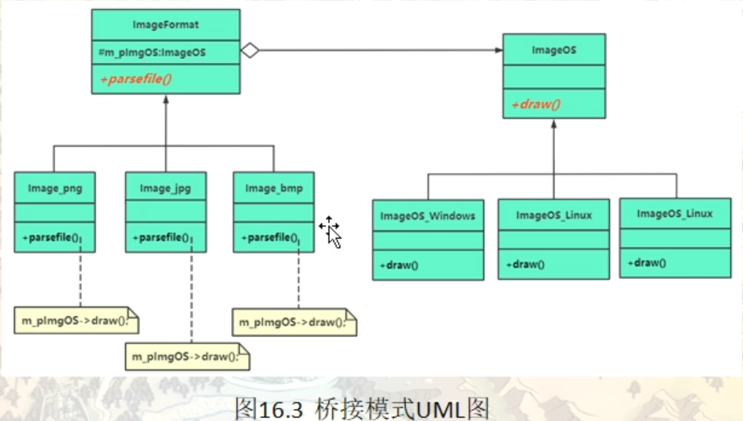
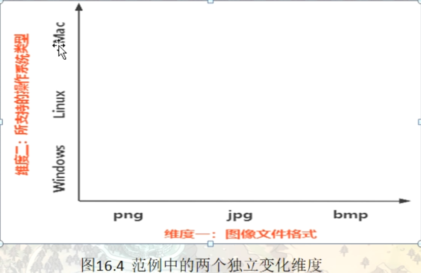

# 桥接模式（Bridge）

桥接模式也称桥梁模式，简称桥模式，是一种结构型模式。它解决的问题就是：根据单一职责原则，在一个类中，不要做太多事情，如果事情很多，尽量拆分到多个类中去实现。然后在一个类中包含指向另外一个类对象的指针，当需要执行另外一个类中的动作时，用指针直接去调用另外一个类中的成员函数。

在现实生活中，某些类具有两个或多个维度的变化，如图形既可按形状分，又可按颜色分。如何设计类似于 Photoshop 这样的软件，能画不同形状和不同颜色的图形呢？如果用继承方式，m 种形状和 n 种颜色的图形就有 m×n 种，不但对应的子类很多，而且扩展困难。

当然，这样的例子还有很多，如不同颜色和字体的文字、不同品牌和功率的汽车、不同性别和职业的男女、支持不同平台和不同文件格式的媒体播放器等。如果用桥接模式就能很好地解决这些问题。

## 桥接模式的定义与特点

桥接（Bridge）模式的定义如下：将抽象与实现分离，使它们可以独立变化。它是用组合关系代替继承关系来实现，从而降低了抽象和实现这两个可变维度的耦合度。

通过上面的讲解，我们能很好的感觉到桥接模式遵循了里氏替换原则和依赖倒置原则，最终实现了开闭原则，对修改关闭，对扩展开放。这里将桥接模式的优缺点总结如下。

桥接（Bridge）模式的优点是：

- 抽象与实现分离，扩展能力强
- 符合开闭原则
- 符合合成复用原则
- 其实现细节对客户透明


缺点是：由于聚合关系建立在抽象层，要求开发者针对抽象化进行设计与编程，能正确地识别出系统中两个独立变化的维度，这增加了系统的理解与设计难度。

## 一个传统的继承范例导致子类数量爆炸式增长

#### 情景模拟

图像文件有多种格式：png,jpg，svg等。现在需要做的事就是将这些不同格式的图像文件读出来，读成统一的格式，然后把图像显示出来

```c++
namespace _nmsp1
{
    // 图像显示类
    class Image
    {
    public:
        // 根据pDate（缓冲区）中的内容以及iDtatalen所指示的缓冲区的长度，将这些数据显示出来
        void draw(const char* pfilename)
        {
            int iLen = 0;
            char *pdata = parsefile(pfilename, iLen);
            if(iLen > 0)
            {
                std::cout << "显示pData所指向的缓冲区的图像数据" << std::endl;
                // 。。。
                delete pdata;
                // 模拟代码中 因为pdata的内存是new出来的，所以这里需要进行内存释放
            }
        }
        
        virtual ~Image() {}
        
    private:
        // 根据文件名分析文件内容，每个子类因为图像文件格式不同，所以会有不同的读取和处理代码
        virtual char* parsefile(const char* pfilename, int& iLen) = 0;
    };
    
    // png 图像格式处理类
    class Image_png : public Image
    {
    private:
        // 读取png文件内容并进行解析,最终整理成统一的二进制数据格式返回
        virtual char* parsefile(const char* pfilename, int& iLen)
        {
            // 以下是模拟代码，模拟从文件中取得数据，然后最终转换得到了100字节的数据格式（事先约定好的规范）
            std::cout << "开始分析png文件中的数据，并将分析结果放到pData中" << std::endl;
            iLen = 100;
            char* presult = new char[iLen];
            // ...
            return presult;
        }
    };
    
    // jpg 图像格式处理类
    class Image_jpg : public Image
    {
    private:
        // 读取jpg文件内容并进行解析,最终整理成统一的二进制数据格式返回
        virtual char* parsefile(const char* pfilename, int& iLen)
        {
            // 以下是模拟代码，模拟从文件中取得数据，然后最终转换得到了100字节的数据格式（事先约定好的规范）
            std::cout << "开始分析jpg文件中的数据，并将分析结果放到pData中" << std::endl;
            iLen = 100;
            char* presult = new char[iLen];
            // ...
            return presult;
        }
    };
    
    // svg 图像格式处理类
    class Image_svg : public Image
    {
    private:
        // 读取svg文件内容并进行解析,最终整理成统一的二进制数据格式返回
        virtual char* parsefile(const char* pfilename, int& iLen)
        {
            // 以下是模拟代码，模拟从文件中取得数据，然后最终转换得到了100字节的数据格式（事先约定好的规范）
            std::cout << "开始分析svg文件中的数据，并将分析结果放到pData中" << std::endl;
            iLen = 100;
            char* presult = new char[iLen];
            // ...
            return presult;
        }
    };
    
    void func()
    {
        Image* pngObj = new Image_png();
        pngObj->draw("c::\\somedir\\png\\pic1.png");
        // 开始分析png文件中的数�，并将分析结果放到pData中
        // 显示pData所指向的缓冲区的图像数据
        
        // 释放资源
        delete pngObj;
    }
}
```



假设现在有一个新的需求，该程序需要放在不同的平台下进行图像绘制，因为不同的平台绘制图像的接口不一样，所以就可能会产生如下图所示的类关系图。所以从这个图中 可以看到，如果是采用继承结构来进行类的设计，那么扩展性将会受到严重限制（比如新增一个对操作系统的支持，或者新增一个对图像文件格式的支持，都会导致类数量的急剧增长）



## 将类与类之间的关系改为委托关系

类与类之间的关系一般有： 继承 和 组合关系。组合关系还可以细分出一种关系，叫做委托关系。

目前我们支持的文件类型是 ： png, svg, jpg，然后我们支持的操作系统是：windows, liunx, macos

有两点说明：（该说明是我们能够改造成委托关系的前提）

- parsefile：首先这个成员函数，我们设定给他的功能是，用来从各种格式的图像文件中读取数据并放入到一个缓冲区当中。这个函数他里面的实现代码我们设定的是与操作系统无关。
- draw：这个成员函数，我们设定的功能是用来显示pdata中的图像，他的显示（或者说图像绘制功能）实现代码与操作系统有关，不同的操作系统实现方式和调用接口不一样

所以从上面的分析可以看到，我们其实没必要将图像格式和操作系统这两个事掺和到一起，进行类的设计。这种设计其实是违法了单一职责原则的。我们可以把图像格式（png, svg, jpg）的单独设计成一个继承关系类。在其中实现parsefile这个成员函数，因为这个成员函数与操作系统无关，只和文件格式有关。然后另一方面我们把操作系统也单独设计成一个类，在其中实现draw这个成员函数。这样图像格式是一个类层次，操作系统是一个类层次，不管我们拓展操作系统还是拓展文件格式都不会影响另外一个层次

```c++
namespace _nmsp2
{
    // 操作系统类型相关抽象类
    class ImageOS
    {
    public:
        virtual void draw(char* pdata, int iLen) = 0;
        
        virtual ~ImageOS() {};
    };
    
    // windows操作系统
    class ImageOS_Windows : public ImageOS
    {
    public:
        virtual void draw(char* pdata, int iLen)
        {
            std::cout << "windows下进行图像绘制，绘制pdata指向的缓冲区图像...." << std::endl;
        }
    };
    
    // linux操作系统
    class ImageOS_Linux : public ImageOS
    {
    public:
        virtual void draw(char* pdata, int iLen)
        {
            std::cout << "linux下进行图像绘制，绘制pdata指向的缓冲区图像...." << std::endl;
        }
    };
    
    // mac操作系统
    class ImageOS_Mac : public ImageOS
    {
    public:
        virtual void draw(char* pdata, int iLen)
        {
            std::cout << "mac下进行图像绘制，绘制pdata指向的缓冲区图像...." << std::endl;
        }
    };
    
    // 图像文件格式抽象类
    class ImageFornat
    {
    public:
        ImageFornat(ImageOS* pos):m_pImgOS(pos)
        {}
        
        virtual void parsefile(const char* pfilename) = 0;
        // 根据文件名分析文件内容，每个文件因为文件格式不同，所以需要做不同的文件处理
        
        virtual ~ImageFornat() {}
        
    protected:
        ImageOS* m_pImgOS; // 委托
    };
    
    // png 格式图像文件
    class Image_png : public ImageFornat
    {
    public:
        Image_png(ImageOS* os) : ImageFornat(os)
        {}
        
        virtual void parsefile(const char* pfilename)
        {
            // 以下是模拟代码，模拟从文件中取得数据，然后最终转换得到了100字节的数据格式（事先约定好的规范）
            std::cout << "开始分析png文件中的数据，并将分析结果放到pData中" << std::endl;
            int iLen = 100;
            char* presult = new char[iLen];
            m_pImgOS->draw(presult, iLen);
            // ...
            delete presult;
        }
    };
    
    
    // jpg 格式图像文件
    class Image_jpg : public ImageFornat
    {
    public:
        Image_jpg(ImageOS* os) : ImageFornat(os)
        {}
        
        virtual void parsefile(const char* pfilename)
        {
            // 以下是模拟代码，模拟从文件中取得数据，然后最终转换得到了100字节的数据格式（事先约定好的规范）
            std::cout << "开始分析JPG文件中的数据，并将分析结果放到pData中" << std::endl;
            int iLen = 100;
            char* presult = new char[iLen];
            m_pImgOS->draw(presult, iLen);
            // ...
            delete presult;
        }
    };
    
    // svg 格式图像文件
    class Image_svg : public ImageFornat
    {
    public:
        Image_svg(ImageOS* os) : ImageFornat(os)
        {}
        
        virtual void parsefile(const char* pfilename)
        {
            // 以下是模拟代码，模拟从文件中取得数据，然后最终转换得到了100字节的数据格式（事先约定好的规范）
            std::cout << "开始分析SVG文件中的数据，并将分析结果放到pData中" << std::endl;
            int iLen = 100;
            char* presult = new char[iLen];
            m_pImgOS->draw(presult, iLen);
            // ...
            delete presult;
        }
    };
    
    void func()
    {
        // 针对windows操作系统
        ImageOS* osWindows = new ImageOS_Windows();
        // 运行时把图像文件格式png和操作系统动态组合到一起
        ImageFornat* pngImage = new Image_png(osWindows);
        pngImage->parsefile("c::\\somedir\\png\\pic1.png");
        
        // 开始分析png文件中的数据，并�分析结果放到pData中
        // windows下进行图像绘制，绘制pdata指向的缓冲区图像....
        
        delete pngImage;
        delete osWindows;
    }
}
```



比如上面使用继承的，如果要新增一个图片格式（gif）,那么就需要新增4个类（gif + windowsgif + linuxgif + macgif），而如果采用了桥接模式，下面的这种实现方式，新增一个文件格式的支持，就只需要新增一个类，在ImageFormat下新增一个Image_Gif类即可。这样就避免了新增需求导致的继承关系的爆炸式类数量增长。



不同维度的独立变化才是能够顺利使用桥接模式的前提

## 引入桥接（Bridge）模式

可以将抽象化部分与实现化部分分开，取消二者的继承关系，改用组合关系。

将抽象部分与它的具体实现部分分离，使得他们都可以独立的变化和扩展

#### 模式的结构

桥接（Bridge）模式包含以下主要角色。

1. 抽象化（Abstraction）角色：定义抽象类，并包含一个对实现化对象的引用。对应我们范例中的ImageFornat类
2. 扩展抽象化（Refined Abstraction）角色：是抽象化角色的子类，实现父类中的业务方法，并通过组合关系调用实现化角色中的业务方法。对应我们范例中的 Image_Png, Image_Svg, Image_Jpg这3个类
3. 实现化（Implementor）角色：定义实现化角色的接口，供扩展抽象化角色调用。对应我们范例中的ImageOS类。
4. 具体实现化（Concrete Implementor）角色：给出实现化角色接口的具体实现。对应我们范例中的ImageOS_Windows, ImageOS_Linux,ImageOS_Mac这三个类

## 桥接模式的应用场景

当一个类内部具备两种或多种变化维度时，使用桥接模式可以解耦这些变化的维度，使高层代码架构稳定。

桥接模式通常适用于以下场景。

1. 当一个类存在两个独立变化的维度，且这两个维度都需要进行扩展时。
2. 当一个系统不希望使用继承或因为多层次继承导致系统类的个数急剧增加时。
3. 当一个系统需要在构件的抽象化角色和具体化角色之间增加更多的灵活性时。


桥接模式的一个常见使用场景就是替换继承。我们知道，继承拥有很多优点，比如，抽象、封装、多态等，父类封装共性，子类实现特性。继承可以很好的实现代码复用（封装）的功能，但这也是继承的一大缺点。

因为父类拥有的方法，子类也会继承得到，无论子类需不需要，这说明继承具备强侵入性（父类代码侵入子类），同时会导致子类臃肿。因此，在 设计模式 中，有一个原则为优先使用组合/聚合，而不是继承。


很多时候，我们分不清该使用继承还是组合/聚合或其他方式等，其实可以从现实语义进行思考。因为软件最终还是提供给现实生活中的人使用的，是服务于人类社会的，软件是具备现实场景的。当我们从纯代码角度无法看清问题时，现实角度可能会提供更加开阔的思路。