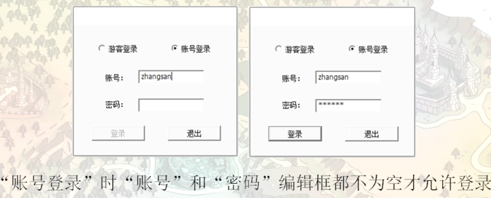
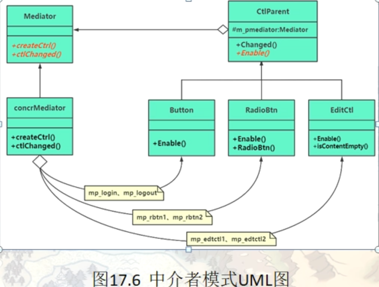

# 中介者模式（Mediator）

中介者模式也称为调停者模式。

在现实生活中，常常会出现好多对象之间存在复杂的交互关系，这种交互关系常常是“网状结构”，它要求每个对象都必须知道它需要交互的对象。例如，每个人必须记住他（她）所有朋友的电话；而且，朋友中如果有人的电话修改了，他（她）必须让其他所有的朋友一起修改，这叫作“牵一发而动全身”，非常复杂。

如果把这种“网状结构”改为“星形结构”的话，将大大降低它们之间的“耦合性”，这时只要找一个“中介者”就可以了。如前面所说的“每个人必须记住所有朋友电话”的问题，只要在网上建立一个每个朋友都可以访问的“通信录”就解决了。这样的例子还有很多，例如，你刚刚参加工作想租房，可以找“房屋中介”；或者，自己刚刚到一个陌生城市找工作，可以找“人才交流中心”帮忙。

在软件的开发过程中，这样的例子也很多，例如，在 MVC 框架中，控制器（C）就是模型（M）和视图（V）的中介者；还有大家常用的 QQ 聊天程序的“中介者”是 QQ 服务器。所有这些，都可以采用“中介者模式”来实现，它将大大降低对象之间的耦合性，提高系统的灵活性。

## 中介者模式基本概念

中介者（Mediator）模式的定义：定义一个中介对象来封装一系列对象之间的交互，使原有对象之间的耦合松散，且可以独立地改变它们之间的交互。中介者模式又叫调停模式，它是迪米特法则的典型应用。

中介者模式是一种对象行为型模式，其主要优点如下。

1. 类之间各司其职，符合迪米特法则。
2. 降低了对象之间的耦合性，使得对象易于独立地被复用。
3. 将对象间的多对多关联转变为一对多的关联，提高系统的灵活性，使得系统易于维护和扩展。


其主要缺点是：中介者模式将原本多个对象直接的相互依赖变成了中介者和多个同事类的依赖关系。当同事类越多时，中介者就会越臃肿，变得复杂且难以维护。所以在使用中介者模式的时候，要平衡好同事对象之间的交互复杂度和中介者模式实现复杂度，然后在决定是否使用中介者模式。

## 中介者模式范例引入

#### 需求如下

登录界面有 游客登录 账号登录，二者只能选其一进行登录，当选择游客登录时，账号 和 密码输入框 禁用。同时登录按钮开启，当选择账号登录时，账号和密码输入框启用，同时账号和密码都不为空的时候，，登录按钮才开启，不然任意一个为空，都禁用登录按钮，退出按钮始终开启可点击

```c++
namespace _nmsp1
{
    // UI控件的父类
    class CtlParent
    {
    public:
        CtlParent(string caption):m_caption(caption)
        {}
        
        virtual ~CtlParent() {}
        
    public:
        // 单UI控件发生变化时，该函数会被调用
        virtual void Change(std::map<string, CtlParent*>& tmpctlList) = 0;
        // 形参map中包含所有对话框中所涉及的UI控件
        
        // 设置UI控件 启用或者禁用
        virtual void Enable(bool sign) = 0;
        
    protected:
        string m_caption;   // 控件上面显示的文字内容
    };
    
    // 普通按钮相关类
    class Button : public CtlParent
    {
    public:
        Button(string caption):CtlParent(caption) {}
        
        // 设置按钮 启用或者禁用
        virtual void Enable(bool sign)
        {
            if(sign == true)
            {
                std::cout << "按钮 [" << m_caption << "]  以被启用" << std::endl;
            }
            else
            {
                std::cout << "按钮 [" << m_caption << "]  以被禁用" << std::endl;
            }
        }
        
        // 按钮被点击时 该函数会被调用
        virtual void Change(std::map<string, CtlParent*>& tmpctlList);
    };
    
    // 单选按钮相关类
    class Radio : public CtlParent
    {
    public:
        Radio(string caption):CtlParent(caption) {}
        
        // 设置单选按钮 启用或者禁用
        virtual void Enable(bool sign)
        {
            // 单选按钮用到禁用和启用
        }
        
        // 设置单选按钮被选中或者取消时的回调函数
        void Selected(bool sign)
        {
            if(sign == true)
            {
                std::cout << "单选按钮 [" << m_caption << "]  被选中" << std::endl;
            }
            else
            {
                std::cout << "单选按钮 [" << m_caption << "]  被禁用" << std::endl;
            }
        }
        
        // 单选按钮被点击时 该函数会被调用
        virtual void Change(std::map<string, CtlParent*>& tmpctlList);
    };
    
    // 输入框相关类
    class EditCtl : public CtlParent
    {
    public:
        EditCtl(string caption):CtlParent(caption) {}
        
        // 设置输入框 启用或者禁用
        virtual void Enable(bool sign)
        {
            if(sign == true)
            {
                std::cout << "输入框 [" << m_caption << "]  以被启用" << std::endl;
            }
            else
            {
                std::cout << "输入框 [" << m_caption << "]  以被禁用" << std::endl;
            }
        }
        
        // 编辑框中的内容是否为空
        bool isContentEmpty()
        {
            return m_content.empty();
        }
        
        // 编辑框中的内容发生变化时 该函数会被调用
        virtual void Change(std::map<string, CtlParent*>& tmpctlList);
        
    private:
        string m_content;       // 输入框中的内容
    };
    
    // ----------------------------------------
    // 按钮 change
    void Button::Change(std::map<string, CtlParent*>& tmpctlList)
    {
        if(m_caption == "login") // 登录按钮
        {
            std::cout << "登录中......." << std::endl;
        }
        else if(m_caption == "exit") // 退出按钮
        {
            std::cout << "退出游戏！" << std::endl;
        }
    }
    
    // 单选按钮 change
    void Radio::Change(std::map<string, CtlParent*>& tmpctlList)
    {
        if(m_caption == "visiter")    // 游客登录
        {
            (static_cast<Radio*>(tmpctlList["visiter"]))->Selected(true);   // 游客登录单选按钮被选中
            (static_cast<Radio*>(tmpctlList["count"]))->Selected(false);    // 账号登录单选按钮被禁用
        
            tmpctlList["username"]->Enable(false);  // 账号输入框被禁用
            tmpctlList["password"]->Enable(false);  // 密码输入框被禁用
            
            tmpctlList["login"]->Enable(true);      // 登录按钮设置启用
            tmpctlList["exit"]->Enable(true);       // 退出按钮设置启用
            
        }
        else if(m_caption == "count")    // 账号登录
        {
            (static_cast<Radio*>(tmpctlList["visiter"]))->Selected(false);   // 游客登录单选按钮被禁用
            (static_cast<Radio*>(tmpctlList["count"]))->Selected(true);    // 账号登录单选按钮被选中
        
            tmpctlList["username"]->Enable(true);  // 账号输入框被启用
            tmpctlList["password"]->Enable(true);  // 密码输入框被启用
            
            // 判断账密是否输入
            if(static_cast<EditCtl*>(tmpctlList["username"])->isContentEmpty() || static_cast<EditCtl*>(tmpctlList["password"])->isContentEmpty())
            {
                // 账号密码为空
                tmpctlList["login"]->Enable(false);      // 登录按钮设置禁用
            }
            else
            {
                tmpctlList["login"]->Enable(true);      // 登录按钮设置启用
            }
            tmpctlList["exit"]->Enable(true);       // 退出按钮设置启用
        }
    }
    
    // 编辑框 change
    void EditCtl::Change(std::map<string, CtlParent*>& tmpctlList)
    {
        // 判断账密是否输入
        if(static_cast<EditCtl*>(tmpctlList["username"])->isContentEmpty() || static_cast<EditCtl*>(tmpctlList["password"])->isContentEmpty())
        {
            // 账号密码为空
            tmpctlList["login"]->Enable(false);      // 登录按钮设置禁用
        }
        else
        {
            tmpctlList["login"]->Enable(true);      // 登录按钮设置启用
        }
    }
    
    void func()
    {
        // 创建各种控件
        CtlParent* visiterRadio = new Radio("visiter");
        CtlParent* countRadio = new Radio("count");
        CtlParent* usernameInput = new EditCtl("username");
        CtlParent* passwordInput = new EditCtl("password");
        CtlParent* loginBtn = new Button("login");
        CtlParent* exitBtn = new Button("exit");
        
        std::map<string, CtlParent*> uiCtlList;
        
        // 将所有创建的UI控件保存到map容器中
        uiCtlList["visiter"] = visiterRadio;
        uiCtlList["count"] = countRadio;
        uiCtlList["username"] = usernameInput;
        uiCtlList["password"] = passwordInput;
        uiCtlList["login"] = loginBtn;
        uiCtlList["exit"] = exitBtn;
        
        // 默认情况下UI状态
        (static_cast<Radio*>(uiCtlList["visiter"]))->Selected(true);
        (static_cast<Radio*>(uiCtlList["count"]))->Selected(false);
        
        uiCtlList["username"]->Enable(false);
        uiCtlList["password"]->Enable(false);
        
        uiCtlList["login"]->Enable(true);
        uiCtlList["exit"]->Enable(true);
        
        // 单选按钮 [visiter]  被选中
        // 单选按钮 [count]  被禁用
        // 输入框 [username]  以被禁用
        // 输入框 [password]  以被禁用
        // 按钮 [login]  以被启用
        // 按钮 [exit]  以被启用
        
        std::cout << "------- 模拟点击【账号登录】按钮 -------" << std::endl;
        uiCtlList["count"]->Change(uiCtlList);
        // 单选按钮 [visiter]  被禁用
        // 单选按钮 [count]  被选中
        // 输入框 [username]  以被启用
        // 输入框 [password]  以被启用
        // 按钮 [login]  以被禁用
        // 按钮 [exit]  以被启用
        
        
        // 释放资源
        for(auto iter = uiCtlList.begin(); iter != uiCtlList.end(); ++iter)
        {
            delete iter->second;
            iter->second = nullptr;
        }
    }
}
```

上面这个范例就是典型的网状设计，每个控件在发生改变的时候，直接与其他ui控件进行逻辑交互。这个时候，我们可以引入一个中介者类。由中介者来控制和协调一组对象的交互，每个对象不需要知道其他对象的存在，只需要知道中介者的存在，与中介者打交道即可。



```c++
namespace _nmsp2
{
    // 类前向申明
    class CtlParent;
    
    // 中介者抽象父类
    class Mediator
    {
    public:
        virtual ~Mediator() {}
    public:
        virtual void createCtrl() = 0;  // 用来创建所有需要用到的控件
        virtual void ctlChange(CtlParent* ctl) = 0;
        // 单某个UI控件发生变化时，调用中介者对象的该成员函数来通知调用中介者
    };
    
    // ----------------------------------------
    
    // 定义UI控件抽象类
    class CtlParent
    {
    public:
        CtlParent(Mediator* mediator, string name) : m_pMediator(mediator), m_caption(name)
        {}
        
        virtual ~CtlParent() {}
        
    public:
        // 当UI控件发生变化时，该成员函数会被调用
        virtual void Change()
        {
            m_pMediator->ctlChange(this);   // 通知中介者对象，把所有事情交给中介者去做
        }
        
        // 设置UI控件的启用或者禁用
        virtual void Enable(bool sign) = 0;
        
    protected:
        Mediator* m_pMediator;  // 指向中介者对象的指针
        string m_caption;   // 控件名
    };
    
    // ----------------------------------------
    
    // 普通按钮相关类
    class Button : public CtlParent
    {
    public:
        Button(Mediator* ctl, string name):CtlParent(ctl, name)
        {}
        
    public:
        // 设置按钮启用或者禁用
        virtual void Enable(bool sign)
        {
            if(sign == true)
            {
                std::cout << "按钮 [" << m_caption << "] 以被启用" << std::endl;
            }
            else
            {
                std::cout << "按钮 [" << m_caption << "] 以被禁用" << std::endl;
            }
        }
        
    };
    
    // 单选按钮相关类
    class Radio : public CtlParent
    {
    public:
        Radio(Mediator* ctl, string name):CtlParent(ctl, name)
        {}
        
    public:
        // 设置按钮启用或者禁用
        virtual void Enable(bool sign)
        {}
        
        // 设置单选按钮的选中或者取消选中状态
        void Selected(bool sign)
        {
            if(sign == true)
            {
                std::cout << "单选按钮 [" << m_caption << "] 以被选中" << std::endl;
            }
            else
            {
                std::cout << "单选按钮 [" << m_caption << "] 被取消选中" << std::endl;
            }
        }
        
    };
    
    // 编辑框相关类
    class EditCtl : public CtlParent
    {
    public:
        EditCtl(Mediator* ctl, string name):CtlParent(ctl, name)
        {}
        
    public:
        // 设置编辑框启用或者禁用
        virtual void Enable(bool sign)
        {
            if(sign == true)
            {
                std::cout << "输入框 [" << m_caption << "] 以被启用" << std::endl;
            }
            else
            {
                std::cout << "输入框 [" << m_caption << "] 以被禁用" << std::endl;
            }
        }
        
        // 判断输入框内容是否为空
        bool isContentEmpty()
        {
            return m_content.empty();
        }
        
    private:
        string m_content;   // 输入框中的内容
        
    };
    
    // ----------------------------------------
    
    // 具体中介者类（当然这个中介者类不是必须有的，这里范例里为了中介者模式的完整性演示，把这个加上）
    class  ConcreMediator : public Mediator
    {
    public:
        ~ConcreMediator()
        {
            if(loginBtn) {delete loginBtn; loginBtn = nullptr;}
            if(exitBtn) {delete exitBtn; exitBtn = nullptr;}
            if(visiterRadio) {delete visiterRadio; visiterRadio = nullptr;}
            if(accountRadio) {delete accountRadio; accountRadio = nullptr;}
            if(usernameInput) {delete usernameInput; usernameInput = nullptr;}
            if(passwordInput) {delete passwordInput; passwordInput = nullptr;}
        }
    
        virtual void createCtrl()
        {
            // 当然，你不在这里创建也行，在main中创建也可以
            loginBtn = new Button(this, "login");
            exitBtn = new Button(this, "exit");
            
            visiterRadio = new Radio(this, "visiter");
            accountRadio = new Radio(this, "account");
            
            usernameInput = new EditCtl(this, "username");
            passwordInput = new EditCtl(this, "password");
            
            // 初始化缺省的 ui空间状态
            std::cout << "---------------------登录页面初始化-------------------" << std::endl;
            visiterRadio->Selected(true);   // 游客模式选中
            accountRadio->Selected(false);  // 账户模式取消选中
            
            usernameInput->Enable(false);   // 账户输入框禁用
            passwordInput->Enable(false);   // 密码输入框禁用
            
            loginBtn->Enable(true); // 登录按钮启用
            exitBtn->Enable(true);  // 退出按钮启用
        }
        
        virtual void ctlChange(CtlParent* p_ctrl)
        {
            if(p_ctrl == loginBtn)  // 登录按钮被点击
            {
                std::cout << "登录中...." << std::endl;
            }
            else if(p_ctrl == exitBtn)  // 退出按钮被点击
            {
                std::cout << "退出..." << std::endl;
            }
            
            if(p_ctrl == visiterRadio)  // 游客模式
            {
                (static_cast<Radio*>(p_ctrl))->Selected(true);
                accountRadio->Selected(false);
                
                usernameInput->Enable(false);
                passwordInput->Enable(false);
                
                loginBtn->Enable(true);
            }
            else if(p_ctrl == accountRadio) // 账户模式
            {
                // p_ctrl->Selected(true);  //注意这里 抽象类中没有Selected成员函数，要么用类型装换，要么直接用子类成员指针
                accountRadio->Selected(true);
                visiterRadio->Selected(false);
                
                usernameInput->Enable(true);
                passwordInput->Enable(true);
                
                loginBtn->Enable(!(usernameInput->isContentEmpty() || passwordInput->isContentEmpty()));
            }
            
            if(p_ctrl == usernameInput || p_ctrl == passwordInput) // 账户 / 密码 输入框
            {
                loginBtn->Enable(!(usernameInput->isContentEmpty() || passwordInput->isContentEmpty()));
            }
        }
        
    // 这里成员变量写为public修饰（只是为了方便演示，实际项目中可以根据需要改为private修饰，然后通过成员函数进行返回）
    public:
        Button* loginBtn = nullptr;    // 登录按钮
        Button* exitBtn = nullptr;    // 退出按钮
        
        Radio* visiterRadio = nullptr;  // 游客模式单选按钮
        Radio* accountRadio = nullptr;  // 账户模式单选按钮
        
        EditCtl* usernameInput = nullptr;   // 账户输入框
        EditCtl* passwordInput = nullptr;   // 密码输入框
        
    };
    
    // ----------------------------------------
    
    void func()
    {
        ConcreMediator mymedia;
        mymedia.createCtrl();
        // ---------------------登录页面初始化-------------------
        // ��选按钮 [visiter] 以被选中
        // 单选按钮 [account] 被取消选中
        // 输入框 [username] 以被禁用
        // 输入框 [password] 以被禁用
        // 按钮 [login] 以被启用
        // 按钮 [exit] 以被启用
        
        std::cout << "---------------------账户登录被选中时-------------------" << std::endl;
        mymedia.accountRadio->Change();
        // ---------------------账户登录被选中时-------------------
        // 单选按钮 [account] 以被选中
        // 单选按钮 [visiter] 被取消选中
        // 输入框 [username] 以被启用
        // 输入框 [password] 以被启用
        // 按钮 [login] 以被禁用
    }
}
```

所有核心的处理逻辑代码都在中介者类中，中介者类中有所有控件对象的指针，中介者可以通过这些指针来调用这些UI控件的成员函数

## 中介者（Mediator）模式

中介者模式实现的关键是找出“中介者”，下面对它的结构和实现进行分析。

#### 模式的结构

中介者模式包含以下主要角色。

1. 抽象中介者（Mediator）角色：它是中介者的接口，提供了同事对象注册与转发同事对象信息的抽象方法。指的就是范例代码中的Mediator类
2. 具体中介者（Concrete Mediator）角色：实现中介者接口，定义一个 List 来管理同事对象，协调各个同事角色之间的交互关系，因此它依赖于同事角色。对应范例中的ConcreMediator类
3. 抽象同事类（Colleague）角色：定义同事类的接口，保存中介者对象，提供同事对象交互的抽象方法，实现所有相互影响的同事类的公共功能。对应范例中的UI控件抽象类CtlParent类
4. 具体同事类（Concrete Colleague）角色：是抽象同事类的实现者，当需要与其他同事对象交互时，由中介者对象负责后续的交互。对应范例中的具体UI实现类（Button, Radio, EditCtl）



### 模式的应用场景

前面分析了中介者模式的结构与特点，下面分析其以下应用场景。

- 当对象之间存在复杂的网状结构关系而导致依赖关系混乱且难以复用时。
- 当想创建一个运行于多个类之间的对象，又不想生成新的子类时。

面向对象程序设计，它鼓励的是将行为分布到各个对象中。虽然将一个系统分割成许多对象，通常可以增强它的可复用性，但是对象之间的相互连接，相互交互的激增，他也会降低对象的可复用性。大量的相互连接，使得对象之间必须协同才能完成工作，整个系统也变得难以分割，代码的调整和改变也变得很困难。这种情况下，就正好是中介者模式出场的好时机。

中介者模式一般用于一组对象以一种定义良好，但是逻辑复杂的方式进行通信的场合，由中介者负责控制和协调一组对象之间的交互。

如果我们的中介者只有一个或者很少的时候，我们可以省略掉中介者的抽象，直接创建中介者进行控制。