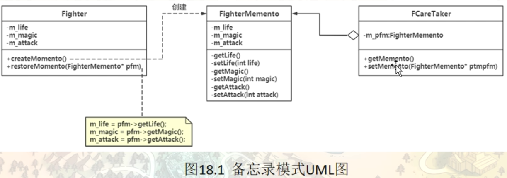

# 备忘录模式（Memento）

备忘录模式也称为 ”快照模式“，属于结构型模式。

每个人都有犯错误的时候，都希望有种“后悔药”能弥补自己的过失，让自己重新开始，但现实是残酷的。在计算机应用中，客户同样会常常犯错误，能否提供“后悔药”给他们呢？当然是可以的，而且是有必要的。这个功能由“备忘录模式”来实现。

其实很多应用软件都提供了这项功能，如 Word、记事本、Photoshop、Eclipse 等软件在编辑时按 Ctrl+Z 组合键时能撤销当前操作，使文档恢复到之前的状态；还有在 IE 中的后退键、数据库事务管理中的回滚操作、玩游戏时的中间结果存档功能、数据库与操作系统的备份操作、棋类游戏中的悔棋功能等都属于这类。

备忘录模式能记录一个对象的内部状态，当用户后悔时能撤销当前操作，使数据恢复到它原先的状态。

## 模式的定义与特点

备忘录（Memento）模式的定义：在不破坏封装性的前提下，捕获一个对象的内部状态，并在该对象之外保存这个状态，以便以后当需要时能将该对象恢复到原先保存的状态。该模式又叫快照模式。

这里说的不破坏封装性的意思是，原来类中该用private修饰的在备忘录中还应该用private修饰，不应该暴露原来类的细节

备忘录模式是一种对象行为型模式，其主要优点如下。

- 提供了一种可以恢复状态的机制。当用户需要时能够比较方便地将数据恢复到某个历史的状态。
- 实现了内部状态的封装。除了创建它的发起人之外，其他对象都不能够访问这些状态信息。
- 简化了发起人类。发起人不需要管理和保存其内部状态的各个备份，所有状态信息都保存在备忘录中，并由管理者进行管理，这符合单一职责原则。


其主要缺点是：资源消耗大。如果要保存的内部状态信息过多或者特别频繁，将会占用比较大的内存资源。

## 一个具体实现范例

#### 情景模拟

游戏玩家的进度信息如何进行保存？（当前生命值，蓝量，攻击力。。。）

```c++
namespace _nmsp1
{
    // 备忘录类
    class FighterMemento
    {
    private:
        // 构造函数使用私有构造，防止信息泄露
        FighterMemento(int life, int magic, int attack): m_life(life), m_magic(magic), m_attack(attack)
        {}
        
    private:
        // 提供一些供Fighter类访问的接口，用private修饰防止被任意类访问
        friend class Fighter;   // 友元类Fighter可以访问本类的所有私有成员函数
        
        int getLife() { return m_life; }
        void setLife(int life) { m_life = life; }
        
        int getMagic() { return m_magic; }
        void setMagic(int magic) { m_magic = magic; }
        
        int getAttack() { return m_attack; }
        void setAttack(int attack) { m_attack = attack; }
        
        
        
    private:
    // 备忘录中需要保存的角色数据
        int m_life; // 生命值
        int m_magic;    // 蓝量
        int m_attack;   // 攻击力
    };
    
    // 角色类
    class Fighter
    {
    public:
        Fighter(int life, int magic, int attack): m_life(life), m_magic(magic), m_attack(attack)
        {}
        
    public:
        // 将玩家数据写入到备忘录
        FighterMemento* createMemento()
        {
            return new FighterMemento(m_life, m_magic, m_attack);
        }
        
        // 从备忘录中恢复玩家数据
        void restore(FighterMemento* ptm)
        {
            m_life = ptm->m_life;
            m_magic = ptm->m_magic;
            m_attack = ptm->m_attack;
        }
        
        // 设置玩家死亡状态
        void setToDead()
        {
            m_life = 0;
        }
        
        // 用于打印
        void display()
        {
            std::cout << "玩家当前状态：" << std::endl;
            std::cout << "血量 ------- " << m_life << std::endl;
            std::cout << "蓝量 ------- " << m_magic << std::endl;
            std::cout << "攻击力 ----- " << m_attack << std::endl;
        }
        
    private:
        int m_life; // 生命值
        int m_magic;    // 蓝量
        int m_attack;   // 攻击力
    };
    
    void func()
    {
        Fighter* play = new Fighter(1000, 200, 56);
        play->display();
        // 玩家当前状态：
        // 血量 ------- 1000
        // 蓝量 ------- 200
        // 攻击力 ----- 56
        
        // 创建备忘录
        FighterMemento* ptm = play->createMemento();
        
        // 玩家死亡
        play->setToDead();
        
        // 显示玩家血量
        play->display();
        // 玩家当前状态：
        // 血量 ------- 0
        // 蓝量 ------- 200
        // 攻击力 ----- 56
        
        // 读取存档
        play->restore(ptm);
        
        play->display();
        // 玩家当前状态：
        // 血量 ------- 1000
        // 蓝量 ------- 200
        // 攻击力 ----- 56
        
        // 释放资源
        delete play;
        delete ptm;
    }
    
}
```

当然，在某些备忘录模式中，还会引入一个管理者类（负责人类），但是这不是必须的，他维护一个指向备忘录类的指针，用来管理备忘录。那有了管理者类，声明创建备忘录，什么时候存储备忘录，读取备忘录就不用角色类来做了，就只需要管理者来做了。

```c++
// 管理者类
    class FCareTaker
    {
    public:
        // 构造函数
        FCareTaker(FighterMemento* pfm):m_pfm(pfm) {}
        
        // 获取指向备忘录的指针
        FighterMemento* getMemento()
        {
            return m_pfm;
        }
        
        // 保存指向备忘录的指针
        void setMemento(FighterMemento* pfm)
        {
            m_pfm = pfm;
        }
        
    private:
        FighterMemento* m_pfm;  // 指向备忘录的指针
    };
```

然后使用的时候(个人感觉确实没必要引入这个管理者类)

```c++
 std::cout << "---------------------------------------------------" << std::endl;
        FCareTaker* fc = new FCareTaker(play->createMemento());
        // 玩家死亡
        play->setToDead();
        play->display();
        // 玩家当前状态：
        // 血量 ------- 0
        // 蓝量 ------- 200
        // 攻击力 ----- 56
        
        play->restore(fc->getMemento());
        play->display();
        // 玩家当前状态：
        // 血量 ------- 1000
        // 蓝量 ------- 200
        // 攻击力 ----- 56
```


## 引入备忘录（Memento）模式

备忘录模式的核心是设计备忘录类以及用于管理备忘录的管理者类。

####  模式的结构

备忘录模式的主要角色如下。

1. 发起人（Originator）角色：记录当前时刻的内部状态信息，提供创建备忘录和恢复备忘录数据的功能，实现其他业务功能，它可以访问备忘录里的所有信息。对应范例中的Fighter类（业务类）
2. 备忘录（Memento）角色：负责存储发起人的内部状态，在需要的时候提供这些内部状态给发起人。对应范例中的FighterMemento类，他的创建一般会参考 源发起类，（比如字段信息等），同时除了源发起类，其他类不应该直接访问该类。所以该类的接口一般都是private，同时元发起类 是作为该类的友元类。
3. 管理者（Caretaker）角色：对备忘录进行管理，提供保存与获取备忘录的功能，但其不能对备忘录的内容进行访问与修改。对应范例中的Caretaker类



前面介绍了备忘录模式的定义与特点、结构与实现，该模式的应用场景。

1. 需要保存与恢复数据的场景，如玩游戏时的中间结果的存档功能。
2. 需要提供一个可回滚操作的场景，如 Word、记事本、Photoshop，Eclipse 等软件在编辑时按 Ctrl+Z 组合键，还有数据库中事务操作。