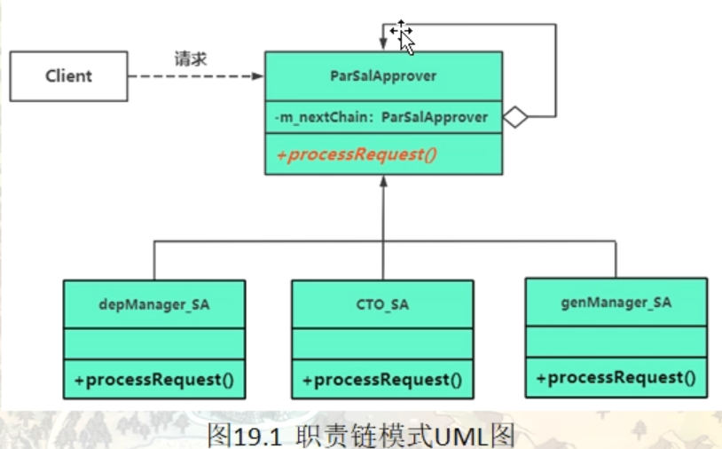

# 职责链模式（Chain Of Responsibility）

也叫做责任模式（是一种行为型模式），看起来它与传统数据结构中的链表非常类似。

在现实生活中，一个事件需要经过多个对象处理是很常见的场景。例如，采购审批流程、请假流程等。公司员工请假，可批假的领导有部门负责人、副总经理、总经理等，但每个领导能批准的天数不同，员工必须根据需要请假的天数去找不同的领导签名，也就是说员工必须记住每个领导的姓名、电话和地址等信息，这无疑增加了难度。

在计算机软硬件中也有相关例子，如总线网中数据报传送，每台计算机根据目标地址是否同自己的地址相同来决定是否接收；还有异常处理中，处理程序根据异常的类型决定自己是否处理该异常；还有 [Struts2](http://c.biancheng.net/struts2/) 的拦截器、[JSP](http://c.biancheng.net/jsp/) 和 [Servlet](http://c.biancheng.net/servlet/) 的 Filter 等，所有这些，都可以考虑使用责任链模式来实现。

## 模式的定义与特点

责任链（Chain of Responsibility）模式的定义：为了避免请求发送者与多个请求处理者耦合在一起，于是将所有请求的处理者通过前一对象记住其下一个对象的引用而连成一条链；当有请求发生时，可将请求沿着这条链传递，直到有对象处理它为止。

注意：责任链模式也叫职责链模式。

在责任链模式中，客户只需要将请求发送到责任链上即可，无须关心请求的处理细节和请求的传递过程，请求会自动进行传递。所以责任链将请求的发送者和请求的处理者解耦了。

责任链模式是一种对象行为型模式，其主要优点如下。

1. 降低了对象之间的耦合度。该模式使得一个对象无须知道到底是哪一个对象处理其请求以及链的结构，发送者和接收者也无须拥有对方的明确信息。
2. 增强了系统的可扩展性。可以根据需要增加新的请求处理类，满足开闭原则。
3. 增强了给对象指派职责的灵活性。当工作流程发生变化，可以动态地改变链内的成员或者调动它们的次序，也可动态地新增或者删除责任。
4. 责任链简化了对象之间的连接。每个对象只需保持一个指向其后继者的引用，不需保持其他所有处理者的引用，这避免了使用众多的 if 或者 if···else 语句。
5. 责任分担。每个类只需要处理自己该处理的工作，不该处理的传递给下一个对象完成，明确各类的责任范围，符合类的单一职责原则。


其主要缺点如下。

1. 不能保证每个请求一定被处理。由于一个请求没有明确的接收者，所以不能保证它一定会被处理，该请求可能一直传到链的末端都得不到处理。
2. 对比较长的职责链，请求的处理可能涉及多个处理对象，系统性能将受到一定影响。
3. 职责链建立的合理性要靠客户端来保证，增加了客户端的复杂性，可能会由于职责链的错误设置而导致系统出错，如可能会造成循环调用。

## 一个关于涨薪审批的范例

加薪请求

> 加薪 <= 1000, 部门经理审批
> 加薪 <= 5000, 加薪 > 1000,  技术总监审批
> 加薪 > 5000， 总经理审批

传统方法处理加薪请求

```c++
namespace _nmsp1
{
    // 薪水处理类
    class SalaryHander
    {
    public:
        // 处理加薪请求
        void raiseRequest(const string sname, int salfigure)  // 员工名， 加薪数额
        {
            if(salfigure <= 1000)
            {
                depManagerSP(sname, salfigure);
            }
            else if(salfigure <= 5000)
            {
                CTOSP(sname, salfigure);
            }
            else
            {
                CEOSP(sname, salfigure);
            }
        }
        
    private:
        // 部门经理审批加薪请求
        void depManagerSP(const string& sname, int salfigure)
        {
            std::cout << sname << " 的加薪要求为：" << salfigure << "元， 部门经理审批通过" << std::endl;
        }
        
        // 技术总监审批加薪请求
        void CTOSP(const string& sname, int salfigure)
        {
            std::cout << sname << " 的加薪要求为：" << salfigure << "元， 技术总监审批通过" << std::endl;
        }
        
        // 总经理审批加薪请求
        void CEOSP(const string& sname, int salfigure)
        {
            std::cout << sname << " 的加薪要求为：" << salfigure << "元， 总经理审批通过" << std::endl;
        }
    };
    
    void func()
    {
        SalaryHander sh;
        sh.raiseRequest("张三", 7823);
        // 张三 的加薪要求为：7823元， 总经理审批通过
        sh.raiseRequest("李四", 1200);
        // 李四 的加薪要求为：1200元， 技术总监审批通过
        sh.raiseRequest("万五", 11000);
        // 万五 的加薪要求为：11000元， 总经理审批通过
    }
}
```

职责链模式改造加薪请求案例

```c++
namespace _nmsp2
{
    // 加薪请求类
    class RaiseRequest
    {
    public:
        // 构造函数
        RaiseRequest(const string& sname, int salfigure) : m_sname(sname), m_salfigure(salfigure)
        {}
        
        // 获取加薪员工名字
        const string& getName() const
        {
            return m_sname;
        }
        
        // 获取加薪数额
        int getSalfigure() const
        {
            return m_salfigure;
        }
        
    private:
        string m_sname;     // 加薪员工名
        int m_salfigure;      // 加薪数额
    };
    
    // 创建职责链
    // 薪水审批者抽象类
    class ParSalApprover
    {
    public:
        ParSalApprover():m_nextChain(nullptr) {}
        virtual ~ParSalApprover() {}
        
        // 设置指向职责链中的下一个审批者
        void setNextChain(ParSalApprover* next)
        {
            m_nextChain = next;
        }
        
        // 处理加薪请求
        virtual void processRequest(const RaiseRequest& req) = 0;
        
    protected:
        // 找链中的下一个对象并把请求投递给链中的下一个对象
        void sendRequestToNextHandler(const RaiseRequest& req)
        {
            // 找链中的下一个对象
            if(m_nextChain!=nullptr)
            {
                // 把加薪请求传递给链中的下一个对象
                m_nextChain->processRequest(req);
            }
            else
            {
                // 没找到链中的下一个对象，程序执行流程走到这里
                std::cout << req.getName() << " 的加薪要求为：" << req.getSalfigure() << "元，无人处理" << std::endl;
            }
        }
    
    private:
        ParSalApprover* m_nextChain; // 指向下一个审批者对象的多态指针（指向自身类型）
        // 每个都指向下一个，就会构成一个链表格式的职责链数据结构
    };
    
    // 创建部门经理
    class depManager_SA : public ParSalApprover
    {
    public:
        // 处理加薪请求
        virtual void processRequest(const RaiseRequest& req)
        {
            int salfigure = req.getSalfigure();
            if(salfigure <= 1000)
            {
                std::cout << req.getName() << " 的加薪要求为：" << req.getSalfigure() << "元，由部门经理审批通过" << std::endl;
            }
            else
            {
                // 自己处理不了，找链中的下一个对象来处理
                sendRequestToNextHandler(req);
            }
        }
    };
    
    // 创建技术总监
    class CTO_SA : public ParSalApprover
    {
    public:
        // 处理加薪请求
        virtual void processRequest(const RaiseRequest& req)
        {
            int salfigure = req.getSalfigure();
            if(salfigure <= 5000)
            {
                std::cout << req.getName() << " 的加薪要求为：" << req.getSalfigure() << "元，由技术经理审批通过" << std::endl;
            }
            else
            {
                // 自己处理不了，找链中的下一个对象来处理
                sendRequestToNextHandler(req);
            }
        }
    };
    
    // 创建总监理
    class CEO_SA : public ParSalApprover
    {
    public:
        // 处理加薪请求
        virtual void processRequest(const RaiseRequest& req)
        {
            int salfigure = req.getSalfigure();
            if(salfigure > 5000)
            {
                std::cout << req.getName() << " 的加薪要求为：" << req.getSalfigure() << "元，由总经理审批通过" << std::endl;
            }
            else
            {
                // 自己处理不了，找链中的下一个对象来处理
                sendRequestToNextHandler(req);
            }
        }
    };
    
    // ----------------------------------------------------------
    void func()
    {
        // 创建职责链中包含的各个对象
        ParSalApprover* dep = new depManager_SA();
        ParSalApprover* cto = new CTO_SA();
        ParSalApprover* ceo = new CEO_SA();
        
        // 将这些职责链对象串在一起构成一个完整的职责链
        dep->setNextChain(cto);
        cto->setNextChain(ceo);
        
        // 创建员工
        string li = "李四";
        string wa = "万五";
        string zs = "张三";
        
        // 创建加薪请求
        const RaiseRequest req1(li, 353);
        const RaiseRequest req2(wa, 3153);
        const RaiseRequest req3(zs, 35123);
        
        dep->processRequest(req1);
        // 李四 的加薪要求为：353元，由部门经理审批通过
        dep->processRequest(req2);
        // 万五 的加薪要求为：3153元，由技术经理审批�过
        dep->processRequest(req3);
        // 张三 的加薪要求为：35123元，由总经理审批通过
        
        // 释放资源
        delete dep;
        delete cto;
        delete ceo;
        
    }
}
```


## 引入职责链（Chain Of Responsibility）模式

通常情况下，可以通过数据链表来实现职责链模式的 数据结构 。

#### 模式的结构

职责链模式主要包含以下角色。

1. 抽象处理者（Handler）角色：定义一个处理请求的接口，包含抽象处理方法和一个后继连接。这里对应的就是范例中的ParSalApprover职责链对象抽象类
2. 具体处理者（Concrete Handler）角色：实现抽象处理者的处理方法，判断能否处理本次请求，如果可以处理请求则处理，否则将该请求转给它的后继者。这里对应的就是depManager_SA, CTO_SA, CEO_SA这几个具体的职责类
3. 客户类（Client）角色：创建处理链，并向链头的具体处理者对象提交请求，它不关心处理细节和请求的传递过程。虽然这个搭建职责链的工作可以放在Hander中，但是一般来讲，都是交给使用职责链的客户端来创建职责链和进行职责链路搭建

责任链模式的本质是解耦请求与处理，让请求在处理链中能进行传递与被处理；理解责任链模式应当理解其模式，而不是其具体实现。责任链模式的独到之处是将其节点处理者组合成了链式结构，并允许节点自身决定是否进行请求处理或转发，相当于让请求流动起来。



#### 责任链模式通常在以下几种情况使用。

1. 多个对象可以处理一个请求，但具体由哪个对象处理该请求在运行时自动确定。
2. 可动态指定一组对象处理请求，或添加新的处理者。
3. 需要在不明确指定请求处理者的情况下，向多个处理者中的一个提交请求。

## 单纯与非单纯的职责链模式