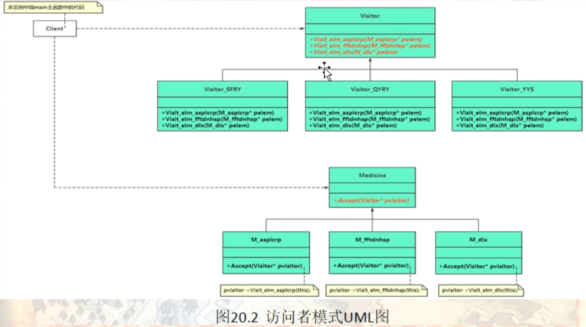

# 访问者模式（Visitor）

在现实生活中，有些集合对象存在多种不同的元素，且每种元素也存在多种不同的访问者和处理方式。例如，公园中存在多个景点，也存在多个游客，不同的游客对同一个景点的评价可能不同；医院医生开的处方单中包含多种药元素，査看它的划价员和药房工作人员对它的处理方式也不同，划价员根据处方单上面的药品名和数量进行划价，药房工作人员根据处方单的内容进行抓药。

这样的例子还有很多，例如，电影或电视剧中的人物角色，不同的观众对他们的评价也不同；还有顾客在商场购物时放在“购物车”中的商品，顾客主要关心所选商品的性价比，而收银员关心的是商品的价格和数量。

这些被处理的数据元素相对稳定而访问方式多种多样的[数据结构](http://c.biancheng.net/data_structure/)，如果用“访问者模式”来处理比较方便。访问者模式能把处理方法从数据结构中分离出来，并可以根据需要增加新的处理方法，且不用修改原来的程序代码与数据结构，这提高了程序的扩展性和灵活性。

## 模式的定义与特点

访问者（Visitor）模式的定义：将作用于某种数据结构中的各元素的操作分离出来封装成独立的类，使其在不改变数据结构的前提下可以添加作用于这些元素的新的操作，为数据结构中的每个元素提供多种访问方式。它将对数据的操作与数据结构进行分离，是行为类模式中最复杂的一种模式。

访问者（Visitor）模式是一种对象行为型模式，其主要优点如下。

1. 扩展性好。能够在不修改对象结构中的元素的情况下，为对象结构中的元素添加新的功能。
2. 复用性好。可以通过访问者来定义整个对象结构通用的功能，从而提高系统的复用程度。
3. 灵活性好。访问者模式将数据结构与作用于结构上的操作解耦，使得操作集合可相对自由地演化而不影响系统的数据结构。
4. 符合单一职责原则。访问者模式把相关的行为封装在一起，构成一个访问者，使每一个访问者的功能都比较单一。


访问者（Visitor）模式的主要缺点如下。

1. 增加新的元素类很困难。在访问者模式中，每增加一个新的元素类，都要在每一个具体访问者类中增加相应的具体操作，这违背了“开闭原则”。
2. 破坏封装。访问者模式中具体元素对访问者公布细节，这破坏了对象的封装性。
3. 违反了依赖倒置原则。访问者模式依赖了具体类，而没有依赖抽象类。

## 一个具体范例的逐步演化

#### 情景模拟

医院医生开的处方单中包含多种药元素，
査看它的划价员和药房工作人员对它的处理方式也不同，
划价员根据处方单上面的药品名和数量进行划价（缴费），
药房工作人员根据处方单的内容进行抓药（取药）。

```c++
namespace _nmsp1
{
    // 药品父类
    class Medicine
    {
    public:
        virtual string getMdcName() = 0; // 获取药品名称
        virtual float getPrice() = 0;   // 获取药品总价
        
        virtual ~Medicine() {}
    };
    
    // 药品1
    class M_asplcrp : public Medicine
    {
    public:
        virtual string getMdcName()
        {
            return "阿司匹林肠溶片";
        }
        
        virtual float getPrice()
        {
            return 154.34f;
        }
    };
    
    // 药品2
    class M_ffttnrsp : public Medicine
    {
    public:
        virtual string getMdcName()
        {
            return "氟伐他汀钠溶释片";
        }
        
        virtual float getPrice()
        {
            return 242.85f;
        }
    };
    
    // 药品3
    class M_dlx : public Medicine
    {
    public:
        virtual string getMdcName()
        {
            return "黛力新";
        }
        
        virtual float getPrice()
        {
            return 122.12f;
        }
    };
    
    // 针对药品的处理类
    class MedicineProc
    {
    public:
        // 增加药品到药品列表中
        void addMedicine(Medicine* mdc)
        {
            m_mdclist.push_back(mdc);
        }
        
        // 缴费动作，取药动作
        void proAction(string strvisitor)   // strvisitor 代表拿到药品单的人
        {
            if(strvisitor == "收费人员")
            {
                float totalcost = 0.0f;
                
                for (auto i = m_mdclist.begin(); i != m_mdclist.end(); ++i) {
                    std::cout << "药品\"" << (*i)->getMdcName() << "\"的价格: " << (*i)->getPrice() << std::endl;
                    totalcost += (*i)->getPrice();
                }
                
                std::cout << "-------------药品总价-------------" << std::endl;
                std::cout << totalcost << std::endl;
            }
            else if(strvisitor == "取药人员")
            {
                for (auto i = m_mdclist.begin(); i != m_mdclist.end(); ++i) {
                    std::cout << "已获得药品\"" << (*i)->getMdcName() << std::endl;
                }
            }
        }
        
    private:
        std::list<Medicine*> m_mdclist; // 药品列表，记录着药品单上的所有药品
    };
    
    
    void func()
    {
        Medicine* pm1 = new M_asplcrp();
        Medicine* pm2 = new M_dlx();
        Medicine* pm3 = new M_ffttnrsp();
        
        MedicineProc poc;
        
        poc.addMedicine(pm1);
        poc.addMedicine(pm2);
        poc.addMedicine(pm3);
        
        poc.proAction("收费人员");
        // 药品"阿司匹林肠溶片"的价格: 154.34
        // 药品"黛力新"的价格: 122.12
        // 药品"氟伐他汀钠溶释片"的价格: 242.85
        // -------------药品总价-------------
        519.31
        
        poc.proAction("取药人员");
        // 已获得药品"阿司匹林肠溶片
        // 已获得药品"黛力新
        // 已获得药品"氟伐他汀钠溶释片
        
        delete pm3;
        delete pm2;
        delete pm1;
    }
}
```

针对上述范例，假设某天，新增一个角色（健身教练），他也要获取这个药品单，然后根据药品情况作出相对应的动作
（比如，调整健身强度等。。），那就需要去代码里新增if分支。
很明显，这样修改代码是违法开闭原则的，每新增一个新角色，就得新增if语句分支

引入访问者模式
访问者模式：访问者（收费人员，取药人员， 健身教练。。。），被访问者（药品、药品单）

```c++
namespace _nmsp2
{
    // 类前向声名
    class Visitor;
    
    // 药品父类
    class Medicine
    {
    public:
        virtual string getMdcName() = 0; // 获取药品名称
        virtual float getPrice() = 0;   // 获取药品总价
        
        virtual ~Medicine() {}
        
        // 在访问者模式中，被访问者通常称为元素，在元素中，我们会申明一个叫做 accept这样一个方法
        // 用于接收访问者的访问，作为被访问者接收访问者的访问是必须的
        virtual void Accept(Visitor* visiter) = 0;
    };
    
    // 药品1
    class M_asplcrp : public Medicine
    {
    public:
        virtual string getMdcName()
        {
            return "阿司匹林肠溶片";
        }
        
        virtual float getPrice()
        {
            return 154.34f;
        }
        
        virtual void Accept(Visitor* visiter);
    };
    
    // 药品2
    class M_ffttnrsp : public Medicine
    {
    public:
        virtual string getMdcName()
        {
            return "氟伐他汀钠溶释片";
        }
        
        virtual float getPrice()
        {
            return 242.85f;
        }
        
        virtual void Accept(Visitor* visiter);
    };
    
    // 药品3
    class M_dlx : public Medicine
    {
    public:
        virtual string getMdcName()
        {
            return "黛力新";
        }
        
        virtual float getPrice()
        {
            return 122.12f;
        }
        
        virtual void Accept(Visitor* visiter);
    };
    
    // 访问者 父类（抽象类）
    class Visitor
    {
    public:
        virtual ~Visitor() {}
        
        // virtual void Visit_elm_asplcrp(M_asplcrp* pelem) = 0;   // 访问元素 阿司匹林肠溶片
        // virtual void Visit_elm_ffttnrsp(M_ffttnrsp* pelem) = 0;   // 访问元素 氟伐他汀钠溶释片
        // virtual void Visit_elm_dlx(M_asplcrp* pelem) = 0;   // 访问元素 黛力新
        
        // 当然这里也可以写成函数重载方式 （看个人习惯）
        virtual void Visit(M_asplcrp* pelem) = 0;   // 访问元素 阿司匹林肠溶片
        virtual void Visit(M_ffttnrsp* pelem) = 0;   // 访问元素 氟伐他汀钠溶释片
        virtual void Visit(M_dlx* pelem) = 0;   // 访问元素 黛力新
        
        // 从这里也可以看出来，访问者模式的一个局限性
        // 那就是要求被访问者他的一个类型要尽可能固定
    };
    
    // Accept具体实现
    void M_asplcrp::Accept(Visitor* visitor)
    {
        visitor->Visit(this);
    }
    
    void M_ffttnrsp::Accept(Visitor* visitor)
    {
        visitor->Visit(this);
    }
    
    void M_dlx::Accept(Visitor* visitor)
    {
        visitor->Visit(this);
    }
    
    // 收费人员访问者
    class Visitor_SFRY : public Visitor
    {
    public:
        Visitor_SFRY() : m_totalcost(0.0f) {}
    public:
        virtual void Visit(M_asplcrp* pelem)   // 访问元素 阿司匹林肠溶片
        {
            std::cout << "药品\"" << pelem->getMdcName() << "\"的价格：" << pelem->getPrice() << std::endl;
            m_totalcost+=pelem->getPrice();
        }
        virtual void Visit(M_ffttnrsp* pelem)   // 访问元素 氟伐他汀钠溶释片
        {
            std::cout << "药品\"" << pelem->getMdcName() << "\"的价格：" << pelem->getPrice() << std::endl;
            m_totalcost+=pelem->getPrice();
        }
        virtual void Visit(M_dlx* pelem)   // 访问元素 黛力新
        {
            std::cout << "药品\"" << pelem->getMdcName() << "\"的价格：" << pelem->getPrice() << std::endl;
            m_totalcost+=pelem->getPrice();
        }
        
    public:
        // 返回总费用
        float getTotal()
        {
            return m_totalcost;
        }
        
    private:
        float m_totalcost;  // 总费用
    };
    
    // 取药人员访问者
    class Visitor_QYRY : public Visitor
    {
    public:
        virtual void Visit(M_asplcrp* pelem)   // 访问元素 阿司匹林肠溶片
        {
            std::cout << "获得药品\"" << pelem->getMdcName() << std::endl;
        }
        virtual void Visit(M_ffttnrsp* pelem)   // 访问元素 氟伐他汀钠溶释片
        {
            std::cout << "获得药品\"" << pelem->getMdcName() << std::endl;
        }
        virtual void Visit(M_dlx* pelem)   // 访问元素 黛力新
        {
            std::cout << "获得药品\"" << pelem->getMdcName() << std::endl;
        }
    };
    
    // 营养师访问者
    class Visitor_YYS : public Visitor
    {
    public:
        virtual void Visit(M_asplcrp* pelem)   // 访问元素 阿司匹林肠溶片
        {
            std::cout << "营养师看到 【" << pelem->getMdcName() << "】，建议多吃粗粮！" << std::endl;
        }
        virtual void Visit(M_ffttnrsp* pelem)   // 访问元素 氟伐他汀钠溶释片
        {
            std::cout << "营养师看到 【" << pelem->getMdcName() << "】，建议多休息，不要熬夜" << std::endl;
        }
        virtual void Visit(M_dlx* pelem)   // 访问元素 黛力新
        {
            std::cout << "营养师看到 【" << pelem->getMdcName() << "】，建议放松心情，不要焦虑" << std::endl;
        }
    };
    
    void func()
    {
        Medicine* pm1 = new M_asplcrp();
        Medicine* pm2 = new M_dlx();
        Medicine* pm3 = new M_ffttnrsp();
        
        Visitor_SFRY visitor_sf;
        Visitor_QYRY visitor_qy;
        Visitor_YYS visitor_yys;
        
        // 各个元素调用Accept来接收收费者的访问
        pm1->Accept(&visitor_sf);
        pm2->Accept(&visitor_sf);
        pm3->Accept(&visitor_sf);
        
        // 药品"阿司匹林肠溶片"的价格：154.34
        // 药品"黛力新"的价格：122.12
        // 药品"氟伐他汀钠溶释片"的价格：242.85
        
        std::cout << "-------------药品总价-------------" << std::endl;
        std::cout << "共计缴费：" << visitor_sf.getTotal() << std::endl;
        // 共计缴费: 519.31
        
        std::cout << "-------------窗口取药-------------" << std::endl;
        pm1->Accept(&visitor_qy);
        pm2->Accept(&visitor_qy);
        pm3->Accept(&visitor_qy);
        // 获得药品"阿司匹林肠溶片
        // 获得药品"黛力新
        // 获得药品"氟伐他汀钠溶释片
        
        std::cout << "-------------咨询营养师-------------" << std::endl;
        pm1->Accept(&visitor_yys);
        pm2->Accept(&visitor_yys);
        pm3->Accept(&visitor_yys);
        // 营养师看到 【阿司匹林肠溶片】，建议多吃粗粮��
        // 营养师看到 【黛力新】，建议放松心情，不要焦虑
        // 营养师看到 【氟��他汀钠溶释片】，建议多休息，不要熬夜
        
        
        delete pm3;
        delete pm2;
        delete pm1;
    }
}
```

## 引入访问者（visitor）模式

提供一个作用于对象结构中各元素的操作表示，使得可以在不改变个元素的前提下定义（扩展）作用于这些元素的新操作。允许一个或者多个操作引用到一组对象上，使对象本身和各种操作解耦



访问者（Visitor）模式实现的关键是如何将作用于元素的操作分离出来封装成独立的类，其基本结构与实现方法如下。

#### 模式的结构

访问者模式包含以下主要角色。

1. 抽象访问者（Visitor）角色：定义一个访问具体元素的接口，为每个具体元素类对应一个访问操作 visit() ，该操作中的参数类型标识了被访问的具体元素。
2. 具体访问者（ConcreteVisitor）角色：实现抽象访问者角色中声明的各个访问操作，确定访问者访问一个元素时该做什么。
3. 抽象元素（Element）角色：声明一个包含接受操作 accept() 的接口，被接受的访问者对象作为 accept() 方法的参数。
4. 具体元素（ConcreteElement）角色：实现抽象元素角色提供的 accept() 操作，其方法体通常都是 visitor.visit(this) ，另外具体元素中可能还包含本身业务逻辑的相关操作。
5. 对象结构（Object Structure）角色：是一个包含元素角色的容器，提供让访问者对象遍历容器中的所有元素的方法，通常由 List、Set、Map 等聚合类实现。

#### 模式的应用场景

当系统中存在类型数量稳定（固定）的一类数据结构时，可以使用访问者模式方便地实现对该类型所有数据结构的不同操作，而又不会对数据产生任何副作用（脏数据）。

简而言之，就是当对集合中的不同类型数据（类型数量稳定）进行多种操作时，使用访问者模式。

通常在以下情况可以考虑使用访问者（Visitor）模式。

1. 对象结构相对稳定，但其操作算法经常变化的程序。
2. 对象结构中的对象需要提供多种不同且不相关的操作，而且要避免让这些操作的变化影响对象的结构。
3. 对象结构包含很多类型的对象，希望对这些对象实施一些依赖于其具体类型的操作。

## 访问者模式深入理解

访问者模式，双分派/二次分派/双重分派（Double-dispatch）调用机制。

双分派表示要执行的操作取决于被访问者（元素）类型和访问者类型，说白了范例中的Accept虚函数其实就是一种双分派调用机制，accept具体的调用代码不仅取决于被访问者，还取决于访问者。

增加新访问者容易，但是增加被访问者（元素）困难

与操作有关的代码都放到了访问者子类中

要求具体元素类的接口比较丰富，但是这也会导致元素类暴露太多公共操作接口而破坏封装性