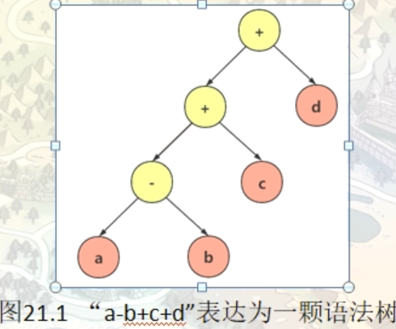
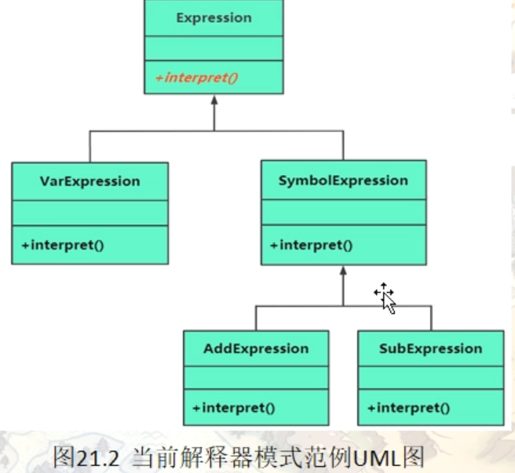
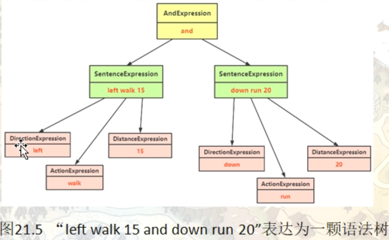

# 解释器模式（Interpreter）

在软件开发中，会遇到有些问题多次重复出现，而且有一定的相似性和规律性。如果将它们归纳成一种简单的语言，那么这些问题实例将是该语言的一些句子，这样就可以用“编译原理”中的解释器模式来实现了。

虽然使用解释器模式的实例不是很多，但对于满足以上特点，且对运行效率要求不是很高的应用实例，如果用解释器模式来实现，其效果是非常好的。

解释器模式适合对一些比较简单的文法结构进行分析。

## 模式的定义与特点

解释器（Interpreter）模式的定义：给分析对象定义一个语言，并定义该语言的文法表示，再设计一个解析器来解释语言中的句子。也就是说，用编译语言的方式来分析应用中的实例。这种模式实现了文法表达式处理的接口，该接口解释一个特定的上下文。

这里提到的文法和句子的概念同编译原理中的描述相同，“文法”指语言的语法规则，而“句子”是语言集中的元素。例如，汉语中的句子有很多，“我是中国人”是其中的一个句子，可以用一棵语法树来直观地描述语言中的句子。

解释器模式是一种类行为型模式，其主要优点如下。

1. 扩展性好。由于在解释器模式中使用类来表示语言的文法规则，因此可以通过继承等机制来改变或扩展文法。
2. 容易实现。在语法树中的每个表达式节点类都是相似的，所以实现其文法较为容易。


解释器模式的主要缺点如下。

1. 执行效率较低。解释器模式中通常使用大量的循环和递归调用，当要解释的句子较复杂时，其运行速度很慢，且代码的调试过程也比较麻烦。
2. 会引起类膨胀。解释器模式中的每条规则至少需要定义一个类，当包含的文法规则很多时，类的个数将急剧增加，导致系统难以管理与维护。
3. 可应用的场景比较少。在软件开发中，需要定义语言文法的应用实例非常少，所以这种模式很少被使用到。

## 一个解释器模式编写的范例

#### 情景模拟

假设存在一些变量，这些变量都用一个 字母 来表示。（a,b,c,d）

这些变量的值希望在运行时进行指定，同时希望对这些变量进行加减法运算

比如：程序运行，我们给a,b,c,d值为7,9,3,2 然后给他一个字符串“a-b+c+d”

希望程序能够进行如下运算 7-9+3+2 = 3

#### 分析：

字符串表达式是可以做任意变量之间的任意加减操作的。比如上面提到的，我们可以先算a-b.，然后将得到的结构在 +c,然后得到的结果再+d。所以这是一个从左到右的计算规则（或者从左到右的语法规则），如果将这些规则表达为一个句子，来代表a-b+c+d，然后构建一个解释器来解释这个句子。这就是解释器模式所做的事情。实质或者说难点就是如何将计算规则表达为一颗语法树【表达式树】



这些表达式分为 非终结表达式（树枝-黄色）和终结表达式（树叶-红色）。语法树中的每个节点所属的类都会有一个叫做Interpreter的成员函数，用来对本节点进行解释。对于我们现在这个情景来说，解释器对树叶节点的解释操作就是直接用数值来对变量进行替换。而对于非终结表达式（黄色）所作出的解释就是，将该节点下的左操作数和右操作数进行实际的加减操作。

```c++
namespace _nmsp1
{
    // 表达式（节点）父类
    class Expression
    {
    public:
        Expression(int num, char sign):m_dgb_num(num), m_dgb_sign(sign)
        {}
        
        virtual ~Expression() {}
        
    public:
        // 解析语法树中单前节点的函数
        // map中的键值对用于保存变量名以及对应的值
        virtual int interpreter(std::map<char, int> var) = 0;
        
    public:
        // 一下两个成员变量只是为了跟踪调试，便于观察而引入
        int m_dgb_num;  // 创建该对象时的一个编号，用于记录本对象是第几个创建的
        char m_dgb_sign;    // 标记本对象类型，v代表是变量（终结表达式），+、-表示是一个非终结符表达式
        
    };
    
    // 终结符表达式 
    class VarExpression : public Expression
    {
    public:
        VarExpression(const char& key, int num, char sign):Expression(num, sign)
        {
            m_k = key;
        }
        
         virtual int interpreter(std::map<char, int> var)
         {
            return var[m_k];    // 返回该变量名对应的数值
         }
        
        
    private:
        char m_k; // 保存变量名
    };
    
    // 运算符表达式（非终结表达式）父类
    class SymbolExpression : public Expression
    {
    public:
        SymbolExpression(Expression* left, Expression* right, int num, char sign):Expression(num, sign)
        {
            m_left = left;
            m_right = right;
        }
        
        // 获取左孩子
        Expression* getLeft()
        {
            return m_left;
        }
        
        // 获取右孩子
        Expression* getRight()
        {
            return m_right;
        }
        
    protected:
    // 对于非终结表达式，左右各有一个操作数
        Expression* m_left;
        Expression* m_right;
    };
    
    // 加法运算符表达式
    class AddExpression : public SymbolExpression
    {
    public:
        AddExpression(Expression* left, Expression* right, int num, char sign):SymbolExpression(left,right,num,sign)
        {}
        
        virtual int interpreter(std::map<char, int> var)
        {
            // 递归调用左操作数interpreter方法
            int value1 = m_left->interpreter(var);
            // 递归调用右操作数interpreter方法
            int value2 = m_right->interpreter(var);
            int result = value1 + value2;
            return result;
        }
    };
    
    // 减法运算符表达式
    class SubExpression : public SymbolExpression
    {
    public:
        SubExpression(Expression* left, Expression* right, int num, char sign):SymbolExpression(left,right,num,sign)
        {}
        
        virtual int interpreter(std::map<char, int> var)
        {
            // 递归调用左操作数interpreter方法
            int value1 = m_left->interpreter(var);
            // 递归调用右操作数interpreter方法
            int value2 = m_right->interpreter(var);
            int result = value1 - value2;
            return result;
        }
    };
    
    // 创建语法树的函数
    // strExp 表示要计算的表达式的字符串
    Expression* analyse(string strExp)
    {
        std::stack<Expression*> expSatck;   // 这里用到了栈这种顺序容器
        Expression* right = nullptr;
        Expression* left = nullptr;
        int icount = 1;
        
        // 循环遍历字符串中每一个字符
        for(size_t i = 0; i < strExp.size(); ++i)
        {
            switch(strExp[i])
            {
                // 加减运算就是将计算的结果反倒栈顶，然后下一次运算的时候再从栈顶取出来
                case '+':
                    // 加法符号（非终结表达式）
                    left = expSatck.top();  // 返回栈顶元素作为左孩子
                    ++i;
                    right = new VarExpression(strExp[i], icount++, 'v');
                    // 将加法运行结果压栈处理
                    expSatck.push(new AddExpression(left, right, icount++, '+'));
                    break;
                case '-':
                    // 减法符号（非终结表达式）
                    left = expSatck.top();  // 返回栈顶元素做为左孩子
                    ++i;
                    right = new VarExpression(strExp[i], icount++, 'v');
                    // 将减法运算压栈处理
                    expSatck.push(new SubExpression(left, right, icount++, '-'));
                    break;
                default:
                    // 终结符表达式
                    expSatck.push(new VarExpression(strExp[i], icount++, 'v'));
                    // 遇到变量，压栈处理
            }
        }
        
        Expression* expression = expSatck.top();
        
        return expression;
    }
    
    // 资源释放函数 (从根节点)
    void release(Expression* expression)
    {
        // 释放表达式树的节点内存
        SymbolExpression* pSe = dynamic_cast<SymbolExpression*>(expression);
        // 此处代码有优化空间（不使用dynamic_cast）
        if(pSe)
        {
            release(pSe->getLeft());
            release(pSe->getRight());
        }
        delete expression;
    }
    
    void func()
    {
        string strExp = "a-b+c-d+e+f";
        std::map<char, int> varmap;
        // 下面给字符串表达式中每个参与运算的变量赋一个对应的数值
        varmap.insert(make_pair('a', 23));
        varmap.insert(make_pair('b', 3));
        varmap.insert(make_pair('c', 223));
        varmap.insert(make_pair('d', 3));
        varmap.insert(make_pair('e', 7));
        varmap.insert(make_pair('f', 19));
        
        // 创建语法树
        Expression* expression = analyse(strExp);
        // 调用interpreter接口求解字符串表达式的结果
        int result = expression->interpreter(varmap);
        std::cout << "字符串" << strExp << "的计算结果为：" << result << std::endl;
        // 字符串a-b+c-d+e+f的计算结果为：266
        
        // 释放资源
        release(expression);
    }
}
```



## 引入解释器（Interpreter）模式

解释器模式常用于对简单语言的编译或分析实例中，为了掌握好它的结构与实现，必须先了解编译原理中的“文法、句子、语法树”等相关概念。

#### 1) 文法

文法是用于描述语言的语法结构的形式规则。没有规矩不成方圆，例如，有些人认为完美爱情的准则是“相互吸引、感情专一、任何一方都没有恋爱经历”，虽然最后一条准则较苛刻，但任何事情都要有规则，语言也一样，不管它是机器语言还是自然语言，都有它自己的文法规则。例如，中文中的“句子”的文法如下。

```
〈句子〉::=〈主语〉〈谓语〉〈宾语〉
〈主语〉::=〈代词〉|〈名词〉
〈谓语〉::=〈动词〉
〈宾语〉::=〈代词〉|〈名词〉
〈代词〉你|我|他
〈名词〉7大学生I筱霞I英语
〈动词〉::=是|学习
```


注：这里的符号“::=”表示“定义为”的意思，用“〈”和“〉”括住的是非终结符，没有括住的是终结符。

#### 2) 句子

句子是语言的基本单位，是语言集中的一个元素，它由终结符构成，能由“文法”推导出。例如，上述文法可以推出“我是大学生”，所以它是句子。

#### 3) 语法树

语法树是句子结构的一种树型表示，它代表了句子的推导结果，它有利于理解句子语法结构的层次。图 1 所示是“我是大学生”的语法树。


图1 句子“我是大学生”的语法树


有了以上基础知识，现在来介绍解释器模式的结构就简单了。解释器模式的结构与[组合模式](http://c.biancheng.net/view/1373.html)相似，不过其包含的组成元素比组合模式多，而且组合模式是对象结构型模式，而解释器模式是类行为型模式。

#### 模式的结构

解释器模式包含以下主要角色。

1. 抽象表达式（Abstract Expression）角色：定义解释器的接口，约定解释器的解释操作，主要包含解释方法 interpret()。对应上面范例中的Expression抽象类，他是终结符表达式与非终结符表达式的公共基类
2. 终结符表达式（Terminal Expression）角色：是抽象表达式的子类，用来实现文法中与终结符相关的操作，文法中的每一个终结符都有一个具体终结表达式与之相对应。
3. 非终结符表达式（Nonterminal Expression）角色：也是抽象表达式的子类，用来 实现文法中与非终结符相关的操作，文法中的每条规则都对应于一个非终结符表达式。
4. 环境（Context）角色：通常包含各个解释器需要的数据或是公共的功能，一般用来传递被所有解释器共享的数据，后面的解释器可以从这里获取这些值。对应范例中的varmap
5. 客户端（Client）：主要任务是将需要分析的句子或表达式转换成使用解释器对象描述的抽象语法树，然后调用解释器的解释方法，当然也可以通过环境角色间接访问解释器的解释方法。

#### 应用场景。

1. 当语言的文法较为简单，且执行效率不是关键问题时。
2. 当问题重复出现，且可以用一种简单的语言来进行表达时。
3. 当一个语言需要解释执行，并且语言中的句子可以表示为一个抽象语法树的时候，如 XML 文档解释。


注意：解释器模式在实际的软件开发中使用比较少，因为它会引起效率、性能以及维护等问题。

## 机器人控制器范例

#### 规定机器人的行为规则

> 1：运动反向有4个，上（up）下（down）左（left）右（right）
> 2：机器人的运动方式有2种，行走（walk），奔跑（run）

机器人能够接收的终结符表达式有 运动方向， 运动方式， 运动距离（单位：米）
left walk 15; 让机器人向左走15米
down run 29； 让机器人向下跑29米
机器人能接收的非终结符表达式其实就是句子，句子由“运动方向，运动方式，运动距离”构成
另一个非终结符表达式“and” ,代表和的意思
left walk 14 and down run 23;



```c++
namespace _nmsp1
{
    // 表达式父类
    class Expression
    {
    public:
        virtual ~Expression(){}
        
    public:
        // 解析语法树中的单前节点
        virtual string interpreter() = 0;
    };
    
    // 运动方向终结符表达式
    class DirectionExpression : public Expression
    {
    public:
        DirectionExpression(const string& direction)
        {
            m_direction = direction;
        }
        
        virtual string interpreter()
        {
            if(m_direction == "up")
            {
                return "向上";
            }
            else if(m_direction == "down")
            {
                return "向下";
            }
            else if(m_direction == "left")
            {
                return "向左";
            }
            else if(m_direction == "right")
            {
                return "向右";
            }
            else
            {
                return "运动方向错误";
            }    
        }
        
    private:
        string m_direction; // 运动反向有4个，上（up）下（down）左（left）右（right）
    };
    
    // 运动方式终结符表达式
    class ActionExpression : public Expression
    {
    public:
        ActionExpression(const string& action)
        {
            m_action = action;
        }
        
        virtual string interpreter()
        {
            if(m_action == "walk")
            {
                return "行走";
            }
            else if(m_action == "run")
            {
                return "奔跑";
            }
            else
            {
                return "运动方式错误";
            }    
        }
        
    private:
        string m_action; // 机器人的运动方式有2种，行走（walk），奔跑（run）
    };
    
    // 运动距离终结符表达式
    class DistanceExpression : public Expression
    {
    public:
        DistanceExpression(const string& distance)
        {
            m_distance = distance;
        }
        
        virtual string interpreter()
        {
            return m_distance + "米";
        }
        
    private:
        string m_distance;  // 运动距离，用字符串表示
    };
    
    // 非终结符表达式（句子）
    class SentenceExpression : public Expression
    {
    public:
        SentenceExpression(Expression* direction, Expression* action, Expression* distance)
        {
            m_direction = direction;
            m_action = action;
            m_distance = distance;
        }
        
        // 获取方向
        Expression* getDirection()
        {
            return m_direction;
        }
        
        // 获取方式
        Expression* getAction()
        {
            return m_action;
        }
        
        // 获取距离
        Expression* getDistance()
        {
            return m_distance;
        }
        
        virtual string interpreter()
        {
            return m_direction->interpreter() + m_action->interpreter() + m_distance->interpreter();
        }
        
    private:
        Expression* m_direction;    // 运动方向
        Expression* m_action;       // 运动方式
        Expression* m_distance;     // 运动距离
    };
    
    // and 非终结符表达式
    class AndExpression : public Expression
    {
    public:
        AndExpression(Expression* left, Expression* right):m_left(left), m_right(right)
        {}
        
        Expression* getLeft()
        {
            return m_left;
        }
        
        Expression* getRight()
        {
            return m_right;
        }
        
        virtual string interpreter()
        {
            return m_left->interpreter() + "然后，" + m_right->interpreter();
        }
        
    private:
        // 左右各一个操作数
        Expression* m_left;
        Expression* m_right;
    };
    
    // 提供一个字符串拆分函数
    void split_string(const string str, vector<string>& vec, const string cut)
    {
        string::size_type begin_index, end_index;
        end_index = str.find(cut);
        begin_index = 0;
        while(string::npos!=end_index)
        {
            vec.push_back(str.substr(begin_index, end_index - begin_index));
            begin_index = end_index+cut.size();
            end_index = str.find(cut, begin_index);
        }
        if(begin_index != str.length())
        {
            vec.push_back(str.substr(begin_index));
        }
    }
    
    // 搭建语法树（分析创建）
    Expression* analyse(string strExp)
    {
        std::stack<Expression*> expStack;
        Expression* direction = nullptr;
        Expression* action = nullptr;
        Expression* distance = nullptr;
        
        // 左右孩子
        Expression* left = nullptr;
        Expression* right = nullptr;
        
        // 机器人控制命令指令之间是使用空格进行分割的
        // char *strc = new char[strlen(strExp.c_str()) + 1];
        // strcpy(strc, strExp.c_str());
        // std::vector<string> resultVec;
        // char* tmpStr = strtok(strc, " ");       // 按空格来切割字符串
        // while(tmpStr != nullptr)
        // {
        //     resultVec.push_back(string(tmpStr));
        //     tmpStr = strtok(NULL, " ");
        // }
        // delete[] strc;
        
        std::vector<string> resultVec;
        split_string(strExp, resultVec, " ");
        
        // for(auto iter = resultVec.begin(); iter!=resultVec.end(); ++iter)
        // {
        //     std::cout << (*iter) << std::endl;
        // }
        
        // 开始解析
        for(auto iter = resultVec.begin(); iter!=resultVec.end(); ++iter)
        {
            if((*iter) == "and")
            {
                left = expStack.top();  // 返回栈顶元素
                ++iter;
                
                direction = new DirectionExpression(*iter);
                ++iter;
                
                action = new ActionExpression(*iter);
                ++iter;
                
                distance = new DistanceExpression(*iter);
                
                // 然后用上面分析出来的节点创建一个新的句子（因为左右孩子都是句子）
                right = new SentenceExpression(direction, action, distance);
                
                // 把左孩子和右孩子塞到栈中
                expStack.push(new AndExpression(left, right));
            }
            else
            {
                direction = new DirectionExpression(*iter);
                ++iter;
                
                action = new ActionExpression(*iter);
                ++iter;
                
                distance = new DistanceExpression(*iter);
                
                expStack.push(new SentenceExpression(direction, action, distance));
            }
        }
        Expression* result = expStack.top();
        return result;
    }
    
    // 释放内存
    void release(Expression* expression)
    {
        SentenceExpression* pse = dynamic_cast<SentenceExpression*>(expression);
        
        if(pse)
        {
            release(pse->getDirection());
            release(pse->getAction());
            release(pse->getDistance());
        }
        else
        {
            // 左孩子右孩子（然后孩子节点会跳进上面这个if里去）
            AndExpression* pae = dynamic_cast<AndExpression*>(expression);
            if(pae)
            {
                release(pae->getLeft());
                release(pae->getRight());
            }
        }
        delete expression;
    }
    
    void func()
    {
        string zl = "left walk 12 and up run 23";
        
        Expression* expression = analyse(zl);
        
        std::cout << expression->interpreter() << std::endl;
        // 向左行走12米然后，向上奔跑23米
        
        // 释放内存
        release(expression);
    }
    
}
```