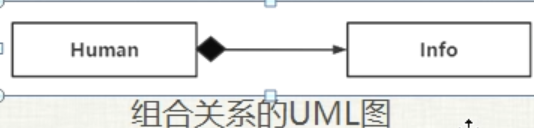
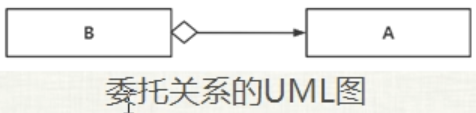

# 类与类之间的组合关系与委托关系

## 组合关系

组合关系也叫复合关系：Composition

组合：一个类的定义中含有其他类类型的成员变量，这两个类之间就是一种组合关系。

### has-a关系

has-a 翻译过来就是 有一个 的关系。

```c++
namespace _nmsp1
{
    class Info
    {
    private:
        std::string m_name; // 名字
        int m_gender;   // 性别
        int m_age;  // 年龄
    };
    
    class Human
    {
    public:
        Info m_info;
    };
}
```

可以看到类Human中的m_info他的类型就是一个Info类型，那么这里Human与类Info之间就是一种has-a关系。进一步来说就是Human这个类中包含一个Info对象。

has-a关系也被称为is-part-of关系。如果说Human has a Info。那么也可以认为 Info is-a-part-of-Human。

### is-implemented-in-terms-of关系

翻译过来就是 “根据...实现出...”。

我们知道，multimap 容器，它是一个关联性容器，他里面保存的是键值对，它这里的键是允许重复的。

```c++
std::multimap<int, int> tmpc;
tmpc.insert(std::make_pair(1, 1));
tmpc.insert(std::make_pair(2, 3));
tmpc.insert(std::make_pair(1, 5));
        
std::cout << "tmpc.size() = " << tmpc.size() << std::endl;
// tmpc.size() = 3
```

现在希望开发一个不允许键重复的容器，smap。很容易想到，开发这个smap是否可以利用这个Mutimap容器呢？

有人可能会想到利用继承来实现。比如

```c++
class smap : public std::multimap<T, U> {....};
```

但是这里因为public继承是一种is-a关系，也就是说子类对象它也是一个父类对象，那么在这个范例中这种is-a关系显然不成立，因为multimap中可以允许出现重复的键，但是对于smap他并不能，所以显然这两个不应该是is-a关系。所以这种继承multimap的实现不合适。

这里使用组合模式来进行实现就比较合适。

```c++
namespace _nmsp3
{
    template<typename T, typename U>
    class smap
    {
    public:
        void insert(const T& key, const U& value)
        {
            if(container.find(key) != container.end())
                return;
            container.insert(std::make_pair(key, value));
        }
        
        size_t size()
        {
            return container.size();
        }
        
    private:
        std::multimap<T, U> container;
    };
    
    void func()
    {
        smap<int, int> tmpsmap;
        tmpsmap.insert(1, 1);
        tmpsmap.insert(2, 3);
        tmpsmap.insert(1, 5);
        
        std::cout << "tmpsmap.size() = " << tmpsmap.size() << std::endl;
        // tmpsmap.size() = 2
    }
}
```

通过这个范例，就阐述了我们自己写的这个smap与系统定义的multimap之间的关系，就是一种 "is-implemented-in-terms-of" 组合关系。进一步说明，就是根据multimap容器实现出了smap容器，实现方式就是通过在smap类中定义了一个multimap类型的成员对象。

### 组合关系的UML图



human 类中有一个 Info 类型的成员变量。其中这里的实心菱形表示真包含的意思，意味着如果创建了一个Human类对象（整体对象），其中会包含Info类对象（成员对象）。这两个对象具有统一的生命周期，一旦整体对象不纯在了，那么成员对象也就不存在了

## 委托关系

委托关系（聚合关系）：Delegation

委托关系是指一个类中包含指向另一个类的指针

```c++
namespace _nmsp4
{
    class A
    {
    public:
        void funca()
        {
            std::cout << "A::funca()被执行了" << std::endl;
        }
    };
    
    class B
    {
    public:
        B(A* tmpA):m_pa(tmpA)
        {}
        
        void funcB()
        {
            m_pa->funca();
        }
        
    private:
        A* m_pa;
    };
    
    void func()
    {
        A* oba = new A();
        B* obb = new B(oba);
        
        obb->funcB();
        // A::funca()被执行了
        
        delete oba;
        delete obb;
    }
}
```



该UML图表示B类中有一个指向A类的指针，所以B类指向A类。和上面的组合关系的UML相比，这里的空心菱形就不像是实心那样代表包含一个对象的实体，而是一根指针，因为B类对象中包含指向A类对象的指针，所以我们调用B类的func函数做某些事情，那么B类对象obb就可以把这个动作委托传递（转给）A类来完成。也就是B类把对自己funcB的调用，通过调用A类的funca这个成员函数来完成，这就意味着B类可以把自己要做的事情委托给A类来做。