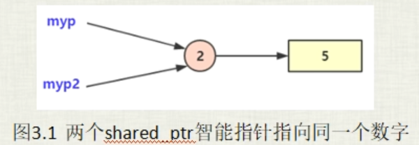
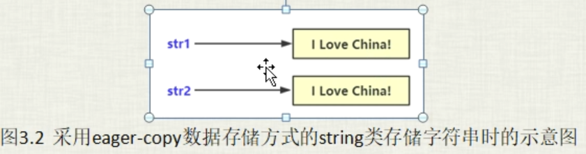
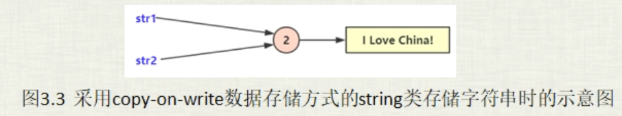

# shared_ptr实现及string存储简单说明

## shared_ptr智能指针实现简单说明

shared_ptr这个智能指针采用的是共享所有权来管理指向对象的生命周期，所以一个对象能够被多个对象所拥有，多个shared_ptr指针之间相互协作，从而确保不在需要所指对象时将该对象内存释放掉。

```c++
#include <iostream>
#include <memory>

using namespace std;

int main()
{
    shared_ptr<int> myp(new int(5));
    int icount = myp.use_count();
    std::cout << "icount = " << icount << std::endl;
    // icount = 1
    
    {
        shared_ptr<int> myp2(myp);
        icount = myp2.use_count();
        std::cout << "icount = " << icount << std::endl;
        // icount = 2
    }
    
    icount = myp.use_count();
    std::cout << "icount = " << icount << std::endl;
    // icount = 1

    return 0;
}
```



## string类型字符串存储方式的简单说明

string实现方式：

- 比较典型的有eager-copy（贪婪/粗暴 拷贝）
- copy-on-write（写时复制）
- small string optimization （短字符串优化-SSO）

```c++
namespace _nmsp2
{
    void func()
    {
        string str1 = "i love China";
        string str2 = str1;     // 拷贝构造
        printf("str1所存储的字符串地址 = %p\n", str1.c_str());
        // str1所存储的字符串地址 = 0x7ffe72884940
        printf("str2所存储的字符串地址 = %p\n", str2.c_str());
        // str2所存储的字符串地址 = 0x7ffe72884960
    }
}
```

可以看到，str2这个string对象是有str1这个对象构造出来，但是他们所保存的这个字符串数据却是毫无瓜葛，str1和str2所存储的地址不相同。这种毫无瓜葛的string类或者字符串存储方式就是 eager-copy（贪婪/粗暴 拷贝）。从这个示意图中我们可以看到eager-copy这种字符串保存方式的一个缺点，就是浪费内存。因为首先他们保存的内容完全相同，其次str2是由str1拷贝构造出来的，结果str1和str2都分别用不同的内存来保存。当然有缺点必然有优点，那就是实现eager-copy的代码比较简单，不容易出错。



短字符串优化，如果说你所保存的这个字符串长度较短，那么这个字符串的内容实际上会保存到string这个对象（str1)本身的预留空间里去。但是如果这个字符串保存的空间太长，这个时候string这个对象本身的预留空间不足以存下这么长的内容，那么string的实现中就会单独开辟出一块内存来保存这个字符串



从示意图上可以看到，copy-on-write（写时复制）这种字符串存储技术（注意：写时复制不仅仅是字符串存储，他可以用在各种数据存储上），它的一个优点就是节省内存，尤其是你字符串特别大的时候，str1和str2字符串存储的内容相同，而且str2是通过str1拷贝构造出来的。也正是因为是拷贝构造出来的，所以str1和str2他们所指向的字符串完全可以用同一块内存来保存。写时复制他的一个缺点就是代码实现复杂。

在linux中有一个fork函数，他用来创建子进程。fork的执行效率非常高，它执行效率高的工作原理就是fork它产生的新进程不会复制原进程的内存空间，而是和原来的进程共享一个进程空间（就和我们现在谈的这个写时复制有异曲同工之妙），这个共享内存空间就是一种写时复制（copy-on-write)。也就是原来的这个父进程和新产生的这个子进程他们可以同时自由的读取这块共享的内存，注意这里只是读，但是如果这个子进程或者父进程对这块内存进行修改的话，那么这个内存就会复制出一份来（这也就是写时复制）给这个进程单独使用。

说了这么多，其实想提的就是，要想实现写时复制，那么就需要用到 引用计数 这种编程手段的介入。