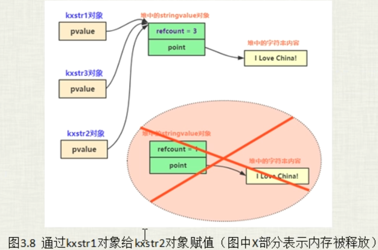
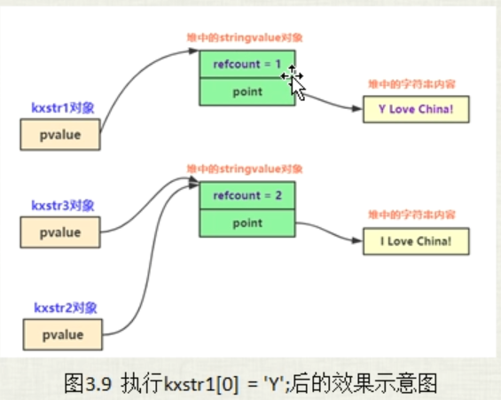
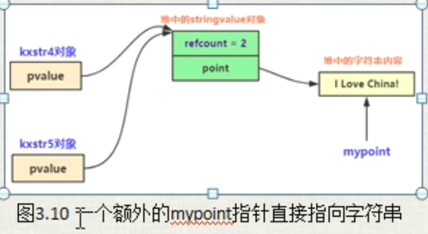
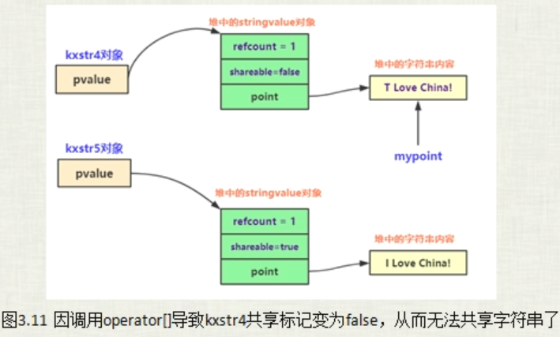

# 通过copy-on-write方式实现的mystring类


```c++
namespace _nmsp1
{
    class mystring
    {
    public:
        mystring(const char* tmpstr = "")   // 构造函数
        {
            
        }
        
        mystring& operator=(const mystring& tmpv)
        {
            if(tmpv == this)    // 判断是不是自己拷贝自己
            {
                return *this;
            }
            
            delete[] point;
            point = new char[sizeof(tmpv.point) + 1];   // 给字符串末尾的 \0 留一个位置，所以 + 1
            strcpy(point, tmpv.point);
            
            return *this;
        }
        
    private:
        char* point;    // 指向实际的字符串
    };
}
```

首先看这段代码，这里拷贝赋值运算符这种写法，并不是我们想要的效果，他如果这样写，那么在执行拷贝赋值操作的时候，就会导致每一个产生的新对象他的字符串都会被分配一段新的内存，也就不是我们想要的引用计数的效果，也就是不是我们想要的数据共享效果。


## 骨架与计数设计

创建新结构 stringValue ： 保存计数器 和 指向字符串的指针。

stringValue存在的意义就是把 要保存的字符串 和 对这个字符串的引用计数统一的保存在一个stringValue对象中

```c++
namespace _nmsp1
{
    class mystring
    {
    public:
        mystring(const char* tmpstr = "")   // 构造函数
        {
            
        }
        
        mystring& operator=(const mystring& tmpv)
        {
            
            
            return *this;
        }
        
    private:
        // 创建一个类中类，用来保存引用计数和指向的字符串指针
        struct stringValue
        {
            size_t refcount;    // 引用计数
            char* point;        // 指向实际字符串
            
            // 构造函数
            stringValue(const char* tmpstr):refcount(1)
            {
                // 因为是共享内存，所以只有在第一次指向某个字符串的时候，才会开辟内存（才会指向这个构造函数）
                point = new char[strlen(tmpstr) + 1];
                strcpy(point, tmpstr);
            }
            
            // 析构函数
            ~stringValue()
            {
                delete[] point;
            }
        };
        
    private:
        stringValue* pvalue;    // mystring类中指向 stringValue对象的指针
    };
}
```

## 构造函数

```c++
// 在构造函数中把这个 stringValue 构造出来
        mystring(const char* tmpstr = "") : pvalue(new stringValue(tmpstr))  // 构造函数
        {
            
        }
```

代码补充到现在，那么如下两个字符串构造对应的内存状态应该是：

```c++
_nmsp1::mystring str1("i love china");
_nmsp1::mystring str2 = ("i love china");
```


## 拷贝构造函数

```c++
namespace _nmsp1
{
    class mystring
    {
    public:
        // 在构造函数中把这个 stringValue 构造出来
        mystring(const char* tmpstr = "") : pvalue(new stringValue(tmpstr))  // 构造函数
        {
            
        }
        
        // 拷贝构造函数
        mystring(const mystring& tmpv):pvalue(tmpv.pvalue)
        {
            ++pvalue->refcount; // 引用计数加1
        }
        
        // 析构函数
        ~mystring()
        {
            --pvalue->refcount;
            if(pvalue->refcount == 0)
            {
                delete pvalue;
            }
        }
        
        mystring& operator=(const mystring& tmpv)
        {
            
            
            return *this;
        }
        
    private:
        // 创建一个类中类，用来保存引用计数和指向的字符串指针
        struct stringValue
        {
            size_t refcount;    // 引用计数
            char* point;        // 指向实际字符串
            
            // 构造函数
            stringValue(const char* tmpstr):refcount(1)
            {
                // 因为是共享内存，所以只有在第一次指向某个字符串的时候，才会开辟内存（才会指向这个构造函数）
                point = new char[strlen(tmpstr) + 1];
                strcpy(point, tmpstr);
            }
            
            // 析构函数
            ~stringValue()
            {
                delete[] point;
            }
        };
        
    private:
        stringValue* pvalue;    // mystring类中指向 stringValue对象的指针
    };
}
```

对于这里这个析构函数，首先先把引用计数减一，然后判断引用计数是否为0，为0表示没有mystring对象继续指向这个字符串了，那么就可以直接delete这个 stringValue对象的指针，然后就会执行 stringValue类中的析构函数，把这个真正的字符串所指向的指针 point给delete掉。

代码补充到现在，那么如下利用字符串拷贝构造对应的内存状态应该是：

```c++
_nmsp1::mystring str3 = str1;    // 调用拷贝构造函数
```


## 拷贝赋值运算符

注意一个编程技巧：如果类中有 指针成员，那么一般都需要我们手工的为类写拷贝构造函数和拷贝赋值运算符。否者就可能会出现问题。

```c++
// 拷贝赋值运算符
        mystring& operator=(const mystring& tmpv)
        {
            if(this == &tmpv)
            {
                return *this;
            }
            
            // 将原来的那个(也就是自己） mystring 对象的引用计数 -1
            --pvalue->refcount;
            if(pvalue->refcount == 0)
            {
                delete pvalue;
            }
            
            // 然后将自己指向新的 mystring 对象，
            pvalue = tmpv.pvalue;
            // 然后引用计数 + 1
            ++pvalue->refcount;
            
            return *this;
        }
```



## 外部加锁、内部加锁、写时复制（copy-on-write）

外部加锁：调用者负责加锁，有调用者决定跨线程使用共享对象时的加锁时机。

内部加锁，对象将所有对自己的访问进行串行化，通过为每个成员函数加锁的方法来实现。这样就不需要再多线程共享该对象时进行外部加锁了（内部加锁并不常见）

实现出某些接口的多线程版本的动机和必要性是值得深思的。绝大多数情况下对于实现加锁和解锁的时机都应该有程序员来控制（外部加锁），内部加锁一般只适用于操作独立，内部很完整的接口。

```c++
// 重载[]操作符
        const char& operator[](int index)
        {
            return pvalue->point[index];
        }
```

重载[]操作符，以便能够像普通string一样能够通过[]下标去获取字符。

```c++
_nmsp1::mystring str1("i love china");
std::cout << str1[0] << std::endl;  // i
```

重载非const版本的operator[]，实现写时复制

```c++
// 重载非const版本的operator[]，实现写时复制
        char& operator[](int index)
        {
            if(pvalue->refcount > 1)
            {
                // 说明有其他mystring对象也指向该字符串。那这个时候就得将其复制出来
                --pvalue->refcount;
                pvalue = new stringValue(pvalue->point);    // 写时复制，自立门户，开辟新内存
            }
            return pvalue->point[index];
        }
```

当我们为mystring类添加这个非const版本的[]重载的时候，发现原来那个调用const版本的[]也改为调用非const版本了。这是一个缺陷，因为我正常[]只是读取某个索引值的字符，没有存在写动作，这样就会导致我用一次，就会给我分配出一个内存，这是很没有必要的事。

```c++
int main()
{
    _nmsp1::mystring str1("i love china");
    _nmsp1::mystring str2 = ("i love china");
    
    _nmsp1::mystring str3(str1);    // 调用拷贝构造函数
    str2 = str1;                    // 调用拷贝赋值运算符
    
    _nmsp1::mystring str4 = str1;   // 调用拷贝构造函数；
    
    std::cout << str1[0] << std::endl;  // i  这里原本是调用const版本的operator[],但是添加了非const版本的operator[]之后，这里也跑去调用了非const版本的operator[]
    
    str1[0] = 'u';	// 调用的是非const 版本的 operator[],因为const版本的返回的是const常量，不能被修改（做左值）
    std::cout << str1[0] << std::endl;	// u

    return 0;
}
```

实际上发生上述行为就是因为编译器没办法判断 `std::cout << str1[0] << std::endl;`和 `str1[0] = 'u';`这两个操作哪个是用于读，哪个是用于写。所以编译器的处理就很简单粗暴，只要是调用[]，只要你有非const版本的[]重载存在，都一律调用非const版本的operator[]重载。所以这里其实这个const版本的重载其实也就没必要存在了。



## 通过指针修改mystring所指字符串的内容

```c++
_nmsp1::mystring str5 = "i love china";
char *pmypoint = &str5[0];  // 也就是 pmypoint 也是指向的 "i love china"
_nmsp1::mystring str6 = str5;
```

假设存在如上代码，那么我们不难发现，str5和str6都是指向同一块字符串，他们的引用计数为2，但是问题就在于现在有个裸指针 pmypoint也是指向这块字符串内存。通过下面的图可以看到，这个pmypoint这个裸指针并没有通过stringvalue来指向这个字符串，而是直接指向了这个字符串。那如果出现下面的代码，

```c++
*pmypoint = 'L';
```

该行代码就会导致 str5和str6这两个字符串内容都被篡改了。这显然失败不合理的，因为我代码的原意是 这个 pmypoint指针指向的是str5的字符串，那我修改了也只会修改str5的字符串内容，而不该修改到str6的字符串内容。



解决方式有两种：第一种不解决，你如果非要写出这种用裸指针直接指向一个stringvalue管理的字符串，那你就要承受这样的代价，这种情况应该在接口文档里注明。

第二种方式：通过代码修改进行解决：思路就是给 stringvalue引入一个bool类型的成员变量，用来判断该 stringValue指向的字符串是否能够被其他mystring对象共享，然后该bool值的一个改变时机就是 operator[]操作符被调用的时候，只要该操作符被调用了，就说明该 stringValue指向的字符串不能再被其他 mystring 对象进行共享了。同时拷贝构造函数这里因为就是进行共享内存的关键实现地方，所以这里的代码也要加入 单前拷贝的对象是否允许共享的判断，如果不允许，那就只能自立门户，自己new一个新的stringValue对象了。

```c++
namespace _nmsp1
{
    class mystring
    {
    public:
        // 在构造函数中把这个 stringValue 构造出来
        mystring(const char* tmpstr = "") : pvalue(new stringValue(tmpstr))  // 构造函数
        {
            
        }
        
        // 拷贝构造函数
        mystring(const mystring& tmpv) // :pvalue(tmpv.pvalue)
        {
            if(tmpv.pvalue->shareable)
            {
                pvalue(tmpv.pvalue);
                ++pvalue->refcount; // 引用计数加1
            }
            else
            {
                // 不能共享，只能自己自立门户
                pvalue = new stringValue(tmpv->point);
                
            }
        }
        
        // 析构函数
        ~mystring()
        {
            --pvalue->refcount;
            if(pvalue->refcount == 0)
            {
                delete pvalue;
            }
        }
        
        // 拷贝赋值运算符
        mystring& operator=(const mystring& tmpv)
        {
            if(this == &tmpv)
            {
                return *this;
            }
            
            // 将原来的那个(也就是自己） mystring 对象的引用计数 -1
            --pvalue->refcount;
            if(pvalue->refcount == 0)
            {
                delete pvalue;
            }
            
            // 然后将自己指向新的 mystring 对象，
            pvalue = tmpv.pvalue;
            // 然后引用计数 + 1
            ++pvalue->refcount;
            
            return *this;
        }
        
        // 重载非const版本的operator[]，实现写时复制
        char& operator[](int index)
        {
            if(pvalue->refcount > 1)
            {
                // 说明有其他mystring对象也指向该字符串。那这个时候就得将其复制出来
                --pvalue->refcount;
                pvalue = new stringValue(pvalue->point);    // 写时复制，自立门户，开辟新内存
            }
            
            // 一旦这个 operator[] 操作符被调用，那么就意味着这个字符串将不能再被其他 mystring 对象共享了
            pvalue->shareable = false;
            
            return pvalue->point[index];
        }
        
    private:
        // 创建一个类中类，用来保存引用计数和指向的字符串指针
        struct stringValue
        {
            bool shareable;     // 一个是否能被共享的标记，这个是否能被共享就是只是否能够被其他mystring对象共享
            // 刚创建一个mystring对象的时候，所指向的那个字符串当然应该是能够被共享的
            
            size_t refcount;    // 引用计数
            char* point;        // 指向实际字符串
            
            // 构造函数
            stringValue(const char* tmpstr):refcount(1),shareable(true)
            {
                // 因为是共享内存，所以只有在第一次指向某个字符串的时候，才会开辟内存（才会指向这个构造函数）
                point = new char[strlen(tmpstr) + 1];
                strcpy(point, tmpstr);
            }
            
            // 析构函数
            ~stringValue()
            {
                delete[] point;
            }
        };
        
    private:
        stringValue* pvalue;    // mystring类中指向 stringValue对象的指针
    };
}
```



### 引用计数功能付出的代价：

额外引入了stringValue这个辅助类（这个辅助类也是需要占内存的）

在类mystring的实现中也额外增加很多代码，提高程序的复杂度。所以很多时候在进行程序设计往往是通过提高程序代码的复杂度来节省资源，提高程序执行效率。