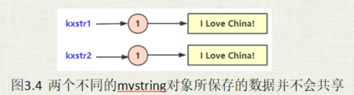
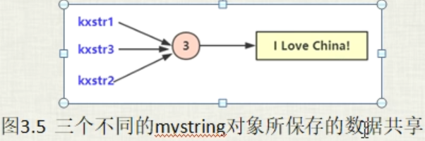
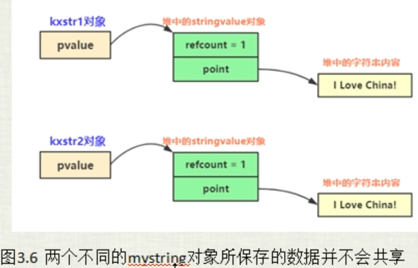
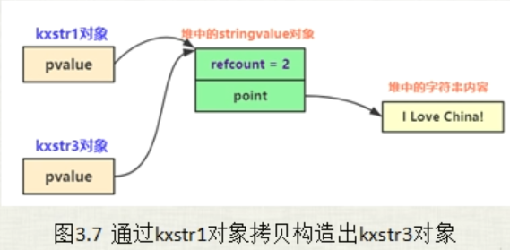

# 通过copy-on-write方式实现的mystring类



```c++
namespace _nmsp1
{
    class mystring
    {
    public:
        mystring(const char* tmpstr = "")   // 构造函数
        {
            
        }
        
        mystring& operator=(const mystring& tmpv)
        {
            if(tmpv == this)    // 判断是不是自己拷贝自己
            {
                return *this;
            }
            
            delete[] point;
            point = new char[sizeof(tmpv.point) + 1];   // 给字符串末尾的 \0 留一个位置，所以 + 1
            strcpy(point, tmpv.point);
            
            return *this;
        }
        
    private:
        char* point;    // 指向实际的字符串
    };
}
```

首先看这段代码，这里拷贝赋值运算符这种写法，并不是我们想要的效果，他如果这样写，那么在执行拷贝赋值操作的时候，就会导致每一个产生的新对象他的字符串都会被分配一段新的内存，也就不是我们想要的引用计数的效果，也就是不是我们想要的数据共享效果。



## 骨架与计数设计

创建新结构 stringValue ： 保存计数器 和 指向字符串的指针。

stringValue存在的意义就是把 要保存的字符串 和 对这个字符串的引用计数统一的保存在一个stringValue对象中

```c++
namespace _nmsp1
{
    class mystring
    {
    public:
        mystring(const char* tmpstr = "")   // 构造函数
        {
            
        }
        
        mystring& operator=(const mystring& tmpv)
        {
            
            
            return *this;
        }
        
    private:
        // 创建一个类中类，用来保存引用计数和指向的字符串指针
        struct stringValue
        {
            size_t refcount;    // 引用计数
            char* point;        // 指向实际字符串
            
            // 构造函数
            stringValue(const char* tmpstr):refcount(1)
            {
                // 因为是共享内存，所以只有在第一次指向某个字符串的时候，才会开辟内存（才会指向这个构造函数）
                point = new char[strlen(tmpstr) + 1];
                strcpy(point, tmpstr);
            }
            
            // 析构函数
            ~stringValue()
            {
                delete[] point;
            }
        };
        
    private:
        stringValue* pvalue;    // mystring类中指向 stringValue对象的指针
    };
}
```

## 构造函数

```c++
// 在构造函数中把这个 stringValue 构造出来
        mystring(const char* tmpstr = "") : pvalue(new stringValue(tmpstr))  // 构造函数
        {
            
        }
```

代码补充到现在，那么如下两个字符串构造对应的内存状态应该是：

```c++
_nmsp1::mystring str1("i love china");
_nmsp1::mystring str2 = ("i love china");
```



```c++
_nmsp1::mystring str3 = str1;    // 调用拷贝构造函数
```



## 拷贝构造函数

## 拷贝赋值运算符

## 外部加锁、内部加锁、写时复制（copy-on-write）

## 通过指针修改mystring所指字符串的内容