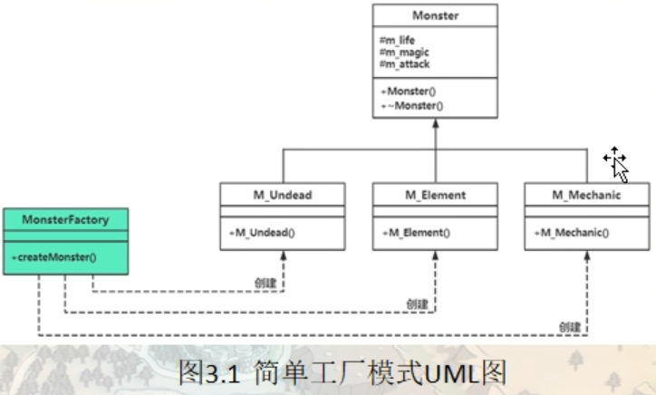
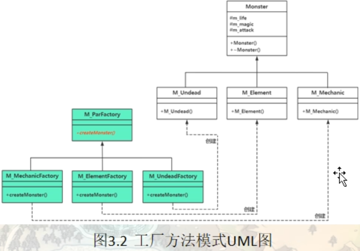

工厂模式、原型（prototype）模式，建造者（Builder）模式

---

# 工厂模式

现实生活中，原始社会自给自足（没有工厂），农耕社会小作坊（简单工厂，民间酒坊），工业革命流水线（工厂方法，自产自销），现代产业链代工厂（抽象工厂，富士康）。我们的项目代码同样是由简到繁一步一步迭代而来的，但对于调用者来说，却越来越简单。

在日常开发中，凡是需要生成复杂对象的地方，都可以尝试考虑使用工厂模式来代替。

> 注意：上述复杂对象指的是类的构造函数参数过多等对类的构造有影响的情况，因为类的构造过于复杂，如果直接在其他业务类内使用，则两者的耦合过重，后续业务更改，就需要在任何引用该类的源代码内进行更改，光是查找所有依赖就很消耗时间了，更别说要一个一个修改了。

工厂模式的定义：定义一个创建产品对象的工厂接口，将产品对象的实际创建工作推迟到具体子工厂类当中。这满足创建型模式中所要求的“创建与使用相分离”的特点。

工厂模式属于创建型模式，按实际业务场景划分，工厂模式有 3 种不同的实现方式，分别是简单工厂模式、工厂方法模式和抽象工厂模式。

new创建的是 堆对象，堆对象可以实现多态。工厂模式就是通过把创建对象的代码包装起来，做到创建对象的代码与其具体的业务逻辑代码相隔离

## 简单工厂模式（Simple Factory）

我们把被创建的对象称为“产品”，把创建产品的对象称为“工厂”。如果要创建的产品不多，只要一个工厂类就可以完成，这种模式叫“简单工厂模式”。

在简单工厂模式中创建实例的方法通常为静态（static）方法，因此简单工厂模式（Simple Factory Pattern）又叫作静态工厂方法模式（Static Factory Method Pattern）。

简单来说，简单工厂模式有一个具体的工厂类，可以生成多个不同的产品，属于创建型设计模式。简单工厂模式不在 GoF 23 种设计模式之列。

简单工厂模式每增加一个产品就要增加一个具体产品类和一个对应的具体工厂类，这增加了系统的复杂度，违背了“开闭原则”。

> “工厂方法模式”是对简单工厂模式的进一步抽象化，其好处是可以使系统在不修改原来代码的情况下引进新的产品，即满足开闭原则。

情景模拟：假设游戏中有三类怪物，亡灵类，元素类，机械类，都有生命值，蓝量，攻击力基本属性，Monster作为父类，M_Undead（亡灵类），M_Element（元素类），M_Mechainc（机械类）

```c++
namespace _nmsp1
{
    // 怪物基类
    class Monster
    {
    public:
        Monster(int life, int magic, int attack):m_life(life),m_magic(magic),m_attack(attack)
        {}
        
        virtual ~Monster()
        {}
        
    // 可能会被子类访问的成员
    protected:
        int m_life;     // 生命值
        int m_magic;    // 蓝量
        int m_attack;   // 攻击力
    };
    
    // 亡灵类
    class M_Undead : public Monster
    {
    public:
        M_Undead(int life, int magic, int attack) : Monster(life, magic, attack)
        {
            std::cout << "一个亡灵怪出现了" << std::endl;
        }
    };
    
    // 元素类
    class M_Element : public Monster
    {
    public:
        M_Element(int life, int magic, int attack) : Monster(life, magic, attack)
        {
            std::cout << "一个元素怪出现了" << std::endl;
        }
    };
    
    // 机械类
    class M_Mechainc : public Monster
    {
    public:
        M_Mechainc(int life, int magic, int attack) : Monster(life, magic, attack)
        {
            std::cout << "一个机械怪出现了" << std::endl;
        }
    };
    
    
    // 怪物工厂类
    class MonsterFactory
    {
    public:
        static Monster* createMonster(string strmontype)
        {
            Monster *prtnobj = nullptr;
            if (strmontype == "udd")    // udd 创建亡灵类
            {
                prtnobj = new M_Undead(500, 100, 60);
            }
            else if (strmontype == "ele")  // ele 创建元素类
            {
                prtnobj = new M_Element(700, 300, 30);
            }
            else if (strmontype == "mec")   // mec 创建机械类
            {
                prtnobj = new M_Mechainc(1000, 0, 50);
            }
            
            return prtnobj;
        }
    };
    
    // 虽然通过这个怪物工厂类我们不需要与怪物类名直接打交道，但是还是需要给工厂类传递要创建哪种类
    
}
```

使用 new + 具体类名来创建对象是一种依赖具体类型的紧耦合关系，简单工厂模式的实现思路：使用工厂类可以实现创建怪物的代码与各个具体的怪物类对象要实现的逻辑代码隔离

### 优点和缺点

#### 优点：

1. 工厂类包含必要的逻辑判断，可以决定在什么时候创建哪一个产品的实例。客户端可以免除直接创建产品对象的职责，很方便的创建出相应的产品。工厂和产品的职责区分明确。
2. 客户端无需知道所创建具体产品的类名，只需知道参数即可。
3. 也可以引入配置文件，在不修改客户端代码的情况下更换和添加新的具体产品类。

#### 缺点：

1. 简单工厂模式的工厂类单一，负责所有产品的创建，职责过重，一旦异常，整个系统将受影响。且工厂类代码会非常臃肿，违背高聚合原则。
2. 使用简单工厂模式会增加系统中类的个数（引入新的工厂类），增加系统的复杂度和理解难度
3. 系统扩展困难，一旦增加新产品不得不修改工厂逻辑，在产品类型较多时，可能造成逻辑过于复杂
4. 简单工厂模式使用了 static 工厂方法，造成工厂角色无法形成基于继承的等级结构。

### 开闭原则

开闭原则明确的告诉我们：软件实现应该对扩展开放，对修改关闭，其含义是说一个软件实体应该通过扩展来实现变化，而不是通过修改已有的代码来实现变化的。（比如可以通过增加新类，增加新成员函数来进行扩展）

### 简单工厂模式的定义（实现意图）：

定义一个工厂类（MonsterFactory），该类的成员函数（createMonster）可以根据不同参数来创建并返回不同的类对象，被创建的对象所属的类（M_Undead，M_Element，M_Mechainc），一般都具有相同的父类（Monster），调用者无需关系创建细节。

### 简单工厂模式UML图



## 工厂方法模式（Factor Method)

上面介绍了简单工厂模式，提到了简单工厂模式违背了开闭原则，而“工厂方法模式”是对简单工厂模式的进一步抽象化，其好处是可以使系统在不修改原来代码的情况下引进新的产品，即满足开闭原则。

工厂方法模式是使用频率最高的工厂模式，它也可以简称为工厂多态模式或者工厂模式

#### 优点：

- 用户只需要知道具体工厂的名称就可得到所要的产品，无须知道产品的具体创建过程。
- 灵活性增强，对于新产品的创建，只需多写一个相应的工厂类。
- 典型的解耦框架。高层模块只需要知道产品的抽象类，无须关心其他实现类，满足迪米特法则、依赖倒置原则和里氏替换原则。

#### 缺点：

- 类的个数容易过多，增加复杂度
- 增加了系统的抽象性和理解难度
- 抽象产品只能生产一种产品，此弊端可使用 【抽象工厂模式】 解决。

#### 应用场景：

- 客户只知道创建产品的工厂名，而不知道具体的产品名。如 TCL 电视工厂、海信电视工厂等。
- 创建对象的任务由多个具体子工厂中的某一个完成，而抽象工厂只提供创建产品的接口。
- 客户不关心创建产品的细节，只关心产品的品牌

现在使用工厂方法模式进行改造，就需要为每个怪物类提供一个工厂，然后些工厂可以有一个基类工厂类M_UndeadFactory, M_ElementFactory, M_MechaincFactory,他们有一个共同父类，M_ParFactory (工厂抽象类)，符合开闭原则，付出的代价就是需要新增多个新的工厂类

```c++
namespace _nmsp1
{
    // 怪物基类
    class Monster
    {
    public:
        Monster(int life, int magic, int attack):m_life(life),m_magic(magic),m_attack(attack)
        {}
        
        virtual ~Monster()
        {}
        
    // 可能会被子类访问的成员
    protected:
        int m_life;     // 生命值
        int m_magic;    // 蓝量
        int m_attack;   // 攻击力
    };
    
    // 亡灵类
    class M_Undead : public Monster
    {
    public:
        M_Undead(int life, int magic, int attack) : Monster(life, magic, attack)
        {
            std::cout << "一个亡灵怪出现了" << std::endl;
        }
    };
    
    // 元素类
    class M_Element : public Monster
    {
    public:
        M_Element(int life, int magic, int attack) : Monster(life, magic, attack)
        {
            std::cout << "一个元素怪出现了" << std::endl;
        }
    };
    
    // 机械类
    class M_Mechainc : public Monster
    {
    public:
        M_Mechainc(int life, int magic, int attack) : Monster(life, magic, attack)
        {
            std::cout << "一个机械怪出现了" << std::endl;
        }
    };
    
    // --------------------
    // 工厂抽象类 (工厂基类)
    class M_ParFactory
    {
    public:
        virtual Monster* createMonster() = 0;  // 具体实现在子类中进行
        virtual ~M_ParFactory() {}
    };
    
    // M_UndeadFactory,
    class M_UndeadFactory:public M_ParFactory
    {
    public:
        Monster* createMonster()
        {
            return new M_Undead(500, 100, 60);
        }
    };
    
    // M_ElementFactory, 
    class M_ElementFactory:public M_ParFactory
    {
    public:
        Monster* createMonster()
        {
            return new M_Element(700, 300, 30);
        }
    };
    
    // M_MechaincFactory
    class M_MechaincFactory:public M_ParFactory
    {
    public:
        Monster* createMonster()
        {
            return new M_Mechainc(1000, 0, 50);
        }
    };
    
    // 全局的，用于创建怪物对象的函数，注意形参类型是工厂父类类型指针，返回类型是怪物父类类型的指针
    Monster* Gbl_createMonster(M_ParFactory* factory)
    {
        return factory->createMonster();
        // 调用的 createMonster 是一个虚函数，所以这里会因为多态而去调用实际子类对象的 createMonster
        // 该虚函数扮演了多态new的行为，给进来的factory指向的具体怪物工厂类不同，实际创建的怪物类也不同
    
        // 所以这里就将改变的部分抽象到了这个函数里，根据你给定的工厂类不同，我就给你创建相对应的怪物类
        // 要新增怪物类,那就新增怪物工厂,然后这里也不需要做改动
        
    }
}
```

### 工厂方法模式定义（实现意图）：

定义一个用于创建对象的接口（M_ParFactory类中的createMonster虚成员函数，这其实就是一个工厂方法，工厂方法模式这个名字也是由此而来），但由子类（M_UndeadFactory, M_ElementFactory, M_MechaincFactory）决定要实例化的类是哪一个。该模式使得某个类（M_Undead，M_Element，M_Mechainc）的实例化延迟到工程类的子类（M_UndeadFactory, M_ElementFactory, M_MechaincFactory）



一般可以认为，将简单工厂模式的代码经过把工厂类进行抽象改造成符合开闭原则的代码就变成了工厂方法模式

把用new创建对象集中到用某个或者某些工厂类的成员函数中做的好处：

1：封装变化，将需求迭代对代码的影响降到最小

2：如果创建对象之前需要额外处理一些业务代码，可以将这些代码增加到具体工厂类的工厂方法成员函数中

## 抽象工厂模式（Abstract Factory）

### 战斗场景分类范例

### 不同厂商生产不同部件范例