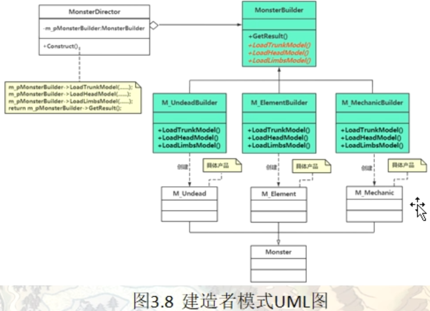

# 建造者（Builder）模式

建造者模式也称：构建器/构建者/生成器模式。也属于创建型模式

在软件开发过程中有时需要创建一个复杂的对象，这个复杂对象通常由多个子部件按一定的步骤组合而成。例如，计算机是由 CPU、主板、内存、硬盘、显卡、机箱、显示器、键盘、鼠标等部件组装而成的，采购员不可能自己去组装计算机，而是将计算机的配置要求告诉计算机销售公司，计算机销售公司安排技术人员去组装计算机，然后再交给要买计算机的采购员。

生活中这样的例子很多，如游戏中的不同角色，其性别、个性、能力、脸型、体型、服装、发型等特性都有所差异；还有汽车中的方向盘、发动机、车架、轮胎等部件也多种多样；每封电子邮件的发件人、收件人、主题、内容、附件等内容也各不相同。

以上所有这些产品都是由多个部件构成的，各个部件可以灵活选择，但其创建步骤都大同小异。这类产品的创建无法用前面介绍的工厂模式描述，只有建造者模式可以很好地描述该类产品的创建。

## 模式的定义与特点

建造者（Builder）模式的定义：指将一个复杂对象的构造与它的表示分离，使同样的构建过程可以创建不同的表示，这样的设计模式被称为建造者模式。它是将一个复杂的对象分解为多个简单的对象，然后一步一步构建而成。它将变与不变相分离，即产品的组成部分是不变的，但每一部分是可以灵活选择的。

该模式的主要优点如下：

1. 封装性好，构建和表示分离。
2. 扩展性好，各个具体的建造者相互独立，有利于系统的解耦。
3. 客户端不必知道产品内部组成的细节，建造者可以对创建过程逐步细化，而不对其它模块产生任何影响，便于控制细节风险。


其缺点如下：

1. 产品的组成部分必须相同，这限制了其使用范围。
2. 如果产品的内部变化复杂，如果产品内部发生变化，则建造者也要同步修改，后期维护成本较大。


建造者（Builder）模式和工厂模式的关注点不同：建造者模式注重零部件的组装过程，而工厂方法模式更注重零部件的创建过程，但两者可以结合使用。

## 一个具体实现范例的逐步重构

**情景模拟**

怪物：亡灵类，元素类，机械类，怪物组成：头部，躯干，肢体，3个部分组成，这几个部分的模型都是分开制作的，

**编码步骤：**

将怪物躯干信息读入内存，将怪物头部信息和肢体读入内存，将头部和肢体模型以正确的位置和反向挂接到躯干上
最终装配出完整的怪物模型，Assemble, LoadTrunkMode, LoadHeadMode, LoadLimbsMode这几个函数称为构建过程相关的函数

```c++
namespace _nmsp1
{
    // 怪物父类
    class Monster
    {
    public:
        virtual ~Monster() {}
        
        // 装配函数
        void Assemble(string strmodelNo)    // strmodelNo 模型编号 形如“12992329532990”这种字符串
        {
            LoadTrunkMode(strmodelNo.substr(4, 3));    // 载入躯干模型，截取部分字符串以表示躯干编号
            LoadHeadMode(strmodelNo.substr(7, 3));    // 载入头部模型，截取部分字符串以表示头部编号
            LoadLimbsMode(strmodelNo.substr(10, 3));    // 载入肢体模型，截取部分字符串以表示肢体编号
            
            // 将模型挂接到躯干。。。。
        }
        
        // 载入躯干
        virtual void LoadTrunkMode(string strNo) = 0;
        
        // 载入头部
        virtual void LoadHeadMode(string strNo) = 0;
        
        // 载入肢体
        virtual void LoadLimbsMode(string strNo) = 0;
    };
    
    // 亡灵类
    class M_Undead : public Monster
    {
    public:
        // 载入躯干
        void LoadTrunkMode(string strNo)
        {
            std::cout << "载入亡灵类躯干模型....." << std::endl;
        }
        
        // 载入头部
        void LoadHeadMode(string strNo)
        {
            std::cout << "载入亡灵类头部模型.....将模型挂接到躯干......" << std::endl;
        }
        
        // 载入肢体
        void LoadLimbsMode(string strNo)
        {
            std::cout << "载入亡灵类肢体模型.....将模型挂接到躯干......" << std::endl;
        }
    };
    
    // 元素类
    class M_Element : public Monster
    {
    public:
        // 载入躯干
        void LoadTrunkMode(string strNo)
        {
            std::cout << "载入元素类躯干模型....." << std::endl;
        }
        
        // 载入头部
        void LoadHeadMode(string strNo)
        {
            std::cout << "载入元素类头部模型.....将模型挂接到躯干......" << std::endl;
        }
        
        // 载入肢体
        void LoadLimbsMode(string strNo)
        {
            std::cout << "载入元素类肢体模型.....将模型挂接到躯干......" << std::endl;
        }
    };
    
    // 机械类
    class M_Mechanic : public Monster
    {
    public:
        // 载入躯干
        void LoadTrunkMode(string strNo)
        {
            std::cout << "载入机械类躯干模型....." << std::endl;
        }
        
        // 载入头部
        void LoadHeadMode(string strNo)
        {
            std::cout << "载入机械类头部模型.....将模型挂接到躯干......" << std::endl;
        }
        
        // 载入肢体
        void LoadLimbsMode(string strNo)
        {
            std::cout << "载入机械类肢体模型.....将模型挂接到躯干......" << std::endl;
        }
    };
}
```

引入与怪物类同层次的相关的构建器类，把怪物类相关的构建代码迁移到构建器中

```c++
namespace _nmsp2
{
    // 怪物父类
    class Monster
    {
    public:
        virtual ~Monster() {}

    };
    
    // 亡灵类
    class M_Undead : public Monster
    {
    
    };
    
    // 元素类
    class M_Element : public Monster
    {
    };
    
    // 机械类
    class M_Mechanic : public Monster
    {
    };
    
    // ------------------------------
    // 怪物构建器父类
    class MonsterBuilder
    {
    public:
        virtual ~MonsterBuilder() {}
        
        // // 装配函数
        // void Assemble(string strmodelNo)    // strmodelNo 模型编号 形如“12992329532990”这种字符串
        // {
        //     LoadTrunkMode(strmodelNo.substr(4, 3));    // 载入躯干模型，截取部分字符串以表示躯干编号
        //     LoadHeadMode(strmodelNo.substr(7, 3));    // 载入头部模型，截取部分字符串以表示头部编号
        //     LoadLimbsMode(strmodelNo.substr(10, 3));    // 载入肢体模型，截取部分字符串以表示肢体编号

        // }
        
        // 载入躯干
        virtual void LoadTrunkMode(string strNo) = 0;
        
        // 载入头部
        virtual void LoadHeadMode(string strNo) = 0;
        
        // 载入肢体
        virtual void LoadLimbsMode(string strNo) = 0;
        
        // 返回指向Monster类的成员变量指针 m_pMonster
        // 目的：当一个复杂的对象构造完成后可以通过该成员函数把对象返回
        Monster* GetResult()
        {
            return m_pMonster;
        }
        
    protected:
        Monster* m_pMonster;
        // 指向Monster类的成员变量指针
    };
    
    // ------------------------------
    // 亡灵类怪物构建器类
    class M_UndeadBuilder : public MonsterBuilder
    {
    public:
        // 构造函数
        M_UndeadBuilder()
        {
            m_pMonster = new M_Undead();
        }
        
        // 载入躯干
        void LoadTrunkMode(string strNo)
        {
            std::cout << "载入亡灵类躯干模型....." << std::endl;
            // 具体要做的事情其实是委托给怪物子类完成，委托指的是把本该自己实现的功能转给其他类实现
            // m_pMonster->....
            
        }
        
        // 载入头部
        void LoadHeadMode(string strNo)
        {
            std::cout << "载入亡灵类头部模型.....将模型挂接到躯干......" << std::endl;
            // m_pMonster->....
        }
        
        // 载入肢体
        void LoadLimbsMode(string strNo)
        {
            std::cout << "载入亡灵类肢体模型.....将模型挂接到躯干......" << std::endl;
            // m_pMonster->....
        }
    };
    
    // 元素类怪物构建器类
    class M_ElementBuilder : public MonsterBuilder
    {
    public:
        // 构造函数
        M_ElementBuilder()
        {
            m_pMonster = new M_Element();
        }
        
        // 载入躯干
        void LoadTrunkMode(string strNo)
        {
            std::cout << "载入元素类躯干模型....." << std::endl;
        }
        
        // 载入头部
        void LoadHeadMode(string strNo)
        {
            std::cout << "载入元素类头部模型.....将模型挂接到躯干......" << std::endl;
        }
        
        // 载入肢体
        void LoadLimbsMode(string strNo)
        {
            std::cout << "载入元素类肢体模型.....将模型挂接到躯干......" << std::endl;
        }
    };
    
    // 机械类怪物构建器类
    class M_MechanicBuilder : public MonsterBuilder
    {
    public:
        // 构造函数
        M_MechanicBuilder()
        {
            m_pMonster = new M_Mechanic();
        }
        
        // 载入躯干
        void LoadTrunkMode(string strNo)
        {
            std::cout << "载入机械类躯干模型....." << std::endl;
        }
        
        // 载入头部
        void LoadHeadMode(string strNo)
        {
            std::cout << "载入机械类头部模型.....将模型挂接到躯干......" << std::endl;
        }
        
        // 载入肢体
        void LoadLimbsMode(string strNo)
        {
            std::cout << "载入机械类肢体模型.....将模型挂接到躯干......" << std::endl;
        }
    };
    
    // ------------------------------
    // 创建一个指挥者类
    class MonsterDirector
    {
    public:
        // 构造函数
        MonsterDirector(MonsterBuilder *ptmBuilder)
        {
            m_pMonsterBuilder = ptmBuilder;
        }
        
        // 指定新的构建器(该函数就可以让程序后期自行随意更改构建器)
        void SetBuilder(MonsterBuilder* ptmBuilder)
        {
            m_pMonsterBuilder = ptmBuilder;
        }
        
        
        // 装配函数
        // 原 MonsterBuilder中的Assemble成员函数迁移到该指挥类
        Monster* Construct(string strmodelNo)    // strmodelNo 模型编号 形如“12992329532990”这种字符串
        {
            m_pMonsterBuilder->LoadTrunkMode(strmodelNo.substr(4, 3));    // 载入躯干模型，截取部分字符串以表示躯干编号
            m_pMonsterBuilder->LoadHeadMode(strmodelNo.substr(7, 3));    // 载入头部模型，截取部分字符串以表示头部编号
            m_pMonsterBuilder->LoadLimbsMode(strmodelNo.substr(10, 3));    // 载入肢体模型，截取部分字符串以表示肢体编号

            return m_pMonsterBuilder->GetResult();
            // 返回构建后的对象
        }
        
    private:
        // 同样的，就需要在该指挥类中放一个指向MonsterBuilder类的指针
        MonsterBuilder* m_pMonsterBuilder;
        // 指向所有构建器父类
    };
    
}
```


## 引入建造者（Builder）模式

建造者（Builder）模式的定义：指将一个复杂对象的构造与它的表示分离，使同样的构建过程可以创建不同的表示，这样的设计模式被称为建造者模式。它是将一个复杂的对象分解为多个简单的对象，然后一步一步构建而成。它将变与不变相分离，即产品的组成部分是不变的，但每一部分是可以灵活选择的。

上面范例中的MonsterBuilder类就是对象的构建，Monster类就是对象的表示



建造者（Builder）模式的主要角色如下。

1. 产品角色（Product）：它是包含多个组成部件的复杂对象，由具体建造者来创建其各个零部件。这里就对应上面范例中的M_Undead，M_Element，M_Mechanic
2. 抽象建造者（Builder）：它是一个包含创建产品各个子部件的抽象方法的接口，通常还包含一个返回复杂产品的方法 getResult()。这里就是对应上面范例中的MonsterBuilder
3. 具体建造者(Concrete Builder）：实现 Builder 接口，完成复杂产品的各个部件的具体创建方法。这里就对应范例中的M_UndeadBuilder, M_ElementBuilder, M_MechaicBuilder
4. 指挥者（Director）：它调用建造者对象中的部件构造与装配方法完成复杂对象的创建，在指挥者中不涉及具体产品的信息。这里就对应上面范例中的MonsterDirector

## 另一个建造者模式的范例

#### 情景模拟：

公司员工的工作日报，包含标题，内容主题，结尾三部分，标题部分 包含 部门名称，日报生成日期。内容主题部分 包含 具体描述（可能有多条）结尾：包含姓名

将日报导出成多种格式的文件，比如纯文本，XML格式，JSON格式

### 不用设计模式时程序该如何书写

```c++
namespace _nmsp1
{
    // 标题部分
    class DailyHeaderData
    {
    public:
        DailyHeaderData(string name, string date):m_strDepName(name), M_strGenDate(date)
        {}
        
        // 获取部门名称
        string getDepName()
        {
            return m_strDepName;
        }
        
        // 获取日报生成日期
        string getGenDate()
        {
            return M_strGenDate;
        }
        
    private:
        string m_strDepName;    // 部门名称
        string M_strGenDate;    // 日报生成日期
    };
    
    // 日报主题部分 日报主题中的每一条描述数据
    class DailyContentData
    {
    public:
        DailyContentData(string content, double dsTime):m_strContent(content),m_dspendTime(dsTime)
        {}
        
        // 获取工作内容
        string getContent()
        {
            return m_strContent;
        }
        
        // 获取工作时长
        double getDspenTime()
        {
            return m_dspendTime;
        }
        
    private:
        string m_strContent;    // 该项工作内容描述
        double m_dspendTime;    // 完成该项工作花费的时间（单位小时）
    };
    
    
    // 日报中的结尾部分
    class DailyFooterData
    {
    public:
        DailyFooterData(string name):m_strUserName(name)
        {}
        
        // 获取日报所属员工姓名
        string getUserName()
        {
           return m_strUserName;
        }
        
    private:
        string m_strUserName;   // 日报所属的员工姓名
        
    };
    
    // 将日报导出 为 纯文本
    class EportToTextFile
    {
    public:
        // 实现导出动作
        void doExport(DailyHeaderData& dailiHeadobj, std::vector<DailyContentData*>& vec_dailycontobj, DailyFooterData& dailyFooterobj)
        {
            string strtmp = "";
            // 拼标题
            strtmp += dailiHeadobj.getDepName() + "," + dailiHeadobj.getGenDate() + "\n";
            
            // 拼接内容主题（内容可能会有多条，所以这里需要迭代一下）
            for(auto iter = vec_dailycontobj.begin(); iter != vec_dailycontobj.end(); ++iter)
            {
                ostringstream oss;  // #include <sstream>
                oss << (*iter)->getDspenTime();
                strtmp += (*iter)->getContent() + ": 【花费的时间:" + oss.str() + "小时】" + "\n";
            }
            
            // 拼接结尾
            strtmp += "报告人：" + dailyFooterobj.getUserName() + "\n";
            
            
            // 导出文件（略），只展示到屏幕
            std::cout << strtmp << std::endl;
        }
    };
    
    // 将日报导出成xml格式
    class ExportToXmlFile
    {
    public:
        // 实现导出动作
        void doExport(DailyHeaderData& dailiHeadobj, std::vector<DailyContentData*>& vec_dailycontobj, DailyFooterData& dailyFooterobj)
        {
            string strtmp = "";
            // 拼标题
            strtmp += "<?xml version = \"1.0.0\" encoding=\"utf-8\" ?> \n";
            strtmp += "<DailyReport>\n";
            strtmp += "     <Header>\n";
            strtmp += "         <Depname>" + dailiHeadobj.getDepName() + "</Depname>\n";
            strtmp += "         <GenDate>" + dailiHeadobj.getGenDate() + "</GenDate>\n";
            strtmp += "     </Header>\n";
            
            
            // 拼接内容主题（内容可能会有多条，所以这里需要迭代一下）
            strtmp += "     <Body>\n";
            for(auto iter = vec_dailycontobj.begin(); iter != vec_dailycontobj.end(); ++iter)
            {
                ostringstream oss;  // #include <sstream>
                oss << (*iter)->getDspenTime();
            
                strtmp += "         <Content>" + (*iter)->getContent() + "</Content>\n";
                strtmp += "         <SpendTime>花费的时间:" + oss.str() + "小时</SpendTime>\n";
            }
            strtmp += "     </Body>\n";
            
            // 拼接结尾
            strtmp += "     <Footer>\n";
            strtmp += "         <UserName>报告人：" + dailyFooterobj.getUserName() + "</UserName>\n";
            strtmp += "     </Footer>\n";
            
            strtmp += "</DailyReport>\n";
            
            // 导出文件（略），只展示到屏幕
            std::cout << strtmp << std::endl;
        }
    };
    
}
```

### 采用设计模式时程序该如何书写

导出到文件，有3个步骤保持不变

- 1：拼接标题
- 2：拼接内容
- 3：拼接结尾

所以，考虑把这3个步骤（复杂对象的构建过程）提炼抽象出来，形成一个通用的处理过程

建造者模式的初衷：将构建不同格式数据的细节实现代码与具体的构建步骤分离达到复用构建步骤的目的

## 建造者模式总结