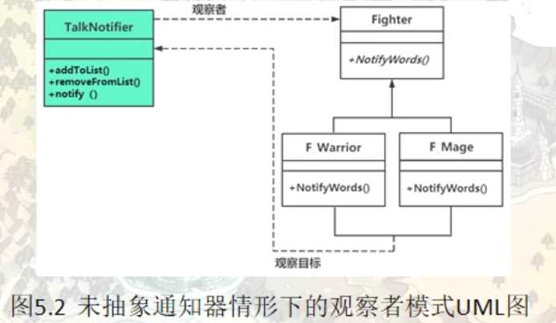
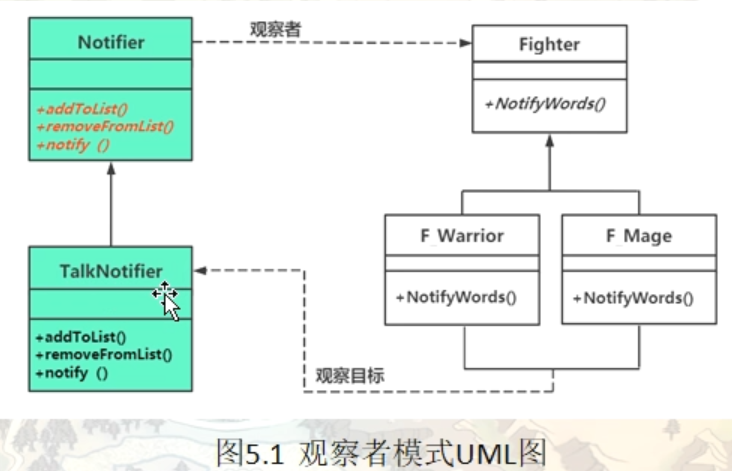

# 观察者模式（Observer）

在现实世界中，许多对象并不是独立存在的，其中一个对象的行为发生改变可能会导致一个或者多个其他对象的行为也发生改变。例如，某种商品的物价上涨时会导致部分商家高兴，而消费者伤心；还有，当我们开车到交叉路口时，遇到红灯会停，遇到绿灯会行。这样的例子还有很多，例如，股票价格与股民、微信公众号与微信用户、气象局的天气预报与听众、小偷与警察等。

在软件世界也是这样，例如，Excel 中的数据与折线图、饼状图、柱状图之间的关系；MVC 模式中的模型与视图的关系；事件模型中的事件源与事件处理者。所有这些，如果用观察者模式来实现就非常方便。

观察者（Observer）模式的定义：指多个对象间存在一对多的依赖关系，当一个对象的状态发生改变时，所有依赖于它的对象都得到通知并被自动更新。这种模式有时又称作发布-订阅模式、模型-视图模式，它是对象行为型模式。

观察者模式是一种对象行为型模式，其主要优点如下。

1. 降低了目标与观察者之间的耦合关系，两者之间是抽象耦合关系。符合依赖倒置原则。
2. 目标与观察者之间建立了一套触发机制。


它的主要缺点如下。

1. 目标与观察者之间的依赖关系并没有完全解除，而且有可能出现循环引用。
2. 当观察者对象很多时，通知的发布会花费很多时间，影响程序的效率。

## 一个遍历问题导致的低效率范例

需求，新增群组功能，同一个群组内的成员可以看到成员聊天消息，非同一群组的成员不能看到群组消息

```c++
namespace _nmsp1
{
    class Fighter;  // 前向声名
    list<Fighter*> g_PlayerList;    // 玩家列表
    
    // 玩家 父类
    class Fighter
    {
    public:
        Fighter(int tmpID, string name):m_iPlayerID(tmpID), m_sPlayerName(name)
        {
            m_iFamilyID = -1;   // 表示当前玩家没有加入任何家族
        }
        
        virtual ~Fighter() {}
        
        // 为玩家设置家族ID
        void SetFamilyID(int tmpID)
        {
            m_iFamilyID = tmpID;
        }
    
    public:
        void SayWorlds(string content)  // 玩家聊天这个动作
        {
            if (m_iFamilyID != -1)
            {
                // 该玩家属于某个家族，将说的话广播通知到家族群的其他玩家
                for(auto iter = g_PlayerList.begin(); iter != g_PlayerList.end(); ++iter)
                {
                    if (m_iFamilyID == (*iter)->m_iFamilyID)
                    {
                        // 同一个家族的其他玩家也应该收到这条信息
                        NotifyWorlds((*iter), content);
                    }
                }
            }
        }
        
    private:
        // 其他玩家收到了当前玩家的聊天消息
        void NotifyWorlds(Fighter* fighter, string content)
        {
            // 显示消息
            std::cout << "玩家：" << fighter->m_sPlayerName << "    收到了玩家：" << m_sPlayerName << "     发送的聊天消息" << std::endl;
            std::cout << "聊天消息内容：" << content << std::endl;
        }
        
    private:
        int m_iPlayerID;    // 玩家ID，全局唯一
        string m_sPlayerName;   // 玩家名
        int m_iFamilyID;    // 家族ID
    };
    
    
    // 战士角色
    class F_Warrior : public Fighter
    {
    public:
        F_Warrior(int temID, string name):Fighter(temID, name)
        {}
    };
    
    // 法师角色
    class F_Mage : public Fighter
    {
    public:
        F_Mage(int temID, string name):Fighter(temID, name)
        {}
    };
    
    // 牧师角色
    class F_Priest : public Fighter
    {
    public:
        F_Priest(int temID, string name):Fighter(temID, name)
        {}
    };
}
```

main中运行测试效果

```c++
int main()
{
    // 创建游戏玩家
    _nmsp1::Fighter* play1 = new _nmsp1::F_Warrior(10, "法维安");
    _nmsp1::Fighter* play2 = new _nmsp1::F_Priest(11, "哈辛达");
    _nmsp1::Fighter* play3 = new _nmsp1::F_Mage(12, "菲奥娜");
    _nmsp1::Fighter* play4 = new _nmsp1::F_Warrior(13, "沙木亚");
    _nmsp1::Fighter* play5 = new _nmsp1::F_Mage(14, "哈比");
    _nmsp1::Fighter* play6 = new _nmsp1::F_Warrior(15, "周虹");
    _nmsp1::Fighter* play7 = new _nmsp1::F_Priest(16, "蓝焰女王");
    
    play1->SetFamilyID(100);
    play2->SetFamilyID(100);
    play3->SetFamilyID(110);
    play4->SetFamilyID(100);
    play5->SetFamilyID(140);
    play6->SetFamilyID(140);
    play7->SetFamilyID(100);
    
    _nmsp1::g_PlayerList.push_back(play1);
    _nmsp1::g_PlayerList.push_back(play2);
    _nmsp1::g_PlayerList.push_back(play3);
    _nmsp1::g_PlayerList.push_back(play4);
    _nmsp1::g_PlayerList.push_back(play5);
    _nmsp1::g_PlayerList.push_back(play6);
    _nmsp1::g_PlayerList.push_back(play7);
    
    // 当某个玩家聊天时，同家族的人都应该收到聊天消息
    play1->SayWorlds("断罪之书，终将夺回！");
    
    // 玩家：法维安    收到了��家：法维安     发送的��天消息
    // 聊天消息内容��断罪之书，终将夺回！
    // 玩家：哈辛达    收到了玩家：法维安     发送�聊天消息
    // 聊天消息内容：断罪之书，终将夺回！
    // 玩家：沙木亚    收到了玩家：法维安     发送的聊天消息
    // 聊天消息内容：断罪之书，终将夺�！
    // 玩家：蓝焰女王    收到了玩家：法维安     发送的聊天消息
    // 聊天消��内容：断罪之书，终将夺回！
    

    return 0;
}

```

当前这种代码虽然实现了聊天功能，但是试想，如果游戏中有上万个玩家，那么这里发一条消息就需要遍历上万次，程序运行效率必然低下。

如果把隶属于某个家族的所有玩家归结到一个列表中，那么当该家族中某个玩家发出一条消息后，就只需要遍历该列表中的玩家，然后发送这条信息即可

## 引入观察者（Observer）模式

```c++
namespace _nmsp2
{
    class Fighter;  // 类前向声名
    
    class Notifier // 通知器 父类
    {
    public:
        virtual void addToList(Fighter* player) = 0;    // 把要被通知的玩家加入到列表中
        virtual void removeFromList(Fighter* player) = 0;   // 把不想被通知的玩家从列表中移除
        virtual void notify(Fighter* talker, string content) = 0;   // 通知细节信息
        virtual ~Notifier() {}
    };
    
    // 玩家 父类
    class Fighter
    {
    public:
        Fighter(int tmpID, string name):m_iPlayerID(tmpID), m_sPlayerName(name)
        {
            m_iFamilyID = -1;   // 表示当前玩家没有加入任何家族
        }
        
        virtual ~Fighter() {}
        
        // 为玩家设置家族ID
        void SetFamilyID(int tmpID)
        {
            m_iFamilyID = tmpID;
        }
        
        int GetFamilyID()
        {
            return m_iFamilyID;
        }
    
        void SayWorlds(string content, Notifier* notifier)  // 玩家聊天这个动作
        {
            notifier->notify(this, content);
        }
        
        
    public:
        // 其他玩家收到了当前玩家的聊天消息
        void NotifyWorlds(Fighter* talker, string content)
        {
            // 显示消息
            std::cout << "玩家：" << m_sPlayerName << "    收到了玩家：" << talker->m_sPlayerName << "     发送的聊天消息" << std::endl;
            std::cout << "聊天消息内容：" << content << std::endl;
        }
        
    private:
        int m_iPlayerID;    // 玩家ID，全局唯一
        string m_sPlayerName;   // 玩家名
        int m_iFamilyID;    // 家族ID
    };
    
    // 战士角色
    class F_Warrior : public Fighter
    {
    public:
        F_Warrior(int temID, string name):Fighter(temID, name)
        {}
    };
    
    // 法师角色
    class F_Mage : public Fighter
    {
    public:
        F_Mage(int temID, string name):Fighter(temID, name)
        {}
    };
    
    // 牧师角色
    class F_Priest : public Fighter
    {
    public:
        F_Priest(int temID, string name):Fighter(temID, name)
        {}
    };
    
    // ---------------------------------------------------------
    // 聊天信息通知器 子类
    class TalkNotifier : public Notifier
    {
    public:
        // 将玩家增加到家族列表中来
        virtual void addToList(Fighter* player)
        {
            int tmpfamilyid = player->GetFamilyID();
            if (tmpfamilyid != -1)  // 加入了某个家族
            {
                auto iter = m_familyMap.find(tmpfamilyid);
                if(iter != m_familyMap.end())
                {
                    // 该家族id在map中已经存在
                    iter->second.push_back(player);
                }
                else
                {
                    // 如果该玩家没有加过家族（该家族id在map中不存在）
                    list<Fighter*> tmpfamilylist;
                    m_familyMap.insert(make_pair(tmpfamilyid, tmpfamilylist));
                    // 以该家族id为key，新增条目到map
                    m_familyMap[tmpfamilyid].push_back(player);
                    // 像该家族中增加第一个玩家
                }
            }
        }
        
        // 将玩家从家族列表中删除
        virtual void removeFromList(Fighter* player)
        {
            int tmpfamilyid = player->GetFamilyID();
            
            if (tmpfamilyid != -1)
            {
                auto iter = m_familyMap.find(tmpfamilyid);
                if (iter != m_familyMap.end())
                {
                    m_familyMap[tmpfamilyid].remove(player);
                }
            }
        }
        
        // 将玩家消息广播到家族群
        virtual void notify(Fighter* talker, string content)
        {
            int tmpfamilyid = talker->GetFamilyID();
            
            if (tmpfamilyid != -1)
            {
                auto iter = m_familyMap.find(tmpfamilyid);
                if (iter != m_familyMap.end())
                {
                    // 遍历该玩家所属家族的所有成员
                    for(auto iterl = iter->second.begin(); iterl != iter->second.end(); ++iterl)
                    {
                        (*iterl)->NotifyWorlds(talker, content);
                    }
                }
            }
        }
        
    private:
    // map 中的 key 表示家族id，list表示家族成员列表
        map<int, list<Fighter*>> m_familyMap;
    };
    
}
```

引入观察者模式后的main测试

```c++
// 创建游戏玩家
    _nmsp2::Fighter* play12 = new _nmsp2::F_Warrior(10, "法维安");
    _nmsp2::Fighter* play22 = new _nmsp2::F_Priest(11, "哈辛达");
    _nmsp2::Fighter* play32 = new _nmsp2::F_Mage(12, "菲奥娜");
    _nmsp2::Fighter* play42 = new _nmsp2::F_Warrior(13, "沙木亚");
    _nmsp2::Fighter* play52 = new _nmsp2::F_Mage(14, "哈比");
    _nmsp2::Fighter* play62 = new _nmsp2::F_Warrior(15, "周虹");
    _nmsp2::Fighter* play72 = new _nmsp2::F_Priest(16, "蓝焰女王");
    
    play12->SetFamilyID(100);
    play22->SetFamilyID(100);
    play32->SetFamilyID(110);
    play42->SetFamilyID(100);
    play52->SetFamilyID(140);
    play62->SetFamilyID(140);
    play72->SetFamilyID(100);
    
    // 创建通知器
    _nmsp2::Notifier* ptalk = new _nmsp2::TalkNotifier();
    
    // 将玩家增加到家族列表中来，这样才能收到家族消息
    ptalk->addToList(play72);
    ptalk->addToList(play62);
    ptalk->addToList(play52);
    ptalk->addToList(play42);
    ptalk->addToList(play32);
    ptalk->addToList(play22);
    ptalk->addToList(play12);
    
    // 某玩家聊天时，同组人都应该收到消息
    
    ptalk->removeFromList(play42);
    // 将玩家 play42 踢出群聊
    
    play72->SayWorlds("断剑重铸之日，骑士归来之时！", ptalk);
    // ---------------------------------------------------------
    // 玩家：蓝焰女王    收到了玩家：蓝焰女王     发送的聊天消息
    // 聊天消息内容：断剑重铸之日，骑士归来之时！
    // 玩家：哈辛达    收到了玩家：蓝焰女王     发送的聊天消息
    // 聊天消息内容：断剑重铸之日，骑士归来之时！
    // 玩��：法维安    收到了玩家：蓝焰女王     发送的聊天消息
    // 聊天消息内容�断剑重铸之日，骑士归来之时！
    
    
    std::cout << "---------------------------------------------------------" << std::endl;
    
    play62->SayWorlds("越千山红尘险峻，历无常覆水难收", ptalk);
    // ---------------------------------------------------------
    // 玩家：周虹    收到了玩家：周虹     发送的聊天消息
    // 聊天消息内容：越千山红尘险峻，历无常覆水难收
    // 玩家：哈比    收到了玩家：周虹     发送的聊天消息
    // 聊天消息内容：越千山红尘险峻，历无常覆水难收
```



观察者提供了一个特殊的成员函数，也就是这个NotifyWorlds，并把自己计入到通知器的列表中来（这也就是订阅或者注册），当这个通知器意识到有事件发生的时候，通过遍历对象列表，找到每个观察者，然后调用观察者提供的特定成员函数（这就相当于发布）来达到通知观察者某个事件的目的，观察者可以在NotifyWords中编写实现代码，来编写收到通知后想做的事情



#### 模式的结构

观察者模式的主要角色如下。

1. 抽象主题（Subject）角色：也叫抽象目标类 或者 观察目标，它提供了一个用于保存观察者对象的聚集类和增加、删除观察者对象的方法，以及通知所有观察者的抽象方法。这里指Notifier这个类
2. 具体主题（Concrete Subject）角色：也叫具体目标类，它实现抽象目标中的通知方法，当具体主题的内部状态发生改变时，通知所有注册过的观察者对象。它这里面维护一个观察者列表，当状态发生变化的时候，他会调用notify向各个观察者发送通知。这里指的就是TalkNotifier类
3. 抽象观察者（Observer）角色：它是一个抽象类或接口，它包含了一个更新自己的抽象方法，当接到具体主题的更改通知时被调用。这里指的就是 Fighter这个类
4. 具体观察者（Concrete Observer）角色：实现抽象观察者中定义的抽象方法，以便在得到目标的更改通知时更新自身的状态。这里指的就是F_Warrior / F_Mage / ..

#### 观察者模式特点：

1. 在观察者和观察目标之间，建立了一个抽象的耦合（松耦合），观察目标只需要维持一个抽象的观察列表，并不需要了解具体的观察者类。改变观察者或者观察目标的一方，只要调用接口不发生改变，就不会影响另一方，松耦合的双方都依赖抽象而不是具体类，满足依赖倒置原则
2. 观察目标会向观察列表中的所有观察者发送通知，而不是观察者不断向观察目标查询状态的变化。从而简化了系统一对多的设计难度
3. 可以通过新增代码的方式新增新的观察者和观察目标，符合开闭原则

## 应用联想

在软件系统中，当系统一方行为依赖另一方行为的变动时，可使用观察者模式松耦合联动双方，使得一方的变动可以通知到感兴趣的另一方对象，从而让另一方对象对此做出响应。

通过前面的分析与应用实例可知观察者模式适合以下几种情形。

1. 对象间存在一对多关系，一个对象的状态发生改变会影响其他对象。
2. 当一个抽象模型有两个方面，其中一个方面依赖于另一方面时，可将这二者封装在独立的对象中以使它们可以各自独立地改变和复用。
3. 实现类似广播机制的功能，不需要知道具体收听者，只需分发广播，系统中感兴趣的对象会自动接收该广播。
4. 多层级嵌套使用，形成一种链式触发机制，使得事件具备跨域（跨越两种观察者类型）通知。