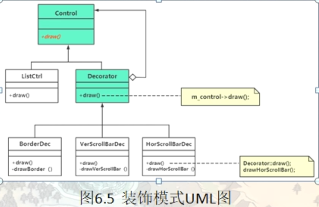

# 装饰模式（Decorator）

装饰模式也称装饰器模式（包装模式），是一种结构型模式，展现出了一种运行时的可扩展能力，是一种比继承更强大和更灵活的设计视角和设计能力

在软件开发过程中，有时想用一些现存的组件。这些组件可能只是完成了一些核心功能。但在不改变其结构的情况下，可以动态地扩展其功能。所有这些都可以釆用装饰器模式来实现。

## 装饰器模式的定义与特点

装饰器（Decorator）模式的定义：指在不改变现有对象结构的情况下，动态地给该对象增加一些职责（即增加其额外功能）的模式，它属于对象结构型模式。

装饰器模式的主要优点有：

- 装饰器是继承的有力补充，比继承灵活，在不改变原有对象的情况下，动态的给一个对象扩展功能，即插即用
- 通过使用不用装饰类及这些装饰类的排列组合，可以实现不同效果
- 装饰器模式完全遵守开闭原则


其主要缺点是：装饰器模式会增加许多子类，过度使用会增加程序得复杂性。

## 问题的提出

#### 情景模拟：

以一个列表控件为例，如何丰富控件上的内容。先后为一个普通的列表控件增加边框，垂直滚动条，水平滚动条

- ListCtrl 代表最普通的列表控件，提供一个draw方法，来绘制自己

- BorderListCtrl 继承自ListCtrl，用于表示增加了边框的控件，提供draw方法
- VerScBorderListCtrl 继承自 BorderListCtrl  ，用于表示增加了边框又增加了垂直滚动条的控件，提供draw方法
- HorScVerScBorderListCtrl 继承自 VerScBorderListCtrl，表示增加了边框，垂直和水平滚动条的控件，提供draw方法

试想这种代码编写方式有什么弊端，如果我们又有一个新需求，比如加个阴影，加个外发光。。。岂不是又得继承下去，实现更多继承关系的类。即，如果我们又新的需求，就得创建新的子类，就会导致类数量的泛滥，灵活性也会变得很差。
所以在这种情形下，采用继承机制来解决我们控件创建问题，显然不是一个好的方法

继承改为组装方法来解决，防止类泛滥

- ListCtrl 代表最普通的列表控件，提供一个draw方法，来绘制自己
- 增加边框 -> 带边框的列表控件
- 增加垂直滚动条->带垂直滚动条的控件，再给这个带垂直滚动条的列表控件增加一个水平滚动条 -> 即带垂直又带水平滚动条

这种通过装饰方法将一个类的功能不断的增强的思想（动态的增加新的功能），就是装饰模式的核心设计思想

## 引入装饰（Decorator）模式

#### 组合复用原则

合成复用原则（Composite Reuse Principle，CRP）又叫组合/聚合复用原则（Composition/Aggregate Reuse Principle，CARP）。它要求在软件复用时，要尽量先使用组合或者聚合等关联关系来实现，其次才考虑使用继承关系来实现。

如果要使用继承关系，则必须严格遵循里氏替换原则。合成复用原则同里氏替换原则相辅相成的，两者都是开闭原则的具体实现规范。

组合复用原则强调，若两个使用类的继承来进行设计，则父类代码的修改可能会影响到子类的行为，而且很可能父类的很多方法子类是用不到的，这显然是一种浪费，若使用组合方式进行设计，则可以大大降低两个类之间 的依赖关系，也不会存在因为继承关系而导致的浪费行为，所以如果继承和组合都能达到设计目的，优先考虑使用组合，组合优于继承

#### 合成复用原则的重要性

通常类的复用分为继承复用和合成复用两种，继承复用虽然有简单和易实现的优点，但它也存在以下缺点。

1. 继承复用破坏了类的封装性。因为继承会将父类的实现细节暴露给子类，父类对子类是透明的，所以这种复用又称为“白箱”复用。
2. 子类与父类的耦合度高。父类的实现的任何改变都会导致子类的实现发生变化，这不利于类的扩展与维护。
3. 它限制了复用的灵活性。从父类继承而来的实现是静态的，在编译时已经定义，所以在运行时不可能发生变化。


采用组合或聚合复用时，可以将已有对象纳入新对象中，使之成为新对象的一部分，新对象可以调用已有对象的功能，它有以下优点。

1. 它维持了类的封装性。因为成分对象的内部细节是新对象看不见的，所以这种复用又称为“黑箱”复用。
2. 新旧类之间的耦合度低。这种复用所需的依赖较少，新对象存取成分对象的唯一方法是通过成分对象的接口。
3. 复用的灵活性高。这种复用可以在运行时动态进行，新对象可以动态地引用与成分对象类型相同的对象。

```c++
namespace _nmsp1
{
    // 创建一个抽象控件类
    class Control
    {
    public:
        virtual void draw() = 0;
        // draw 方法，用于将自身绘制到屏幕
        
    public:
        virtual ~Control() {}
    };
    
    // 控件类本体
    class ListCtrl : public Control
    {
    public:
        virtual void draw()
        {
            std::cout << "绘制了普通的列表控件" << std::endl;
            // 具体绘制可以使用DirectX或者OpenGL进行
        }
    };
    
    
    // 抽象装饰器类（用于做装饰器的父类）
    // 这里做点额外说明，经过装饰器装饰过的列表控件，他任然还是一个列表控件，这里不要把装饰器单纯的理解为装饰器
    // 而是理解成经过包装后的新控件。所以抽象装饰器类继承自Control并不突兀，也合情合理
    // 同时注意到，抽象装饰器类中有一个成员变量 m_control，他的类型是抽象控件类指针，从这里可以看到
    // 抽象装饰器和抽象控件类之间不仅是以职工继承关系，也是一种组合关系
    class Decorator:public Control
    {
    public:
        // 构造函数
        Decorator(Control* tmpCtrl):m_control(tmpCtrl)
        {}
        
        virtual void draw()
        {
            m_control->draw();  // 调用是哪个draw,取决于m_control指向的对象
        }
        
    private:
        Control* m_control;     // 需要被装饰的其他控件，这里用的是Control* 
    };
    
    // 边框装饰器类
    class BorderDec : public Decorator
    {
    public:
        BorderDec(Control* tmpCtrl):Decorator(tmpCtrl) {}
        
        virtual void draw()
        {
            Decorator::draw();  // 绘制本体
            // 调用父类的draw方法，以保持过往已经绘制出的内容
            // 注意这行写法，这里就是装饰模式的典型写法
            
            drawBorder();   // 绘制边框
        }
    
    private:
        void drawBorder()
        {
            std::cout << "绘制边框" << std::endl;
        }
    };
    
    // 垂直滚动条装饰器类
    class VerScrollBarDec : public Decorator
    {
    public:
        VerScrollBarDec(Control* tmpCtrl):Decorator(tmpCtrl) {}
        
        virtual void draw()
        {
            Decorator::draw();  // 绘制本体
            // 调用父类的draw方法，以保持过往已经绘制出的内容
            // 注意这行写法，这里就是装饰模式的典型写法
            
            drawVerScrollBar();   // 绘制垂直滚动条
        }
    
    private:
        void drawVerScrollBar()
        {
            std::cout << "绘制垂直滚动条" << std::endl;
        }
    };
    
    // 水平滚动条装饰器类
    class HorScrollBarDec : public Decorator
    {
    public:
        HorScrollBarDec(Control* tmpCtrl):Decorator(tmpCtrl) {}
        
        virtual void draw()
        {
            Decorator::draw();  // 绘制本体
            // 调用父类的draw方法，以保持过往已经绘制出的内容
            // 注意这行写法，这里就是装饰模式的典型写法
            
            drawHorScrollBar();   // 绘制水平滚动条
        }
    
    private:
        void drawHorScrollBar()
        {
            std::cout << "绘制水平滚动条" << std::endl;
        }
    };
    
}
```

main

```c++
int main()
{
    // 创建一个即带边框又带垂直滚动条的列表控件
    // 首先绘制一个普通的列表控件
    // 创建控件本体
    _nmsp1::Control* ctl = new _nmsp1::ListCtrl();
    
    // 接着借助普通的列表控件，可以绘制出一个 带边框的列表控件
    
    // 创建装饰器
    // 其实这里 用 _nmsp1::Control* 去指也可以，只是这里为了更直接，就使用直接父类指针了
    
    // 带边框的
    _nmsp1::Decorator* dcB = new _nmsp1::BorderDec(ctl);
    
    // 将带边框的再装饰一层垂直滚动条
    _nmsp1::Decorator* dcV = new _nmsp1::VerScrollBarDec(dcB);
    
    // 绘制
    dcV->draw();
    // 绘制了普通的列表控件
    // 绘制边框
    // 绘制垂直滚动条
    
    std::cout << "---------------------------------------------------------------------" << std::endl;
    
    // 装饰一个 只带水平滚动条的控件
    // 首先绘制普通控件
    _nmsp1::Control* ctl2 = new _nmsp1::ListCtrl();
    
    // 然后用水平滚动条进行装饰
    _nmsp1::Decorator* dcH = new _nmsp1::HorScrollBarDec(ctl2);
    
    // 最终绘制
    dcH->draw();
    // 绘制了普通的�表控件
    // 绘制水平滚动条
    
    
    // 资源释放。。。。
    return 0;
}
```

从这个执行结果我们不难看出，装饰模式的每一步都需要利用上一步的装饰成果，我们需要对装饰本体进行层层装饰。在上一句装饰的成果之上继续进行创建。



## 另一个装饰模式的范例

