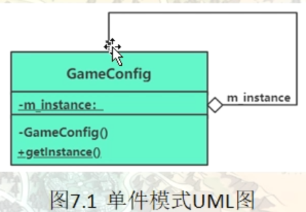

# 单件模式（Singleton）

在有些系统中，为了节省内存资源、保证数据内容的一致性，对某些类要求只能创建一个实例，这就是所谓的单例模式。单件模式比较特殊的点在于，它没有使用到已往设计模式中的抽象手法，而是使用了将构造函数私有化这种编程方法实现。

## 单件类的基本概念和实现

单例（Singleton）模式的定义：指一个类只有一个实例，且该类能自行创建这个实例的一种模式。例如，Windows 中只能打开一个任务管理器，这样可以避免因打开多个任务管理器窗口而造成内存资源的浪费，或出现各个窗口显示内容的不一致等错误。

在计算机系统中，还有 Windows 的回收站、操作系统中的文件系统、多线程中的线程池、显卡的驱动程序对象、打印机的后台处理服务、应用程序的日志对象、数据库的连接池、网站的计数器、Web 应用的配置对象、应用程序中的对话框、系统中的缓存等常常被设计成单例。

单例模式在现实生活中的应用也非常广泛，例如公司 CEO、部门经理等都属于单例模型。J2EE 标准中的 [Servlet](http://c.biancheng.net/servlet/)Context 和 ServletContextConfig、[Spring](http://c.biancheng.net/spring/) 框架应用中的 ApplicationContext、数据库中的连接池等也都是单例模式。

单例模式有 3 个特点：

1. 单例类只有一个实例对象；
2. 该单例对象必须由单例类自行创建；
3. 单例类对外提供一个访问该单例的全局访问点。

c++有位专家：Scott Meyers 有个观点，认为：要使接口或者类型易于正确使用，难以错误使用。这句话的意思就不要把保证不创建出多个类对象的责任推到单例类的使用者身上，这本身应该是类的设计者的责任。所以在设计单例的时候，应该是从类本身的设计入手，而不是说出一份文旦，告诉使用者，这个类只能确保new一次

```c++
namespace _nmsp1
{
    class GameConfig
    {
    private:
        GameConfig() {}
        GameConfig(const GameConfig& tmpobj);   // 拷贝构造私有
        GameConfig& operator=(const GameConfig& tmpobj);    // 拷贝赋值私有
        ~GameConfig() {}
        
    public:
        static GameConfig* getInstance()
        {
            if(m_instance == nullptr)
            {
                m_instance = new GameConfig();
            }
            return m_instance;
        }
        
    private:
        static GameConfig* m_instance;  // 指向本类对象的指针
    };
    
    GameConfig* GameConfig::m_instance = nullptr;   // 在类外（在某个.cpp源文件开头位置，为静态成员变量赋值）
}
```

将构造函数，拷贝构造函数，拷贝赋值运算符 和 析构函数都进行私有化。

## 单件类在多线程中可能导致的问题

```c++
static GameConfig* getInstance()
        {
            // 这种代码在多线程
            if(m_instance == nullptr)
            {
                m_instance = new GameConfig();
            }
            return m_instance;
        }
```

上面的这种代码，如果在多线程中，可能会出现创建出不止一个单例类对象的情况。假设有一个线程，在执行到 

`if(m_instance == nullptr)`这行代码的时候，判断到当前没有实例，if成立，准备创建实例对象的时候，因为系统时间片调度问题，被切换给了下一个线程，然后这个线程也需要获取单例类，然后也走到这里，然后也判断当前是否有实例化出来的对象，判断到没有，然后去进行实例化，这个时候实例出来了一个实例对象。然后系统调度，切换回上一个线程，这个线程因为在切走之前已经判断过了（没有实例化的对象）所以就直接去实例化一个单例对象，那这个时候，就产生了两个单例实例。这时候就使得代码违背了开发者的意愿，产生了混乱。

解决这个问题最简单粗暴的方法就是给 getInstance 这个类方法进行加锁。

```c++
        static GameConfig* getInstance()
        {
            std::lock_guard<std::mutex> gcguard(my_mutex);
            // 加锁之后，在return的时候会自动解锁
            if(m_instance == nullptr)
            {
                m_instance = new GameConfig();
            }
            return m_instance;
        }
```

虽然这种代码从加锁解锁逻辑上没问题，实现了线程安全。但是从执行效率上讲，这种代码有大问题。设想在项目中如果需要频繁调用getinstance，那么就需要频繁的执行这行代码，进行频繁的加锁解锁。多个线程频繁的调用会严重影响程序的执行效率。况且这种加锁解锁机制仅仅只是对第一次new的时候有意义，在getInstance被成功调用一次之后，其实这里的m_instance就变成了只读对象，在多线程中你对一个只读对象进行加锁解锁，意义不大，但是代价很大。

所以这种解决方式，我们不应该采用

另外一种解决方式就是，双重加锁机制（或者叫做双重检查）

```c++
        static GameConfig* getInstance()
        {
            if(m_instance == nullptr)
            {
                std::lock_guard<std::mutex> gcguard(my_mutex);
                if(m_instance == nullptr)
                {
                 	m_instance = new GameConfig();   
                }
            }
            return m_instance;
        }
```

这里用两个if，是一种提高效率的手段。第一个if代表m_instance可能被new过，也可能没有被new过。所以我们在这种情况下进行加锁，然后这个时候，在锁住的情况下，我们再去判断这个if，这个时候因为是被锁住的，所以只要判断通过，就说明肯定是没有被new过的，那这个时候就可以放心的用这个new来进行初始化了。然后，在此之后的getinstance调用，因为有第一层if的判断，那就根本不会执行到下面的加锁代码，极大的提升了程序运行效率。

粗暴加锁是必然加锁，调用一次就加锁一次，而双重锁定是绝大部分调用都不需要加锁

当然这种双重加锁也存在问题，就是一个内存访问重新排序（重新排列编译器产生的汇编指令）导致双重锁定失效的问题。因为有这种潜藏的失效隐患，所以这种双重锁定解决方案也不建议在项目中进行使用。

对于这个失效这里展开讲一下，通常来说，单一个线程执行到 `m_instance = new GameConfig();`这个代码行的时候，这个代码是需要分为3个步骤并且按照顺序来进行执行的。首先在new这个对象的时候，我们知道在new一个对象的时候，实际上是先调用malloc来分配内存，然后执行GameConfig的构造函数来初始化这块内存，最后才让m_instance指向这块内存，这个时候这块内存才能用。但是呢，在cpu内部执行的时候，这3个步骤有可能会因为编译器的优化原因，被重新排序。比如这行代码很有可能被编译器这样执行，首先先用malloc来分配内存，然后用m_instance来指向这块内存，最后才执行GameConfig的构造函数，来初始化这块内存。甚至有写极端情况，编译器会在加锁之前就进行if语句的测试（这是编译器的一个bug），所以因为 `m_instance = new GameConfig();`这行代码拆开的汇编指令执行顺序问题，导致的麻烦。因为试想，m_instance一旦被赋值了，那么就表示 `(m_instance != nullptr)`这个条件成立了，但是你这块内存还没执行构造函数来进行初始化呢，这个时候是不应该被拿来使用的。在多线程中就可能会出现在线程1中没有被初始化完的GameConfig对象，被线程2拿去使用了。这就是双重锁定有可能导致的问题。

这个双重锁定导致的问题在c++中解决起来还比较麻烦，像在 java，c#这些语言中可以通过一个叫做  volatile 的关键字解决。这个关键字一般来讲，作用就是提示编译器不要进行内存访问重新排序。早c++中需要借助c++11的一些新特性，新类型来解决这些问题

一个好的解决多线程创建GameConfig类对象问题的方法是在main主函数中（程序的执行入口），在创建其他任何线程之前，先执行一次 `GameGongig::getInstance()` 这个方法，来把这个单独的GameConfig类对象创建出来

## 饿汉式与懒汉式

### 饿汉式

```c++
GameConfig* GameConfig::m_instance = new GameConfig();
```

蹭静态成员变量初始化的时机，直接进行初始化是允许的，即使构造函数是private修饰也是允许的，因为这行代码是在main函数之前就执行了，所以在main函数中，创建多线程的时候，m_instance已经有有效值了

这就是饿汉式单例实现，也就是程序代码一执行，不管你掉没调用getinstance这个成员函数，这个单件里就已经被创建了
该模式下的单件类创建方式，不受多线程问题的困扰

```c++
namespace _nmsp2
{
    class GameConfig
    {
    private:
        GameConfig() {}
        GameConfig(const GameConfig& tmpobj);   // 拷贝构造私有
        GameConfig& operator=(const GameConfig& tmpobj);    // 拷贝赋值私有
        ~GameConfig() {}
        
    public:
        static GameConfig* getInstance()
        {
            return m_instance;
        }
        
    private:
        static GameConfig* m_instance;  // 指向本类对象的指针
    };
    
    GameConfig* GameConfig::m_instance = new GameConfig();
    // 蹭静态成员变量初始化的时机，直接进行初始化是允许的，即使构造函数是private修饰也是允许的
    // 因为这行代码是在main函数之前就执行了，所以在main函数中，创建多线程的时候，m_instance已经有有效值了

    // 这就是饿汉式单例实现，也就是程序代码一执行，不管你掉没调用getinstance这个成员函数，这个单件里就已经被创建了
    // 该模式下的单件类创建方式，不受多线程问题的困扰
}
```

在饿汉式的单例代码中，我们必须要注意，如果一个项目中，有多个.cpp源文件的话。假设在另外一个.cpp源文件中有这种代码

```c++
int g_test = GameConfig::getInstance()->m_i;
// 这里假设m_i为GameConfig类中的一个int类型变量，
```

注意这种代码是不安全的，因为多个.cpp源文件中，全局变量他们的初始化顺序是不确定的。很可能存在g_test先被初始化，然后m_instance后被初始化，那这个时候 `GameConfig::getInstance()`拿到的就是一个nullptr，那这个时候 -> 就会报告异常，程序会执行异常

### 懒汉式

程序执行之后该单件对象并不存在，只有第一次调用getinstance成员函数之后对象才存在

```c++
namespace _nmsp1
{
    class GameConfig
    {
    private:
        GameConfig() {}
        GameConfig(const GameConfig& tmpobj);   // 拷贝构造私有
        GameConfig& operator=(const GameConfig& tmpobj);    // 拷贝赋值私有
        ~GameConfig() {}
        
    public:
        static GameConfig* getInstance()
        {
            // 这种代码在多线程
            if(m_instance == nullptr)
            {
                m_instance = new GameConfig();
            }
            return m_instance;
        }
        
    private:
        static GameConfig* m_instance;  // 指向本类对象的指针
    };
    
    GameConfig* GameConfig::m_instance = nullptr;   // 在类外（在某个.cpp源文件开头位置，为静态成员变量赋值）
}
```


## 单件类对象内存释放问题

单件对象一般来说，他的生命周期都是贯串整个程序执行结束的，所以一帮可以交给程序执行结束有系统自动进行内存回收。但是也不乏某些情况下需要手动进行内存管理。

饿汉式释放产生的内存
首先，如果单件类代码是以饿汉式编写，那么不管单件类是否被调用，该单件类对象都是存在的，
这个时候，我们可以在GameConfig类定义中增加一个private修饰的静态成员变量
然后在累外面，某个.cpp源文件开头位置，给这个静态成员变量进行定义

```c++
namespace _nmsp2
{
    class GameConfig
    {
    private:
        GameConfig() {}
        GameConfig(const GameConfig& tmpobj);   // 拷贝构造私有
        GameConfig& operator=(const GameConfig& tmpobj);    // 拷贝赋值私有
        ~GameConfig() {}
        
    public:
        static GameConfig* getInstance()
        {
            return m_instance;
        }
        
    // 内存回收方案
    // 类中套一个类。手工释放单件例对象引入的GameConfig类中的嵌套类
    private:
        class Garbo
        {
        public:
            ~Garbo()
            {
                if(GameConfig::m_instance != nullptr)
                {
                    delete GameConfig::m_instance;
                    GameConfig::m_instance = nullptr;
                }
            }
        };
        
    // 饿汉式释放产生的内存
    // 首先，如果单件类代码是以饿汉式编写，那么不管单件类是否被调用，该单件类对象都是存在的，
    // 这个时候，我们可以在GameConfig类定义中增加一个private修饰的静态成员变量
    // 然后在累外面，某个.cpp源文件开头位置，给这个静态成员变量进行定义
    private:
        static Garbo garbobj;
    
        
    private:
        static GameConfig* m_instance;  // 指向本类对象的指针
    };
    
    GameConfig* GameConfig::m_instance = new GameConfig();
    
    // 内存释放
    // 在累外面，某个.cpp源文件开头位置，给这个静态成员变量进行定义赋值
    GameConfig::Garbo GameConfig::garbobj;
}
```

这个程序代码的实现原理其实比较简单，首先该静态成员变量他的内存会被操作系统进行回收，这一回收就会导致该静态成员变量所属的类Garbo的析构函数被调用，然后这个析构函数中正好有释放该单件类对象的代码，这样就完成了单件类对象的释放

懒汉式内存释放

```c++
namespace _nmsp1
{
    class GameConfig
    {
    private:
        GameConfig() {}
        GameConfig(const GameConfig& tmpobj);   // 拷贝构造私有
        GameConfig& operator=(const GameConfig& tmpobj);    // 拷贝赋值私有
        ~GameConfig() {}
        
    public:
        static GameConfig* getInstance()
        {
            // 这种代码在多线程
            if(m_instance == nullptr)
            {
                // 懒汉式内存释放方式2，需要在这里定义一个静态的内存释放嵌套类对象
                // 实现原理就是，在程序执行这行代码的时候，掉一共getinstance获取单例对象，
                // 那么在这里就会创建该内存回收类对象，该对象在程序执行结束之前会由系统进行内存回收，
                // 然后调用析构函数，在析构函数中对单例类对象进行内存释放
                static Garbo garbobj;
                m_instance = new GameConfig();
            }
            return m_instance;
        }
        
    // 内存回收方案1
    // 这种手工提供新的内存释放函数的方式，并不方便，而且要考虑线程安全问题（下面这里没有考虑）
    public:
        static void freeInstance()
        {
            if (m_instance != nullptr)
            {
                delete GameConfig::m_instance;
                GameConfig::m_instance = nullptr;
            }
        }
        
    // 内存回收方案2
    // 类中套一个类。手工释放单件例对象引入的GameConfig类中的嵌套类
    private:
        class Garbo
        {
        public:
            ~Garbo()
            {
                if(GameConfig::m_instance != nullptr)
                {
                    delete GameConfig::m_instance;
                    GameConfig::m_instance = nullptr;
                }
            }
        };
    
        
    private:
        static GameConfig* m_instance;  // 指向本类对象的指针
    };
    
    GameConfig* GameConfig::m_instance = nullptr;   // 在类外（在某个.cpp源文件开头位置，为静态成员变量赋值）
}
```

## 单件类定义、UML图及另外一种实现方式

单例模式是 设计模式 中最简单的模式之一。通常，普通类的构造函数是公有的，外部类可以通过“new 构造函数()”来生成多个实例。但是，如果将类的构造函数设为私有的，外部类就无法调用该构造函数，也就无法生成多个实例。这时该类自身必须定义一个静态私有实例，并向外提供一个静态的公有函数用于创建或获取该静态私有实例。

下面来分析其基本结构和实现方法。

### 1. 单例模式的结构

单例模式的主要角色如下。

- 单例类：包含一个实例且能自行创建这个实例的类。
- 访问类：使用单例的类。



当然，如果不同指针，也可以有另外一种实现单例模式的代码

```c++
namespace _nmsp3
{
    class GameConfig
    {
    private:
        GameConfig() {}
        GameConfig(const GameConfig& tmpobj);   // 拷贝构造私有
        GameConfig& operator=(const GameConfig& tmpobj);    // 拷贝赋值私有
        ~GameConfig() {}
        
    public:
        static GameConfig* getInstance()
        {
            return &m_instance;
        }
        
    private:
        static GameConfig m_instance;
        
    };
    
    GameConfig GameConfig::m_instance;
}
```

**让getInstance返回局部静态变量的引用class GameConfig**，当然这个版本的单例模式也存在线程安全问题

```c++
namespace _nmsp4
{
    // 实现方法是让getInstance返回局部静态变量的引用class GameConfig
    class GameConfig
    {
    private:
        GameConfig() {}
        GameConfig(const GameConfig& tmpobj);   // 拷贝构造私有
        GameConfig& operator=(const GameConfig& tmpobj);    // 拷贝赋值私有
        ~GameConfig() {}
        
    public:
        static GameConfig& getInstance()
        {
            static GameConfig intance;
            // 注意区别 函数第一次执行时被初始化的静态变量      与
            //          通过编译期常量进行初始化的基本类型静态变量
            
            // 这里 instance 就是属于第一种情况。
            // 这里的 instance 他不是基本类型，他是类类型
            // 类类型静态变量他不一样，在这里你不调用getInstance这个静态变量instance就不会被初始化
            
            return intance;
        }
        
    };
}
```

困扰问题：多个单件类之间互相引用的问题（不要在单件类的析构函数中，引用其他单例的类对象）