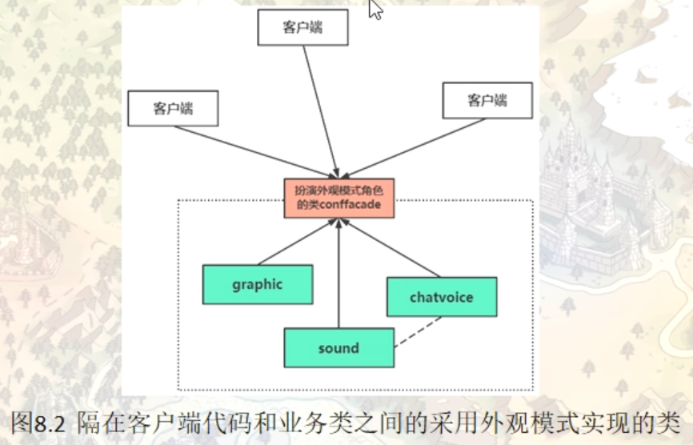

# 外观模式（Facade）

外观模式也被称为门面模式，它是一种结构型模式，目的就是为了隔离接口，相当于一个中间层角色。

当一个系统的功能越来越强，子系统会越来越多，客户对系统的访问也变得越来越复杂。这时如果系统内部发生改变，客户端也要跟着改变，这违背了“开闭原则”，也违背了“迪米特法则”，所以有必要为多个子系统提供一个统一的接口，从而降低系统的耦合度，这就是外观模式的目标。

## 外观模式的定义与特点

外观（Facade）模式又叫作门面模式，是一种通过为多个复杂的子系统提供一个一致的接口，而使这些子系统更加容易被访问的模式。该模式对外有一个统一接口，外部应用程序不用关心内部子系统的具体细节，这样会大大降低应用程序的复杂度，提高了程序的可维护性。

外观模式为客户端和子系统之间提供了一种简化的交互渠道，并没有为子系统增加新的行为。如果希望增加新行为，应该通过修改子系统实现

在日常编码工作中，我们都在有意无意的大量使用外观模式。只要是高层模块需要调度多个子系统（2个以上的类对象），我们都会自觉地创建一个新的类封装这些子系统，提供精简的接口，让高层模块可以更加容易地间接调用这些子系统的功能。尤其是现阶段各种第三方SDK、开源类库，很大概率都会使用外观模式。

外观（Facade）模式是“迪米特法则”的典型应用，它有以下主要优点。

1. 降低了子系统与客户端之间的耦合度，使得子系统的变化不会影响调用它的客户类。
2. 对客户屏蔽了子系统组件，减少了客户处理的对象数目，并使得子系统使用起来更加容易。
3. 降低了大型软件系统中的编译依赖性，简化了系统在不同平台之间的移植过程，因为编译一个子系统不会影响其他的子系统，也不会影响外观对象。


外观（Facade）模式的主要缺点如下。

1. 不能很好地限制客户使用子系统类，很容易带来未知风险。
2. 增加新的子系统可能需要修改外观类或客户端的源代码，违背了“开闭原则”。

## 一个配置相关的范例

#### 情景模拟

程序计划将界面配置，游戏音量配置，语音聊天配置 设计成单件类

```c++
namespace _nmsp1
{
    // 图形相关的配置类
    class Graphic
    {
    private:
        Graphic() {}
        Graphic(const Graphic& tmpobj);
        Graphic& operator=(const Graphic& tmpobj);
        ~Graphic() {}
        
    public:
        static Graphic& getInstance()
        {
            static Graphic instance;
            return instance;
        }
        
    public:
        // 是否全屏显示
        void dispaly(bool enable)
        {
            std::cout << "图形设置 -> 是否全屏显示 ？ " << enable << std::endl;
        }
        // 是否开启游戏特效
        void effect(bool enable)
        {
            std::cout << "图形设置 -> 是否开启特效 ？ " << enable << std::endl;
        }
        // 设置游戏分辨率
        void resolution(int index)
        {
            std::cout << "图形设置 -> 设置游戏分辨率 ？ " << index << std::endl;
        }
        // 是否开启抗锯齿
        void antialiasing(bool enable)
        {
            std::cout << "图形设置 -> 是否开启抗锯齿 ？ " << enable << std::endl;
        }
    };
    
    // 声音相关的配置类
    class Sound
    {
    private:
        Sound() {}
        Sound(const Sound& tmpobj);
        Sound& operator=(const Sound& tmpobj);
        ~Sound() {}
        
    public:
        static Sound& getInstance()
        {
            static Sound instance;
            return instance;
        }
        
    public:
        // 游戏背景音
        void bgsound(int level)
        {
            std::cout << "游戏声音配置 -> 背景音量？" << level << std::endl;
        }
        
        // 游戏环境音
        void envsound(int level)
        {
            std::cout << "游戏声音配置 -> 环境音量？" << level << std::endl;
        }
        
        // 游戏人物音
        void npcsound(int level)
        {
            std::cout << "游戏声音配置 -> 游戏人物音量？" << level << std::endl;
        }
        
        // 设置全局总音量
        void setVolume(int level)
        {
            std::cout << "游戏声音配置 -> 全局音量？" << level << std::endl;
        }
    };
    
    // 语音聊天相关的配置类
    class ChatVoice
    {
    private:
        ChatVoice() {}
        ChatVoice(const ChatVoice& tmpobj);
        ChatVoice& operator=(const ChatVoice& tmpobj);
        ~ChatVoice() {}
        
    public:
        static ChatVoice& getInstance()
        {
            static ChatVoice instance;
            return instance;
        }
        
    public:
        // 话筒音量
        void micvolume(int level)
        {
            std::cout << "语音聊天 -> 麦克风音量大小 ？" << level << std::endl;
        }
        
        // 降噪等级
        void noiseReduction(int level)
        {
            std::cout << "语音聊天 -> 降噪等级 ？" << level << std::endl;
        }
        
        // 音量设置
        void chatvolume(int level)
        {
            std::cout << "语音聊天 -> 聊天音量 ？" << level << std::endl;
        }
    };
    
}
```

main程序执行测试结果

```c++
int main()
{
    _nmsp1::Graphic& g_gp = _nmsp1::Graphic::getInstance();
    
    g_gp.dispaly(false);
    g_gp.effect(true);
    g_gp.resolution(2048);
    g_gp.antialiasing(true);
    // 图形设置 -> 是否全屏显示 ？ 0
    // 图形设置 -> 是否开启特效 ？ 1
    // 图形设置 -> 设置游戏分辨率 ？ 2048
    // 图形设置 -> 是否开启抗锯齿 ？ 1
    
    _nmsp1::Sound& g_sound = _nmsp1::Sound::getInstance();
    
    g_sound.bgsound(65);
    g_sound.envsound(55);
    g_sound.npcsound(80);
    g_sound.setVolume(36);
    // 游戏声音配置 -> 背景音量？65
    // 游戏声音配置 -> 环境音量？55
    // 游戏声音配置 -> 游戏人物音量？80
    // 游戏声音配置 -> 全局音量？36
    
    _nmsp1::ChatVoice& g_chat = _nmsp1::ChatVoice::getInstance();
    
    g_chat.micvolume(70);
    g_chat.noiseReduction(100);
    g_chat.chatvolume(66);
    // 语�聊天 -> 麦克风音量大小 ？70
    // 语音聊天 -> 降噪等级 ？100
    // 语音聊天 -> 聊天音量 ？66

    return 0;
}
```


## 引入外观（facade）模式

Graphic， Sound，ChatVoice 这些类（业务类），main函数中的这些代码（客户端代码）。这个时候提供一个新的类或者接口，用来调用这些配置类的配置函数，这样客户端代码就不需要直接与业务类打交道



外观模式强调的是一种程序设计思想

```c++
// 引入外观模式
    // 扮演外观模式角色的类
    class Conffacade
    {
    private:
        Conffacade() {}
        Conffacade(const Conffacade& tmpobj);
        Conffacade& operator=(const Conffacade& tmpobj);
        ~Conffacade() {}
        
    public:
        static Conffacade& getInstance()
        {
            static Conffacade instance;
            return instance;
        }
        
    public:
        // 低配机通用配置设置
        void LowConfComputer()
        {
            Graphic& g_gp = Graphic::getInstance();
            g_gp.dispaly(true);
            g_gp.effect(false);
            g_gp.resolution(720);
            g_gp.antialiasing(false);
            
            Sound& g_sound = Sound::getInstance();
            g_sound.bgsound(0);
            g_sound.envsound(55);
            g_sound.npcsound(80);
            g_sound.setVolume(36);
            
            ChatVoice& g_chat = ChatVoice::getInstance();
            g_chat.micvolume(50);
            g_chat.noiseReduction(0);
            g_chat.chatvolume(45);
        }
        
        
        // 高配置通用配置设置
        void HighConfComputer()
        {
            Graphic& g_gp = Graphic::getInstance();
            g_gp.dispaly(true);
            g_gp.effect(true);
            g_gp.resolution(2048);
            g_gp.antialiasing(true);
            
            Sound& g_sound = Sound::getInstance();
            g_sound.bgsound(65);
            g_sound.envsound(55);
            g_sound.npcsound(80);
            g_sound.setVolume(66);
            
            ChatVoice& g_chat = ChatVoice::getInstance();
            g_chat.micvolume(100);
            g_chat.noiseReduction(100);
            g_chat.chatvolume(65);
        }
    };
```

外观（Facade）模式的结构比较简单，主要是定义了一个高层接口。它包含了对各个子系统的引用，客户端可以通过它访问各个子系统的功能。现在来分析其基本结构和实现方法。

#### 1. 模式的结构

外观（Facade）模式包含以下主要角色。

1. 外观（Facade）角色：为多个子系统对外提供一个共同的接口。
2. 子系统（Sub System）角色：实现系统的部分功能，客户可以通过外观角色访问它。
3. 客户（Client）角色：通过一个外观角色访问各个子系统的功能。

外观模式体现了面向对象程序设计的一个原则（迪米特法则）

### 迪米特法则的定义

迪米特法则（Law of Demeter，LoD）又叫作最少知识原则（Least Knowledge Principle，LKP)，产生于 1987 年美国东北大学（Northeastern University）的一个名为迪米特（Demeter）的研究项目，由伊恩·荷兰（Ian Holland）提出，被 UML 创始者之一的布奇（Booch）普及，后来又因为在经典著作《程序员修炼之道》（The Pragmatic Programmer）提及而广为人知。

迪米特法则的定义是：只与你的直接朋友交谈，不跟“陌生人”说话（Talk only to your immediate friends and not to strangers）。其含义是：如果两个软件实体无须直接通信，那么就不应当发生直接的相互调用，可以通过第三方转发该调用。其目的是降低类之间的耦合度，提高模块的相对独立性。

迪米特法则中的“朋友”是指：当前对象本身、当前对象的成员对象、当前对象所创建的对象、当前对象的方法参数等，这些对象同当前对象存在关联、聚合或组合关系，可以直接访问这些对象的方法。

### 迪米特法则的优点

迪米特法则要求限制软件实体之间通信的宽度和深度，正确使用迪米特法则将有以下两个优点。

1. 降低了类之间的耦合度，提高了模块的相对独立性。
2. 由于亲合度降低，从而提高了类的可复用率和系统的扩展性。


但是，过度使用迪米特法则会使系统产生大量的中介类，从而增加系统的复杂性，使模块之间的通信效率降低。所以，在釆用迪米特法则时需要反复权衡，确保高内聚和低耦合的同时，保证系统的结构清晰。

### 迪米特法则的实现方法

从迪米特法则的定义和特点可知，它强调以下两点：

1. 从依赖者的角度来说，只依赖应该依赖的对象。
2. 从被依赖者的角度说，只暴露应该暴露的方法。


所以，在运用迪米特法则时要注意以下 6 点。

1. 在类的划分上，应该创建弱耦合的类。类与类之间的耦合越弱，就越有利于实现可复用的目标。
2. 在类的结构设计上，尽量降低类成员的访问权限。
3. 在类的设计上，优先考虑将一个类设置成不变类。
4. 在对其他类的引用上，将引用其他对象的次数降到最低。
5. 不暴露类的属性成员，而应该提供相应的访问器（set 和 get 方法）。
6. 谨慎使用序列化（Serializable）功能。

## 另一个外观模式的范例

#### 情景模拟：

实现一个家庭影院的外观模式：HomeTheaterFacade，与电器设备想关联

屏幕（screen）灯光（light）音响（speaker）DVD播放器（dvdPlayer）游戏机（playerStation）

提供两个接口

> 1：看电影模式    WatchMoive(屏幕打开，音响打开，灯光关闭，dvd打开，游戏机关闭)
> 2：游戏娱乐模式  PlayGame(屏幕打开，音响打开，灯光打开，dvd关闭，游戏机打开)

```c++
namespace _nmsp1
{
    // 屏幕：
    class Screen
    {
    public:
        void on()
        {
            std::cout << "屏幕打开！" << std::endl;
        }
        void off()
        {
            std::cout << "屏幕关闭！" << std::endl;
        }
    };
    
    // 音响：
    class Speaker
    {
    public:
        void on()
        {
            std::cout << "音响打开！" << std::endl;
        }
        void off()
        {
            std::cout << "音响关闭！" << std::endl;
        }
    };
    
    // 灯光：
    class Light
    {
    public:
        void on()
        {
            std::cout << "灯光打开！" << std::endl;
        }
        void off()
        {
            std::cout << "灯光关闭！" << std::endl;
        }
    };
    
    // DVD：
    class DvdPlayer
    {
    public:
        void on()
        {
            std::cout << "DVD打开！" << std::endl;
        }
        void off()
        {
            std::cout << "DVD关闭！" << std::endl;
        }
    };
    
    // 游戏机：
    class PlayerStation
    {
    public:
        void on()
        {
            std::cout << "游戏机打开！" << std::endl;
        }
        void off()
        {
            std::cout << "游戏机关闭！" << std::endl;
        }
    };
    
    // 家庭影院外观模式类
    class HomeTheaterFacade
    {
    public:
        void WatchMoive()
        {
            // (屏幕打开，音响打开，灯光关闭，dvd打开，游戏机关闭)
            screenObj.on();
            lightObj.off();
            speakerObj.on();
            dvdObj.on();
            playerObj.off();
        }
        
        void PlayGame()
        {
            // (屏幕打开，音响打开，灯光打开，dvd关闭，游戏机打开)
            screenObj.on();
            lightObj.on();
            speakerObj.on();
            dvdObj.off();
            playerObj.on();
        }
        
    private:
        Screen screenObj;
        Light lightObj;
        DvdPlayer dvdObj;
        Speaker speakerObj;
        PlayerStation playerObj;
    };
    
}
```

