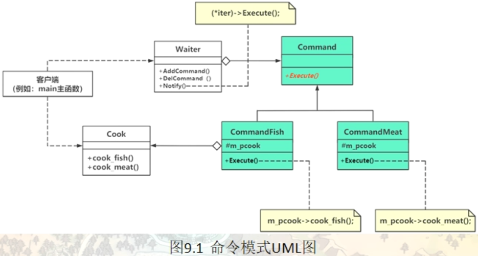

# 命令模式（Command）

在软件开发系统中，“方法的请求者”与“方法的实现者”之间经常存在紧密的耦合关系，这不利于软件功能的扩展与维护。例如，想对方法进行“撤销、重做、记录”等处理都很不方便，因此“如何将方法的请求者与实现者解耦？”变得很重要，命令模式就能很好地解决这个问题。

在现实生活中，命令模式的例子也很多。比如看电视时，我们只需要轻轻一按遥控器就能完成频道的切换，这就是命令模式，将换台请求和换台处理完全解耦了。电视机遥控器（命令发送者）通过按钮（具体命令）来遥控电视机（命令接收者）。

再比如，我们去餐厅吃饭，菜单不是等到客人来了之后才定制的，而是已经预先配置好的。这样，客人来了就只需要点菜，而不是任由客人临时定制。餐厅提供的菜单就相当于把请求和处理进行了解耦，这就是命令模式的体现。

## 通过一个范例引出命令模式代码编写方法

#### 情景模拟

饭馆点菜

```c++
namespace _nmsp1
{
    // 厨师类
    class Cook
    {
    public:
        // 做红烧鱼
        void cook_fish()
        {
            std::cout << "做红烧鱼" << std::endl;
        }
        
        // 做锅包肉
        void cook_meat()
        {
            std::cout << "做锅包肉" << std::endl;
        }
    };
    
    // 试想一下，如果这个饭馆里来的顾客较多，每个顾客都直接把菜品报给厨师的话，厨师容易记错，产生混乱
    // 使用需要引入一个新类（便签命令类），每个顾客一个便签，然后顾客将菜品写在便签上，
    // 厨师依据收到的便签顺序以及每个便签上的菜品编号进行做菜
    // 怎么写这个命令模式？
    // 首先我们需要将厨师能做的每样菜看成一个命令，首先创建命令对应的抽象父类（Command）
    
    // 菜单命令（抽象类）
    class Command
    {
    public:
        Command(Cook* p_cook)
        {
            m_pcook = p_cook;
        }
        
        virtual ~Command() {}
        
        virtual void Excute() = 0;
        // 纯虚函数（子类要在Excute中要具体实现厨师要制作的菜品）
        
    protected:
        Cook* m_pcook;  // 子类需要访问（定义为protected修饰）
    };
    
    // 做红烧鱼命令
    class CommandFish:public Command
    {
    public:
        CommandFish(Cook* pcook):Command(pcook)
        {}
        
        virtual void Excute()
        {
            m_pcook->cook_fish();
        }
    };
    
    // 做锅包肉命令
    class CommandMeat:public Command
    {
    public:
        CommandMeat(Cook* pcook):Command(pcook)
        {}
        
        virtual void Excute()
        {
            m_pcook->cook_meat();
        }
    };
    
    // 上面的命令其实就是将一个动作封装成了一个对象
    
    // 现在改成这种命令模式是顾客直接下单，为了提高效率，可以引入一个服务员类，然后顾客将菜品写到便签上
    // 交给服务员,由服务员进行下单
    
    
    // 服务员类
    class Vaiter
    {
    public:
        void SetCommand(Command* pconm) // 顾客将便签交给服务员
        {
            m_pComand = pconm;
        }
        
        void Notify()   // 服务员将菜品便签交到厨师手里，让厨师开始做菜
        {
            m_pComand->Excute();
        }
        
    private:
        Command* m_pComand;
        // 服务员手中的顾客点的菜品便签（顾客的点菜命令）
    };
    
    
    // 现在这个服务员一次只能通知一道菜品，假设顾客在便签上写了多到菜品（或者一次性给服务递了多个便签）
    // 那这个时候就需要重新设计和这个服务员类了
    
    // 高级服务员
    class VaiterHighLevel
    {
    public:
        void addCommand(Command* pconm) // 顾客将便签交给服务员
        {
            m_ComandList.push_back(pconm);
        }
        
        // 如果顾客想撤单，则将便签从列表中移除
        void delCommand(Command* pconm)
        {
            m_ComandList.remove(pconm);
        }
        
        void Notify()   // 服务员将菜品便签交到厨师手里，让厨师开始做菜
        {
            for(auto iter = m_ComandList.begin(); iter != m_ComandList.end(); ++iter)
            {
                (*iter)->Excute();
            }
        }
        
    private:
        list<Command*> m_ComandList;
        // 服务员手中的顾客点的菜品便签（顾客的点菜命令）
        // 菜品列表
    };
}
```

#### main函数调用结果

```c++
int main()
{
    _nmsp1::Cook* cook = new _nmsp1::Cook();
    cook->cook_fish();
    cook->cook_meat();
    
    std::cout << "命令模式" << std::endl;
    
    _nmsp1::Command* com1 = new _nmsp1::CommandFish(cook);
    
    _nmsp1::Command* com2 = new _nmsp1::CommandMeat(cook);
    
    std::cout << "顾客直接点菜" << std::endl;
    
    com1->Excute();
    // 做红烧鱼
    com2->Excute();
    // 做锅包肉
    
    std::cout << "顾客点菜交给服务员，让服务员交给厨师" << std::endl;
    
    _nmsp1::Vaiter* vait = new _nmsp1::Vaiter();
    
    vait->SetCommand(com1);
    vait->Notify();
    // 做红烧鱼
    
    vait->SetCommand(com2);
    vait->Notify();
    // 做锅包肉
    
    
    std::cout << "顾客批量点菜" << std::endl;
    
    _nmsp1::VaiterHighLevel* hv = new _nmsp1::VaiterHighLevel();
    hv->addCommand(com1);
    hv->addCommand(com2);
    
    hv->Notify();
    // 做红烧鱼
    // 做锅包肉
        
    delete cook;

    return 0;
}
```



## 引入命令（Command）模式

### 命令模式的定义与特点

命令（Command）模式的定义如下：将一个请求或者命令封装为一个对象，使发出请求的责任和执行请求的责任分割开。这样两者之间通过命令对象进行沟通，这样方便将命令对象进行储存、传递、调用、增加与管理，以便这些请求可以以对象的方式通过参数进行传递。能力就是对请求进行封装。

命令模式的主要优点如下。

1. 通过引入中间件（抽象接口）降低系统的耦合度。
2. 扩展性良好，增加或删除命令非常方便。采用命令模式增加与删除命令不会影响其他类，且满足“开闭原则”。
3. 可以实现宏命令。命令模式可以与 组合模式 结合，将多个命令装配成一个组合命令，即宏命令。
4. 方便实现 Undo 和 Redo 操作。命令模式可以与后面介绍的 备忘录模式 结合，实现命令的撤销与恢复。
5. 可以在现有命令的基础上，增加额外功能。比如日志记录，结合装饰器模式会更加灵活。


其缺点是：

1. 可能产生大量具体的命令类。因为每一个具体操作都需要设计一个具体命令类，这会增加系统的复杂性。
2. 命令模式的结果其实就是接收方的执行结果，但是为了以命令的形式进行架构、解耦请求与实现，引入了额外类型结构（引入了请求方与抽象命令接口），增加了理解上的困难。不过这也是 设计模式 的通病，抽象必然会额外增加类的数量，代码抽离肯定比代码聚合更加难理解。

可以将系统中的相关操作抽象成命令，使调用者与实现者相关分离，其结构如下。

#### 1. 模式的结构

命令模式包含以下主要角色。

1. 抽象命令类（Command）角色：声明执行命令的接口，拥有执行命令的抽象方法 execute()。这里指的就是上面的便签抽象类（Command）
2. 具体命令类（Concrete Command）角色：是抽象命令类的具体实现类，它拥有接收者对象，并通过调用接收者的功能来完成命令要执行的操作。这里就对应上面范例中的（CommandFish，CommandMead）
3. 实现者/接收者（Receiver）角色：执行命令功能的相关操作，是具体命令对象业务的真正实现者。对应上面范例中的Cook厨师类
4. 调用者/请求者（Invoker）角色：是请求的发送者，它通常拥有很多的命令对象，并通过访问命令对象来执行相关请求，它不直接访问接收者。这里指的就是上面范例中的Vaiter（服务员类）
5. client（对应上面的main）

## 命令模式用途研究

### 改造范例代码增加对象使用时的独立性

### 命令模式使用场景谈与特点总结